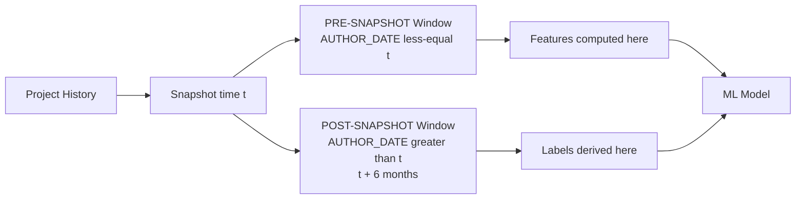

# Technical Debt Prediction Research: Execution Plan

**Aligned with**: Approved MSc Research Proposal (Updated, February 2026) - Abdulmajid Awol Seid

## Overview

This study develops a machine learning approach to predict **high-risk technical debt** at the module level in open-source software projects. Unlike prior work that relies on tool-specific severity classifications, this research uses **consequence-oriented labeling** based on measurable maintenance outcomes observed after a fixed project snapshot, combined with **cross-project validation** to ensure generalizability.

### Research Objectives (from Proposal Section 1.3.2)

1. Construct a module-level dataset from selected OSS projects for cross-project analysis
2. Extract and engineer predictive features combining static code metrics with historical evolution metrics
3. Train and compare ML models for high-risk TD prediction with cross-project validation
4. Identify key predictors through feature importance and error analysis

### Research Questions (from Proposal Section 1.3.3)

- **RQ1**: How can high-risk TD be operationally defined and labeled using measurable, reproducible indicators aligned with maintenance risk?
- **RQ2**: Which static and historical change metrics are most indicative of high-risk TD?
- **RQ3**: How accurately can ML models predict high-risk TD, and which algorithms and feature sets perform best under cross-project validation?

---

## PART A: DATASET DECISION

### Primary Data Source: Technical Debt Dataset v2.0

**Decision**: Use the Technical Debt Dataset v2.0 (Lenarduzzi et al. 2019) as the sole data source. No GitHub scraping required.

**Download URL**: https://github.com/clowee/The-Technical-Debt-Dataset/releases

**Rationale** (paper-ready):
> The Technical Debt Dataset v2.0 provides all inputs required by this study's methodology within a single reproducible artifact: 33 Apache Java projects across 78K commits, 1.8M SonarQube issues, complete Git history, Jira issue tracker data, SZZ fault-inducing mappings, and refactoring records. This breadth supports all three labeling variants required (consequence-oriented primary, SZZ-defect baseline, severity baseline) without custom tool orchestration per project. Using this dataset eliminates four risks identified in proposal Section 3.6: static analysis failures, inconsistent metric configurations, incomplete Jira-commit linking, and SZZ mapping quality. Comparable sister papers use similar or smaller corpora: Tsoukalas et al. [6] 25 projects, Jiang et al. [7,8] ~25 projects, Robredo et al. 31 projects.

### Dataset Contents

| Table | Used For | Key Columns |
|-------|----------|-------------|
| `SONAR_ISSUES` | Static features (non-leaky), severity baseline labels | `PROJECT_ID`, `COMPONENT`, `SEVERITY`, `TYPE`, `DEBT`, `RULE` |
| `SONAR_MEASURES` | Static code metrics (Table 1 features) | `PROJECT_ID`, `COMPONENT`, `METRIC_KEY`, `METRIC_VALUE` |
| `GIT_COMMITS` | Temporal split, historical features | `HASH`, `AUTHOR`, `AUTHOR_DATE`, `IN_MAIN_BRANCH` |
| `GIT_COMMITS_CHANGES` | Per-file churn, bug-fix impact | `COMMIT_HASH`, `FILE_PATH`, `ADDED_LINES`, `DELETED_LINES` |
| `JIRA_ISSUES` | Confirm bug-fix commits (primary labeling) | `ISSUE_KEY`, `TYPE`, `PRIORITY`, `RESOLUTION_DATE` |
| `SZZ_FAULT_INDUCING` | SZZ baseline labeling | `PROJECT_ID`, `FAULT_INDUCING_COMMIT`, `FAULT_FIXING_COMMIT` |
| `REFACTORINGS` | Optional interpretation/validation | `REFACTORING_TYPE`, `COMMIT_HASH` |

### Optional External Validity Extension

If core experiments complete with strong results and time permits, 2-3 non-Apache Java projects may be added as a robustness check (Section "Threats to External Validity" in thesis). This is NOT part of the main experimental pipeline.

---

## PART B: PROJECT STRUCTURE

```
technical-debt/
├── proposal/                       # Approved proposal PDFs/text
├── data/
│   ├── raw/                        # technical_debt_dataset.db (placed manually)
│   ├── processed/                  # Labels + features (auto-generated)
│   │   ├── labels_consequence.csv  # Primary labels
│   │   ├── labels_severity.csv     # Baseline 1
│   │   ├── labels_szz.csv          # Baseline 2
│   │   ├── static_features.csv
│   │   └── historical_features.csv
│   └── external/                   # (optional supplementary data)
├── src/
│   ├── data/
│   │   ├── load_data.py            # SQLite loaders (Jira, SZZ, etc.)
│   │   ├── snapshot.py             # Snapshot date selection and temporal split
│   │   ├── szz.py                  # Bug-fix detection + SZZ helpers
│   │   └── labeling.py             # Three labeling variants
│   ├── features/
│   │   ├── static_features.py      # Table 1 static metrics (snapshot-aware)
│   │   └── historical_features.py  # Pre-snapshot historical metrics
│   ├── models/
│   │   ├── train.py                # Multi-variant training + sensitivity
│   │   └── cross_project.py        # LOPO cross-project + temporal validation
│   ├── reporting/
│   │   └── tables.py               # LaTeX/Markdown table generators
│   └── visualization/
│       └── plots.py                # Paper-ready figures (300 DPI)
├── docs/                           # Paper-ready documentation (thesis sections)
│   ├── 01_methodology.md
│   ├── 02_dataset.md
│   ├── 03_labeling.md
│   ├── 04_features.md
│   ├── 05_experiments.md
│   ├── 06_results.md               # Auto-populated by pipeline
│   ├── 07_discussion.md            # Manual
│   ├── threats_to_validity.md
│   └── thesis_mapping.md           # Output-to-thesis-section map
├── notebooks/                      # Exploratory analysis
├── results/
│   ├── figures/                    # PNG (300 DPI) + SVG
│   └── tables/                     # CSV + LaTeX (.tex)
├── RESEARCH_LOG.md                 # Timestamped methodological decisions
├── EXECUTION_PLAN.md               # This file
├── config.py                       # Temporal + labeling + model settings
├── requirements.txt
└── run_pipeline.py                 # Main orchestration
```

---

## PART C: ENVIRONMENT SETUP

### Requirements

```
pandas>=2.0.0
numpy>=1.24.0
scikit-learn>=1.3.0
xgboost>=2.0.0
lightgbm>=4.0.0
pydriller>=2.5          # Only for optional external validity extension
imbalanced-learn>=0.11.0
matplotlib>=3.7.0
seaborn>=0.12.0
jupyter>=1.0.0
sqlalchemy>=2.0.0
tqdm>=4.65.0
```

### Setup Commands

```bash
cd C:\Users\maaji\Desktop\technical-debt
python -m venv venv
venv\Scripts\activate
pip install -r requirements.txt
```

---

## PART D: TEMPORAL SPLIT ARCHITECTURE (Critical for Validity)

### Snapshot-Based Labeling Protocol

Per proposal Section 3.4, the study uses a strict temporal split to prevent label leakage:



### Snapshot Selection Strategy

Primary: **Median commit date** of each project's main-branch history
- Ensures sufficient history for pre-snapshot features AND sufficient observation window for post-snapshot labels
- Reproducible and consistent across heterogeneous projects

Alternative: Last release tag before project's 60th percentile commit (fallback if needed)

### Observation Window

**Primary**: 6 months post-snapshot
- Justification (citeable): widely used in defect prediction literature (e.g., Zimmermann & Nagappan 2008)
- Balances recency vs. signal strength for varying project activity levels

**Sensitivity analysis windows**: 3, 6, 12 months

---

## PART E: THREE LABELING VARIANTS (Proposal Section 3.4)

### Variant 1 (PRIMARY): Consequence-Oriented Labeling

High-Risk TD = modules with elevated post-snapshot **maintenance risk score**.

**Risk score components** (computed in 6-month post-snapshot window):

| Component | Source | Weight |
|-----------|--------|--------|
| `bugfix_commits_future` | Count of commits touching file with bug-fix keywords or Jira bug link | 0.5 |
| `future_churn` | Added + deleted lines post-snapshot (normalized) | 0.3 |
| `szz_defects_future` | SZZ-linked defect-inducing changes | 0.2 |

**Normalization**: Min-max within project (supports cross-project comparability per Section 3.4)

**Threshold**: Top **20%** within each project labeled High-Risk = 1 (primary)

**Sensitivity analysis**: Top 10%, 20%, 30%

```sql
-- Conceptual SQL (primary labeling)
WITH future_activity AS (
  SELECT
    c.PROJECT_ID,
    ch.FILE_PATH,
    SUM(CASE WHEN is_bugfix(c.MESSAGE) OR jira_linked_bug THEN 1 ELSE 0 END) AS bugfix_commits,
    SUM(ch.ADDED_LINES + ch.DELETED_LINES) AS future_churn,
    SUM(CASE WHEN c.HASH IN (SELECT FAULT_INDUCING_COMMIT FROM SZZ_FAULT_INDUCING) THEN 1 ELSE 0 END) AS szz_defects
  FROM GIT_COMMITS c
  JOIN GIT_COMMITS_CHANGES ch ON c.HASH = ch.COMMIT_HASH
  WHERE c.AUTHOR_DATE > :snapshot_date
    AND c.AUTHOR_DATE <= :snapshot_date + INTERVAL 6 MONTH
    AND c.IN_MAIN_BRANCH = 1
  GROUP BY c.PROJECT_ID, ch.FILE_PATH
)
-- Normalize within project and compute weighted risk score
-- Label top 20% = 1
```

### Variant 2 (BASELINE 1): Severity-Based

High-Risk TD = modules with at least one BLOCKER or CRITICAL SonarQube issue at snapshot time.

**Purpose**: Tests whether consequence-oriented labeling adds value beyond tool-specific severity heuristics.

### Variant 3 (BASELINE 2): SZZ Defect-Oriented

High-Risk TD = modules touched by commits that introduce post-snapshot confirmed defects (via `SZZ_FAULT_INDUCING`).

**Purpose**: Compares against a classic defect-prediction-style label.

### Comparison Analysis

Include a **Venn diagram** of file overlap between the three labeling variants to empirically demonstrate that consequence-oriented labels capture a distinct risk signal.

---

## PART F: FEATURE SET (Proposal Table 1)

All features use **pre-snapshot data only** (AUTHOR_DATE <= t).

### Static Code Metrics (from SONAR_MEASURES)

| Feature | Description | Rationale (from Proposal) |
|---------|-------------|---------------------------|
| `ncloc` (LOC) | Non-comment lines of code | Basic size metric; correlates with defect/maintenance risk |
| `complexity` | Cyclomatic complexity | High complexity increases change effort and error-proneness |
| `cognitive_complexity` | Cognitive complexity | Human-perceived complexity |
| `classes` | Number of classes | Structural size indicator |
| `functions` | Number of methods/functions | Design scale indicator |
| `statements` | Number of statements | Code density |
| `duplicated_lines_density` | % duplicated code | Duplication is linked to propagated fixes |
| `coverage` | Test coverage ratio (if available) | Lower coverage increases latent defect risk |
| `comment_lines_density` | Comment ratio | Documentation indicator |
| `sqale_index` | TD remediation minutes | Maintainability indicator |
| `sqale_debt_ratio` | TD ratio | Normalized maintainability |
| **Derived** | | |
| `cyclomatic_density` | complexity / ncloc | Concentration of complexity |

### Rule Violation Counts (from SONAR_ISSUES, non-leaky)

| Feature | Description |
|---------|-------------|
| `code_smells_nonsevere` | Count of code smells excluding BLOCKER/CRITICAL |
| `bugs_nonsevere` | Count of bugs excluding BLOCKER/CRITICAL |
| `vulnerabilities_nonsevere` | Count of vulnerabilities excluding BLOCKER/CRITICAL |
| `major_issues` | Count of MAJOR severity issues |
| `minor_issues` | Count of MINOR severity issues |

**Leakage protection**: For the severity baseline (Variant 2), ALL severity counts are excluded as features since they define the label. For primary (Variant 1) and SZZ (Variant 3), severity counts may be included as they are independent of the label source.

### Historical Change Metrics (from GIT_COMMITS up to t)

| Feature | Description |
|---------|-------------|
| `total_commits_pre` | Commits touching file up to t |
| `total_contributors_pre` | Distinct authors up to t |
| `code_churn_pre` | Total added + deleted lines up to t |
| `recent_churn_30d_pre` | Churn in 30 days before t |
| `file_age_days_at_snapshot` | Days since first commit, measured at t |
| `days_since_last_change_at_snapshot` | Recency measured at t |
| `ownership_ratio_pre` | Share of changes by dominant contributor |
| `avg_change_size_pre` | Avg lines per commit |
| `add_modify_delete_counts` | Change-type distribution |

---

## PART G: ML MODELS

### Candidate Models (Proposal Section 3.5)

| Model | Library | Why Included |
|-------|---------|--------------|
| Decision Tree | scikit-learn | Interpretable baseline |
| Random Forest | scikit-learn | Ensemble baseline (strong in Tsoukalas et al. [6]) |
| SVM (RBF) | scikit-learn | Traditional classifier |
| XGBoost | xgboost | Best performer in Jiang et al. [7,8] (F2 = 0.77) |
| LightGBM | lightgbm | Fast gradient boosting alternative |

### Class Imbalance Handling

Expected imbalance: ~20% high-risk files per project (primary labeling, top-20% threshold).

Methods in order of preference (Proposal Section 3.5):
1. **Stratified sampling** (always used)
2. **Class weighting** (`class_weight='balanced'` / `scale_pos_weight`)
3. **SMOTE or RandomOverSampler** (only if (1)+(2) insufficient)

### Hyperparameter Tuning

Nested 5-fold CV with GridSearchCV on training folds only.

```python
# Example for XGBoost
param_grid = {
    'n_estimators': [100, 200, 300],
    'max_depth': [3, 5, 7, 10],
    'learning_rate': [0.01, 0.1, 0.2],
    'scale_pos_weight': [1, 3, 5, 10]
}
```

---

## PART H: EVALUATION STRATEGY (Proposal Section 3.5)

### Within-Project Validation
- 10-fold **Stratified** Cross-Validation per project
- Ensures class balance in each fold

### Cross-Project Validation (PRIMARY - for generalizability)
- **Leave-One-Project-Out (LOPO)**: Train on 32 projects, test on 1, repeat
- Reports mean +/- std across held-out projects
- Directly answers RQ3 (generalizability)

### Temporal Within-Project Validation (where feasible)
- Train on older snapshot, test on newer snapshot within same project
- Validates forward-prediction ability

### Evaluation Metrics

| Metric | Formula | Purpose |
|--------|---------|---------|
| Precision | TP / (TP + FP) | Cost of false alarms |
| Recall | TP / (TP + FN) | Coverage of actual high-risk |
| F1-Score | 2PR / (P + R) | Balance |
| F2-Score | 5PR / (4P + R) | Emphasizes recall (costly to miss high-risk) |
| AUC-ROC | Area under ROC | Overall discrimination |
| MI Ratio | % modules to inspect for X% recall | Practical prioritization value |

### Sensitivity Analysis (NEW - per Proposal 3.4)

Grid of robustness checks:
- Percentile thresholds: {10%, 20%, 30%}
- Observation windows: {3, 6, 12} months
- Total: 9 configurations per model per labeling variant

---

## PART I: EXECUTION PHASES

### Phase 1: Environment Setup (Day 1)
- [ ] Create venv and install dependencies
- [ ] Download Technical Debt Dataset v2.0 to `data/raw/`
- [ ] Verify SQLite connectivity

### Phase 2: Data Exploration (Days 2-3)
- [ ] Load SQLite schema; profile per-project commit date ranges
- [ ] Determine snapshot date `t` per project (median commit)
- [ ] Profile bug-fix commit distributions; validate keyword heuristics

### Phase 3: Labeling (Days 4-6)
- [ ] Implement snapshot management (`src/data/snapshot.py`)
- [ ] Implement SZZ helpers (`src/data/szz.py`)
- [ ] Implement three labeling variants (`src/data/labeling.py`)
- [ ] Generate `labels_consequence.csv`, `labels_severity.csv`, `labels_szz.csv`
- [ ] Compute label-overlap statistics (Venn diagram)
- [ ] Manual inspection of 20-30 sample labels for validation

### Phase 4: Feature Extraction (Days 7-11)
- [ ] Extract static metrics (snapshot-aware)
- [ ] Extract historical metrics (AUTHOR_DATE <= t)
- [ ] Leakage audit: verify no feature encodes label
- [ ] Handle missing values; normalize
- [ ] Correlation analysis; remove redundant features

### Phase 5: Model Training (Days 12-17)
- [ ] Train 5 models x 3 label variants = 15 model configurations
- [ ] Hyperparameter tuning on best-performing models
- [ ] Handle class imbalance

### Phase 6: Evaluation (Days 18-23)
- [ ] 10-fold within-project CV
- [ ] Leave-One-Project-Out cross-project validation
- [ ] Sensitivity analysis (3x3 grid per variant)
- [ ] Statistical significance (Wilcoxon signed-rank across projects)

### Phase 7: Analysis & Reporting (Days 24-30)
- [ ] Feature importance (SHAP + permutation importance)
- [ ] Error analysis on misclassified modules
- [ ] Generate all LaTeX/Markdown tables
- [ ] Generate paper-ready figures (300 DPI)
- [ ] Auto-populate `docs/06_results.md`

### Phase 8: Documentation & Paper Prep (Days 31-35)
- [ ] Complete `docs/07_discussion.md`
- [ ] Complete `docs/threats_to_validity.md`
- [ ] Verify `docs/thesis_mapping.md` completeness
- [ ] Final review of `RESEARCH_LOG.md`

---

## PART J: EXPECTED OUTPUT TABLES (Paper-Ready)

### Table 1: Dataset Descriptive Statistics
| Project | Commits | Files | Date Range | Pre-Snapshot Commits | Post-Snapshot Commits | High-Risk % (Primary) |
|---------|---------|-------|------------|---------------------|----------------------|-----------------------|
| ... | | | | | | |

### Table 2: Label Overlap Between Variants
| Variant Pair | Jaccard | Overlap % |
|--------------|---------|-----------|
| Consequence vs Severity | - | - |
| Consequence vs SZZ | - | - |
| Severity vs SZZ | - | - |

### Table 3: Model Comparison - Primary Labels (Within-Project 10-fold CV)
| Model | Precision | Recall | F1 | F2 | AUC-ROC |
|-------|-----------|--------|-----|-----|---------|
| Decision Tree | - | - | - | - | - |
| Random Forest | - | - | - | - | - |
| SVM | - | - | - | - | - |
| XGBoost | - | - | - | - | - |
| LightGBM | - | - | - | - | - |

### Table 4: Cross-Project Validation (LOPO) - All Three Variants
| Variant | Best Model | Mean F1 | Std F1 | Mean AUC |
|---------|-----------|---------|--------|----------|
| Consequence (Primary) | - | - | - | - |
| Severity (Baseline 1) | - | - | - | - |
| SZZ (Baseline 2) | - | - | - | - |

### Table 5: Sensitivity Analysis (Primary Labeling)
| Window (mo) | Percentile | F1 | AUC |
|-------------|-----------|-----|-----|
| 3 | 10% | - | - |
| 3 | 20% | - | - |
| ... | ... | - | - |

### Table 6: Top 15 Features by Importance
| Rank | Feature | Importance | Category |
|------|---------|------------|----------|
| 1 | - | - | Static / Historical |
| ... | ... | ... | ... |

---

## PART K: PAPER-READY DOCUMENTATION STRATEGY

### `docs/` Folder (Thesis-Mapped Output)

Every experiment output feeds a corresponding thesis section:

| Thesis Chapter | Source File | Auto/Manual |
|----------------|-------------|-------------|
| 3.2 Data Sources | `docs/02_dataset.md` + `results/tables/dataset_stats.tex` | Auto |
| 3.3 Features | `docs/04_features.md` + `results/tables/feature_catalog.tex` | Auto |
| 3.4 Labeling | `docs/03_labeling.md` + `results/figures/label_overlap.png` | Auto |
| 3.5 Model Development | `docs/05_experiments.md` | Auto |
| 4 Results | `docs/06_results.md` + all result tables | Auto |
| 5 Discussion | `docs/07_discussion.md` | Manual from template |
| 6 Threats to Validity | `docs/threats_to_validity.md` | Manual from template |

### IEEE-Style Docstrings

Every module has paper-ready docstrings citing proposal sections and sister papers, suitable for direct methodology-section inclusion.

### RESEARCH_LOG.md

Timestamped log of every methodological decision with: (1) decision, (2) alternatives considered, (3) rationale, (4) proposal section reference, (5) impact on paper.

---

## PART L: SISTER PAPERS TO CITE

### Tier 1 (Core)

1. **Lenarduzzi et al. (2019)** [2] - Technical Debt Dataset - our primary data source
2. **Tsoukalas et al. (2020)** [6] - ML for TD-prone modules
3. **Jiang et al. (2024)** [7] - Graph/SNA metrics for TD prediction
4. **Jiang et al. (2025)** [8] - Enhanced metrics for TD prediction

### Tier 2 (Supporting)

5. **Sala et al. (2021)** [3] - DebtHunter SATD detection
6. **Bhatia et al. (2023)** [4] - SATD in ML systems
7. **Rantala & Mäntylä (2020)** [5] - Commit messages for TD prediction
8. **Robredo et al. (2025)** - Time-dependent TD prediction
9. **Li et al. (2022)** - SATD in issue tracking systems

### Tier 3 (Background)

10. **Cunningham (1992)** [1] - Original TD concept
11. **SonarSource (2024)** [9] - SonarQube documentation
12. **Doerrfeld (2025)** [10] - AI-generated code debt

---

## PART M: QUICK START

```bash
cd C:\Users\maaji\Desktop\technical-debt

# Environment
python -m venv venv
venv\Scripts\activate
pip install -r requirements.txt

# Manual step: download dataset
# From: https://github.com/clowee/The-Technical-Debt-Dataset/releases
# Place: data/raw/technical_debt_dataset.db

# Run full pipeline
python run_pipeline.py

# Or step-by-step
python -m src.data.labeling --variant consequence
python -m src.features.static_features
python -m src.features.historical_features
python -m src.models.train --variant consequence
python -m src.models.cross_project --variant consequence
```

---

## CRITICAL NOTES

- **Temporal Leakage**: All features MUST use only pre-snapshot data. Automated leakage audit in `run_pipeline.py`.
- **Cross-Project**: The primary validation mode. Answers RQ3.
- **Uniqueness**: Consequence-oriented labeling with 3-way variant comparison is this study's key contribution vs. prior work.
- **Reproducibility**: Every analysis script is seeded (`random_state=42`) and logged.
- **Paper-Ready**: Every output feeds a documented thesis section via `docs/thesis_mapping.md`.
