<!--
Build instructions
==================
This document is the single Markdown source for the thesis. To produce the
Word version expected by AASTU, run from the project root:

    python scripts/build_thesis.py

or directly:

    pandoc docs/thesis.md -o docs/thesis.docx \
        --resource-path=. --toc --toc-depth=3 --number-sections

If a reference Word template is available at docs/aastu_reference.docx (A4,
Times New Roman 12 pt, 1.5 line spacing, 1.5" left and 1" other margins per
AASTU section 4), pass it with --reference-doc=docs/aastu_reference.docx.
All numeric content, tables, and figures referenced below are produced by
``python run_pipeline.py``; this thesis reads those artefacts but does not
modify them.
-->

\newpage

# Cover Page

ADDIS ABABA SCIENCE AND TECHNOLOGY UNIVERSITY

PREDICTING HIGH-RISK TECHNICAL DEBT IN OPEN-SOURCE SOFTWARE PROJECTS USING MACHINE LEARNING AND CODE METRICS

A MASTER'S THESIS

BY

ABDULMAJID AWOL SEID

DEPARTMENT OF SOFTWARE ENGINEERING

COLLEGE OF SCHOOL OF POST GRADUATE STUDIES

MAY 2026

\newpage

# Title Page

ADDIS ABABA SCIENCE AND TECHNOLOGY UNIVERSITY

PREDICTING HIGH-RISK TECHNICAL DEBT IN OPEN-SOURCE SOFTWARE PROJECTS USING MACHINE LEARNING AND CODE METRICS

By

ABDULMAJID AWOL SEID

A Thesis Submitted as a Partial Fulfillment to the Requirements for the Award of the Degree of Master of Science in Software Engineering

to

DEPARTMENT OF SOFTWARE ENGINEERING

COLLEGE OF SCHOOL OF POST GRADUATE STUDIES

MAY 2026

\newpage

# Approval Page

This is to certify that the thesis prepared by Mr. Abdulmajid Awol Seid entitled "Predicting High-Risk Technical Debt in Open-Source Software Projects Using Machine Learning and Code Metrics" and submitted as a partial fulfillment for the award of the Degree of Master of Science in Software Engineering complies with the regulations of the university and meets the accepted standards with respect to originality, content, and quality.

Signed by Examining Board:

| Role | Name | Signature | Date |
|---|---|---|---|
| Advisor | Tesfaye Gidey (PhD) | ____________ | ____________ |
| External Examiner | ____________ | ____________ | ____________ |
| Internal Examiner | ____________ | ____________ | ____________ |
| Chairperson | ____________ | ____________ | ____________ |
| DGC Chairperson | ____________ | ____________ | ____________ |
| College Dean / Associate Dean for Graduate Programs | ____________ | ____________ | ____________ |

\newpage

# Declaration

I hereby declare that this thesis entitled "Predicting High-Risk Technical Debt in Open-Source Software Projects Using Machine Learning and Code Metrics" was prepared by me, with the guidance of my advisor. The work contained herein is my own except where explicitly stated otherwise in the text, and that this work has not been submitted, in whole or in part, for any other degree or professional qualification. The complete experimental pipeline, including data preparation, feature engineering, model training, statistical inference, and reporting, was implemented by the author and is fully reproducible from the source code accompanying this document.

| | | |
|---|---|---|
| Author: Abdulmajid Awol Seid | Signature, Date: ____________ | |
| Witnessed by: | | |
| Advisor: Tesfaye Gidey (PhD) | Signature, Date: ____________ | |

\newpage

# Dedication

To my family, whose patience and encouragement made this work possible, and to the open-source maintainers whose freely shared code and history form the empirical foundation of this study.

\newpage

# Abstract

Technical debt (TD) refers to the implied cost of rework caused by choosing expedient solutions during software development. Detecting debt is now a largely solved problem; the harder and more practically important question is which modules will impose the greatest future maintenance cost if left unaddressed. This thesis investigates whether machine learning models trained on static code metrics, repository-history metrics, co-change graph features, and pre-snapshot defect signals can predict high-risk technical debt at the file level in open-source software projects, with a deliberate focus on consequence-oriented prioritisation rather than tool-specific severity classification.

Unlike prior technical debt prediction studies that define high-risk through tool-specific severity classifications, this work predicts future maintenance burden resulting from unaddressed debt, shifting the prediction target from debt presence to consequence-oriented prioritisation. The severity variant, derived from SonarQube BLOCKER and CRITICAL labels, is included as a methodological control to benchmark pipeline consistency rather than as a competing prioritisation strategy; its near-tautological structure - where SonarQube features reconstruct SonarQube labels - is itself quantified and reported as a methodological finding.

The study uses the Technical Debt Dataset version 2.0, restricted to twenty-two eligible Apache Java projects after applying minimum-history thresholds. For every project a snapshot date is selected as the median commit date, and three labelling variants are constructed in parallel on the same feature vectors: a primary consequence-oriented label that flags the top twenty per cent of files by a weighted score over post-snapshot bug-fix commits, future churn, and SZZ-derived fault-fixing events; a severity baseline that flags any file with an open BLOCKER or CRITICAL SonarQube issue at the snapshot; and an SZZ baseline that flags files touched by fault-fixing commits in the observation window. Six classifiers, namely logistic regression, decision trees, random forests, support vector machines, XGBoost, and LightGBM, are evaluated under three regimes: stratified ten-fold within-project cross-validation, leave-one-project-out cross-project validation, and a per-project temporal split that trains on the past and tests on the future. Bootstrap confidence intervals, paired Wilcoxon tests with Bonferroni correction, feature-group ablation, hyperparameter tuning with Optuna, probability calibration with Platt scaling and isotonic regression, and SHAP plus permutation importance complete the protocol.

The three labelling variants identify largely disjoint file sets, with pairwise Cohen's kappa between five and twenty-one per cent, providing the first quantitative evidence on this corpus that the choice of operational definition fundamentally changes which files get prioritised. LightGBM is the strongest model on every variant. Within-project F1 reaches 0.606 for the consequence variant and 0.324 for the SZZ variant; cross-project F1 reaches 0.401 and 0.107 respectively. The severity control achieves within-project F1 of 0.716 and cross-project F1 of 0.602, confirming its near-tautological structure rather than constituting an independent prediction result. The cost-effectiveness at the top twenty per cent budget is 0.485 for the consequence variant under cross-project validation, meaning that inspecting the highest-ranked twenty per cent of files in an unseen project recovers about half of the truly burdensome modules. Severity is best predicted by static SonarQube features alone, confirming a near-tautological structure, whereas consequence and SZZ rely on historical process and graph features, agreeing with prior just-in-time defect-prediction findings. The pipeline is fully reproducible end-to-end on a 22-project Apache corpus.

**Keywords:** technical debt, machine learning, prediction, open-source software, code metrics

\newpage

# Acknowledgements

The author gratefully acknowledges the guidance of Dr. Tesfaye Gidey, whose feedback shaped the labelling philosophy and evaluation protocol of this work. The Department of Software Engineering and the School of Post Graduate Studies at Addis Ababa Science and Technology University provided the academic environment in which this research was conducted. The Technical Debt Dataset v2.0 maintainers, in particular Lenarduzzi and colleagues, made the empirical work possible by curating a citable, reproducible benchmark of Apache project histories. The open-source authors of pandas, scikit-learn, LightGBM, XGBoost, igraph, Optuna, SHAP, and pandoc are thanked for the tooling on which the pipeline depends. Any remaining errors and limitations are the author's own.

\newpage

# Table of Contents

The Table of Contents will be generated automatically by pandoc when this document is converted to Word using the `--toc --toc-depth=3` flags. The expected high-level entries, in order, are: Cover Page, Title Page, Approval Page, Declaration, Dedication, Abstract, Acknowledgements, List of Abbreviations and Acronyms, List of Tables, List of Figures, Chapter 1 Introduction, Chapter 2 Literature Review, Chapter 3 Methodology, Chapter 4 Results, Chapter 5 Discussion, Chapter 6 Conclusions and Recommendations, References, Appendix A Reproducibility Manifest, Appendix B Methodological Audit Trail, Appendix C Tuned Hyperparameters, Appendix D Long-Form Result Tables, and List of Publications.

\newpage

# List of Abbreviations and Acronyms

| Abbreviation | Expansion |
|---|---|
| AASTU | Addis Ababa Science and Technology University |
| AI | Artificial Intelligence |
| API | Application Programming Interface |
| AUC | Area Under the Curve |
| BCa | Bias-Corrected and Accelerated (bootstrap) |
| BoE | Board of Examiners |
| CE@20 | Cost-Effectiveness at the top 20 per cent |
| CI | Confidence Interval |
| CI/CD | Continuous Integration / Continuous Deployment |
| CV | Cross-Validation |
| DGC | Departmental Graduate Committee |
| ECE | Expected Calibration Error |
| ETB | Ethiopian Birr |
| F1 | F1-Score (harmonic mean of precision and recall) |
| FUSE | Filesystem in Userspace |
| JIT | Just-In-Time (defect prediction) |
| LightGBM | Light Gradient Boosting Machine |
| LOC | Lines of Code |
| LOPO | Leave-One-Project-Out |
| MCC | Matthews Correlation Coefficient |
| ML | Machine Learning |
| NCLOC | Non-Comment Lines of Code |
| NLL | Negative Log-Likelihood |
| NLP | Natural Language Processing |
| OSS | Open-Source Software |
| PCA | Principal Component Analysis |
| PR-AUC | Precision-Recall Area Under the Curve |
| ROC-AUC | Receiver Operating Characteristic Area Under the Curve |
| RQ | Research Question |
| SATD | Self-Admitted Technical Debt |
| SHAP | SHapley Additive exPlanations |
| SMOTE | Synthetic Minority Over-sampling Technique |
| SVM | Support Vector Machine |
| SZZ | Sliwerski-Zimmermann-Zeller (algorithm) |
| TD | Technical Debt |
| TPE | Tree-structured Parzen Estimator |
| XGBoost | Extreme Gradient Boosting |

\newpage

# List of Tables

The List of Tables is generated automatically when the document is converted with pandoc. The principal tables are:

- Table 3.1. Candidate predictive features for high-risk technical debt prediction.
- Table 3.2. Models evaluated and the role each plays in the comparison.
- Table 4.1. Per-project snapshot metadata for the 22 eligible projects.
- Table 4.2. Per-project positive rates for the three labelling variants.
- Table 4.3. Pairwise label agreement (Cohen's kappa, Jaccard, intersection size).
- Table 4.4. Dataset shape and leakage audit per variant.
- Table 4.5. Within-project ten-fold cross-validation summary.
- Table 4.6. Leave-one-project-out cross-project validation summary.
- Table 4.7. Generalisation gap between within-project and LOPO.
- Table 4.8. Sensitivity of consequence variant to window and percentile.
- Table 4.9. Feature-group ablation summary.
- Table 4.10. Top-fifteen SHAP features per variant.
- Table 4.11. Bootstrap 95 per cent confidence intervals on within-project metrics.
- Table 4.12. Probability calibration results.
- Table 4.13. SMOTE versus class-weight resampling delta.
- Table 4.14. Temporal T1 to T2 within-project validation summary.

\newpage

# List of Figures

- Fig. 4.1. Per-project positive rates for the three labelling variants.
- Fig. 4.2. Three-way label-agreement Venn diagram.
- Fig. 4.3. Within-project versus cross-project F1 by model and variant.
- Fig. 4.4. Per-project F1 distribution under leave-one-project-out validation.
- Fig. 4.5. Sensitivity heatmap of LightGBM consequence-variant performance.
- Fig. 4.6. Feature-group ablation impact per variant.
- Fig. 4.7. SHAP summary - consequence variant.
- Fig. 4.8. SHAP summary - severity variant.
- Fig. 4.9. SHAP summary - SZZ variant.
- Fig. 4.10. Reliability diagrams for uncalibrated, Platt, and isotonic models.
- Fig. 4.11. Aggregated confusion matrices across folds.

\newpage

# Chapter 1 Introduction

## 1.1 Background

Technical debt refers to the implied cost of rework caused by choosing expedient or suboptimal solutions during software development to meet short-term goals [1]. While such choices may speed up delivery, they often reduce maintainability and increase future effort through code smells, design flaws, duplicated logic, or incomplete implementations. Over time, accumulated debt can slow development, raise defect risk, and increase the cost of change, especially in projects that evolve continuously and involve many contributors, such as open-source software (OSS) projects.

Effectively managing technical debt requires not only detecting debt but also prioritising the items that are most likely to create serious maintenance cost, defects, or significant rework if left unresolved. In practice, manual reviews and static-analysis tools often produce long lists of findings with limited guidance on what should be fixed first, making prioritisation difficult under limited time and resources. Machine learning offers a data-driven way to estimate risk by learning from code metrics and repository history, and prior studies show that software attributes such as size, complexity, and change activity can support prediction models [6]. However, much of the existing work focuses on identifying whether technical debt exists rather than predicting which modules contain the most severe or high-risk debt. This study therefore proposes a machine-learning approach to predict high-risk technical debt in OSS projects using code metrics and version history to help maintainers focus effort on the most critical parts of the system.

The central distinction of this study is that it predicts future *maintenance consequences* of technical debt rather than the presence or severity of debt as classified by static analysis tools. This consequence-oriented framing aligns the prediction target with the decision maintainers actually face: not whether debt exists at a given snapshot, but which modules will impose the greatest rework cost, fault density, and structural instability if left unaddressed over the following months.

## 1.2 Problem Statement

Technical debt is an inevitable consequence of rapid software evolution, yet the fundamental challenge in practice is not simply detecting its presence but determining which parts of a system are likely to generate substantial future maintenance burden. While static-analysis tools, repository-mining techniques, and comment-based detection methods can successfully identify code smells, rule violations, and self-admitted technical debt, they typically produce extensive lists of findings without providing reliable guidance on prioritisation. In large and evolving systems, especially open-source projects with constrained resources and distributed contributors, maintainers cannot address all identified issues. What ultimately matters is not whether technical debt exists but whether certain modules are more likely to incur costly rework, repeated defect fixes, structural instability, or long-term degradation if left unaddressed. The absence of empirically grounded risk-prediction mechanisms forces maintainers to rely on heuristics or subjective judgement when allocating limited refactoring effort.

The central problem addressed in this study is whether machine-learning models can use measurable software attributes to predict modules that are likely to exhibit high maintenance risk associated with technical debt. Rather than defining high risk based solely on tool-specific severity classifications, this research conceptualises high-risk technical debt as modules that demonstrate elevated maintenance consequences over time, such as increased future code churn, frequent bug-fix commits, instability across releases, or persistent structural complexity. By combining static code metrics with historical revision and evolution metrics, augmented by co-change graph features and pre-snapshot defect signals, the study constructs a cross-project predictive framework capable of identifying modules that are statistically more likely to become maintenance-intensive. A key challenge lies in designing a labelling and validation strategy that ensures consistency across projects while capturing transferable risk signals rather than project-specific artefacts. Through cross-project and temporal validation, the research seeks to develop a generalisable model that supports proactive, data-driven technical-debt prioritisation.

## 1.3 Research Questions

The thesis is organised around three research questions, each tied to a measurable outcome of the experimental pipeline:

- **RQ1:** How can high-risk technical debt be operationally defined and labelled in open-source projects using measurable, reproducible indicators aligned with maintenance risk, and how do alternative definitions agree with each other on the same corpus?
- **RQ2:** Which static code metrics, historical change metrics, co-change graph features, and pre-snapshot defect signals are most indicative of high-risk technical debt under each labelling definition?
- **RQ3:** How accurately can machine-learning models predict high-risk technical debt, and which algorithms and feature sets perform best under within-project, cross-project, and temporal validation?

## 1.4 Objectives

### 1.4.1 General Objective

To develop and evaluate a machine-learning approach for predicting high-risk technical debt at the file level in open-source software projects using code metrics, repository history, co-change graph features, and pre-snapshot defect signals, in order to support proactive and informed technical-debt prioritisation.

### 1.4.2 Specific Objectives

To achieve the general objective, the study will:

1. Construct a file-level dataset from selected open-source software projects, suitable for cross-project analysis at a fixed snapshot per project.
2. Extract and engineer predictive features by combining static code metrics with historical evolution metrics, co-change graph features, and pre-snapshot defect signals, while enforcing strict temporal separation between feature extraction and label derivation.
3. Operationally define and compare three labelling variants - a consequence-oriented label, a severity baseline, and an SZZ baseline - on identical feature vectors to assess how the choice of definition affects which files are prioritised.
4. Train and compare machine-learning models for high-risk technical-debt prediction and evaluate generalisability using stratified within-project, leave-one-project-out, and per-project temporal cross-validation, supported by bootstrap confidence intervals and pairwise statistical tests.
5. Identify key predictors of high-risk technical debt through feature-group ablation, SHAP value analysis, and permutation importance, and through error analysis at the per-project level.

## 1.5 Significance of the Study

A major practical challenge in technical-debt management is prioritisation. Maintainers can detect many debt indicators yet often lack clear guidance on which ones should be addressed first to prevent the greatest future maintenance cost. By developing a machine-learning approach for predicting high-risk technical debt at the file level, this study aims to support proactive maintenance and improve decision making in refactoring and quality assurance. The expected outcome is a prediction and ranking framework that helps maintainers focus limited effort on the modules most likely to drive costly rework, repeated defect fixes, instability, or long-term maintainability degradation if left unresolved. This can reduce avoidable maintenance effort and help prevent reliability and security exposure that may emerge when high-impact debt accumulates without timely intervention. The study demonstrates this practical value through empirical evaluation of prediction accuracy and prioritisation effectiveness using established measures defined in the methodology.

The study is particularly important for open-source software projects, where maintenance capacity is often constrained and work is distributed across changing contributors. In such environments, a risk-oriented prediction model can support planning and resource allocation by concentrating effort on a smaller subset of modules that is most likely to contribute disproportionately to future maintenance burden. Beyond immediate practice, this research contributes academically by shifting technical-debt prediction from detection toward consequence-oriented risk prediction that aligns with real maintenance outcomes and prioritisation needs. The study further provides cross-project evidence on which combinations of static code metrics, historical evolution metrics, co-change graph features, and pre-snapshot defect signals are most indicative of high-risk technical debt, and it evaluates generalisability using cross-project and temporal validation. Finally, the resulting framework can be integrated into development workflows by producing periodic risk reports or continuous-integration checks that flag modules whose predicted risk exceeds a defined threshold.

## 1.6 Scope and Limitations

The study restricts its empirical work to twenty-two Apache Java projects drawn from the Technical Debt Dataset v2.0 [2], which is a curated, citable benchmark widely used in technical-debt research. The choice of a single language ecosystem and a single curated dataset is a deliberate trade-off: it eliminates the substantial reproducibility risk associated with re-running static-analysis tools across heterogeneous build configurations while constraining the empirical generalisation claims of the thesis to projects similar in structure to the Apache corpus. Projects are required to satisfy a minimum pre-snapshot history of 500 commits and a minimum post-snapshot observation window of 50 commits; eligible projects vary in size from 12 to 5,307 file basenames after aggregation. The study does not retrain or fine-tune source-code language models, nor does it extract features from the source AST directly; all metrics are either dataset-provided or derived from commit history. SVM is included in the within-project comparison required by the proposal but excluded from the cross-project regime due to its quadratic kernel cost on the corpus, which is documented as a deliberate engineering choice rather than a methodological omission.

## 1.7 Thesis Organisation

The remainder of the thesis is organised as follows. Chapter 2 reviews relevant literature on technical-debt detection and prediction, contrasting tool-driven detection with consequence-oriented prediction and motivating the methodological additions adopted in this work. Chapter 3 describes the methodology, covering the dataset, the snapshot and observation-window policy, the three-variant labelling scheme, the feature families, the model family, the imbalance and tuning protocols, the calibration sweep, the evaluation regimes, the statistical inference layer, and the reproducibility infrastructure. Chapter 4 reports the empirical results, including the corpus summary, the leakage audit, within-project and cross-project metrics, sensitivity to labelling parameters, ablation, feature importance, hyperparameter-tuning gains, calibration, resampling, temporal validation, and confusion matrices. Chapter 5 discusses the findings in answer to the three research questions, examines practical implications and threats to validity, and summarises the methodological enhancements that strengthen the study. Chapter 6 concludes with a per-RQ summary of findings, the contributions of the work, practical recommendations, limitations, and future work. References, four appendices, and a List of Publications close the document.

\newpage

# Chapter 2 Literature Review

This chapter reviews the most relevant lines of research on technical-debt detection, prediction, and prioritisation, with explicit attention to the methodological choices that underlie the empirical pipeline reported in this thesis. Each subsection closes with one paragraph that states the gap the present work addresses.

## 2.1 Defining and Measuring Technical Debt

Cunningham introduced technical debt as a metaphor for the trade-off between short-term delivery and long-term maintainability [1]. Subsequent work has refined the metaphor into a measurable construct by tying debt to detectable code-level indicators such as code smells, rule violations, duplicated code, and self-admitted technical debt (SATD) [3]. These indicators are operationally convenient, but their relationship to the future cost of rework remains an empirical question rather than a definition: a file with many style-rule violations is not automatically a file that will require expensive maintenance, and a file with no static-analysis findings can still impose substantial change effort over time. The Technical Debt Dataset v2.0 of Lenarduzzi et al. provides one of the most widely used citable benchmarks for studying these indicators at scale across Apache projects [2].

The gap addressed by this work is the operationalisation of high-risk technical debt as a future-consequence label rather than a present-day indicator label, while preserving the present-day SonarQube and SZZ definitions as comparison baselines so the impact of the choice can be measured.

## 2.2 Detection versus Prediction

Detection-oriented research has matured into reliable automated identification of self-admitted technical debt and of rule violations. Sala et al. introduced DebtHunter, a machine-learning approach to identifying SATD comments and classifying their type [3]. Rantala and Mäntylä showed that commit-message text alone can support classification of debt-related changes [5]. Bhatia and colleagues compared SATD frequencies between machine-learning systems and conventional software, reporting elevated rates in ML-oriented codebases [4]. Although these methods have substantially advanced detection, they treat debt as a detection problem and provide limited guidance on prioritisation. They do not estimate the future cost a particular file will impose; they only confirm that debt indicators are present.

The gap addressed by this work is the shift from indicator detection to risk prediction, treating the question "which files will cause the most future maintenance burden in the next observation window" as the central learning problem.

## 2.3 Static and Process Metric Models

A substantial body of research has applied supervised learning to combinations of static code metrics and process metrics derived from version history. Tsoukalas et al. trained ensemble classifiers on a multi-project SonarQube corpus and reported that gradient-boosted trees identify TD-prone modules with high effectiveness [6]. Hassan demonstrated empirically that the *complexity of code changes*, measured from version-control history, predicts faults more reliably than purely product-based metrics [11]. Kamei and colleagues established the now-standard *just-in-time* defect-prediction protocol, in which file- or change-level features computed from past history predict whether a forthcoming change will introduce a defect [12]; the protocol's central methodological lesson is that *process* metrics frequently outperform *product* metrics for forward-looking risk estimation. The present thesis adopts the just-in-time philosophy at the file level, using a fixed per-project snapshot and a forward observation window.

The gap addressed by this work is twofold. First, while just-in-time defect prediction [12] and change-complexity prediction [11] have established that process metrics dominate product metrics for forward-looking risk estimation, these frameworks target *defect-introducing changes* rather than the *accumulated debt modules most likely to impose future maintenance burden*. This thesis adapts the JIT labelling philosophy - a fixed snapshot, a forward observation window, and process-metric features - to the technical debt prioritisation problem, providing a bridge between the defect prediction and technical debt prediction literatures. Second, the empirical comparison on a single citable corpus of which feature family carries the dominant signal for each of three labelling variants fills a gap in the existing literature, which has evaluated feature sets predominantly under a single, usually severity-based, labelling policy.

## 2.4 Co-change Graph and Network Metrics

Recent work argues that local file-level metrics miss broader structural and interaction effects. Jiang et al. introduced graph-based and social-network style metrics built from dependency and co-change relations among software entities, and showed that combining these metrics with traditional features improves technical-debt prediction effectiveness [7]; their follow-up study extended the metric set and confirmed the improvement under more challenging evaluation settings [8]. The intuition is that frequently co-changing files form clusters whose centrality measures (degree, weighted strength, betweenness, closeness, clustering coefficient, PageRank) capture aspects of architectural fragility that no single file's static metrics reveal. D'Ambros and colleagues had earlier formalised co-change networks as predictors of fault-proneness, providing the methodological basis for this family of features.

The gap addressed by this work is the integration of co-change graph features into a consequence-oriented labelling pipeline and the explicit measurement of how much these features add over a strong static-plus-history baseline.

## 2.5 Severity-Oriented versus Consequence-Oriented Labelling

The dominant labelling strategy in technical-debt studies is to derive labels from static-analysis severity classifications, in particular SonarQube BLOCKER and CRITICAL issues [9]. This labelling has the practical advantage of being computable at the snapshot, but it inherits the analyser's rule set, severity-classification policy, and version. Studies that rely solely on severity labels can therefore benchmark the consistency of the analyser rather than the consequences of the debt. The present work uses severity as one of three explicit baselines and constructs a *consequence-oriented* label from three forward-looking signals computed inside an observation window: the number of bug-fix commits affecting the file, the future code churn (lines added plus lines removed), and the number of SZZ-derived fault-fixing events touching the file. These three signals are min-max normalised within each project before being combined into a weighted risk score with weights 0.5, 0.3, and 0.2 respectively, after which the top twenty per cent of files are flagged. Sensitivity analysis varies both the observation window (3, 6, 12 months) and the percentile threshold (10, 20, 30 per cent).

The gap addressed by this work is the direct empirical comparison of consequence-oriented and tool-defined labels on the same files, quantifying their agreement and their respective predictability.

A further methodological gap, less frequently discussed but directly relevant to the central contribution of this thesis, concerns sensitivity of results to the choice of operational definition itself. Prior technical debt prediction studies rarely evaluate multiple labelling definitions on the same feature vectors and the same corpus, making results across studies incomparable even when the same dataset is used. When labels are derived from severity classifications in one study and from fault-fixing history in another, differences in reported performance may reflect nothing more than the choice of label rather than genuine differences in model quality or feature utility. This study addresses this gap directly by constructing three labelling variants - consequence-oriented, severity-based, and SZZ-based - on identical feature vectors and quantifying their pairwise agreement using Cohen's kappa and Jaccard similarity. To the best of the author's knowledge, this is the first study on the Technical Debt Dataset v2.0 to do so, providing empirical evidence that the operational definition fundamentally changes which files are prioritised and therefore which models appear best.

## 2.6 Cross-Project and Temporal Validation

Cross-project evaluation is the standard test of generalisability in defect and TD prediction research. Herbold and colleagues advocated leave-one-project-out (LOPO) protocols where a model is trained on N - 1 projects and evaluated on the held-out project, and reported expected within-to-LOPO drops of 15 to 40 per cent on F1 for well-engineered defect-prediction models [15]. Falessi and colleagues argued that benchmarks of defect-prediction models should additionally include *temporal* validation, where the training fold ends at a chronologically earlier date than the test fold within the same project, in order to detect whether observed performance is partly an artefact of random shuffling [13]. Both regimes are adopted in the present work. LOPO is run on twenty-two projects for the consequence and severity variants and on the sixteen projects with non-zero SZZ positives for the SZZ variant. Per-project temporal validation uses the 40th percentile of commit dates as the training boundary T1 and the 70th percentile as the test snapshot T2.

The gap addressed by this work is the simultaneous reporting of within-project, cross-project, and temporal results on identical features and labels so that the three regimes can be compared on the same scale.

## 2.7 Calibration, Significance, and Inferential Rigour

Recent work on defect-prediction methodology has emphasised that point estimates of F1 or AUC are insufficient to defend a model: confidence intervals, paired statistical tests, and probability calibration are now expected components of a credible benchmark. Tantithamthavorn and colleagues showed that the choice of hyperparameters can change reported model rankings, motivating principled tuning protocols [14]. Akiba and colleagues introduced Optuna and the tree-structured Parzen estimator as a practical Bayesian-optimisation toolkit, used here to drive 30-trial searches per (variant, model) cell [17]. Saito and Rehmsmeier argued that under heavy class imbalance the precision-recall area under the curve is more informative than ROC-AUC, motivating its use as both a reported metric and a tuning objective [18]. Niculescu-Mizil and Caruana benchmarked Platt scaling and isotonic regression as the two standard probability-calibration approaches and quantified their effects on Brier score and log-likelihood [19]. Demsar provided the now-canonical recommendation for non-parametric significance testing across multiple classifiers using the Wilcoxon signed-rank test, which this thesis adopts with Bonferroni correction. Lundberg and Lee introduced SHAP as a unified feature-attribution framework with strong theoretical guarantees, used here for global feature importance per variant [16].

The gap addressed by this work is the simultaneous integration of these inferential layers in a single technical-debt-prediction pipeline so the headline rankings can be assessed for both statistical and practical significance.

## 2.8 Summary of Gaps Addressed

Taken together, the literature confirms that machine learning is a viable instrument for technical-debt prediction but exhibits three persistent gaps. First, most studies rely on tool-defined or detection-oriented labels and do not measure the agreement between alternative operational definitions. Second, evaluation regimes are often limited to within-project cross-validation, leaving open whether reported performance generalises to unseen projects or future time periods. Third, inferential layers such as confidence intervals, paired significance tests, calibration, and SHAP-based attribution are typically reported piecemeal rather than together. The present thesis closes these three gaps by running three labelling variants in parallel on the same feature vectors, by reporting within-project, cross-project, and temporal results side-by-side, and by adding a complete inferential layer on top of the metrics.

\newpage

# Chapter 3 Methodology

This chapter describes the experimental pipeline that produces every quantitative result reported in Chapter 4. The pipeline is implemented as ten numbered stages in `run_pipeline.py` and is fully reproducible by re-running that single driver after installing the pinned dependencies. Each subsection corresponds to a specific stage or to a cross-cutting concern that affects multiple stages.

## 3.1 Research Design

The research follows an experimental, quantitative, supervised-classification design built around three operational definitions of high-risk technical debt that are evaluated on identical feature vectors. The unit of analysis is a (project, file basename) pair at a fixed per-project snapshot date. The pipeline first builds, then audits, then trains, then evaluates, then explains; every intermediate artefact is persisted as a CSV or Parquet file under `results/` so that any chapter can be regenerated without repeating the upstream stages.

The implemented methodology extends the approved research proposal in seven respects, each closing an explicit gap identified during the experimental phase: (1) co-change graph centrality features (degree, weighted strength, betweenness, closeness, clustering coefficient, PageRank, recency-weighted neighbour counts) realise the proposal's stated commitment to graph-based and social-network style metrics [7, 8]; (2) pre-snapshot defect signals (bug-fix commit counts at 30, 90, and 365-day recency windows, JIRA-linked issue counts, and SZZ-induced commit history) extend the feature space beyond the proposal's original scope; (3) SVM is activated in within-project cross-validation to complete the model family comparison the proposal committed to; (4) Optuna hyperparameter tuning replaces manual grid search; (5) probability calibration with Platt scaling and isotonic regression is added; (6) SMOTE versus class-weight resampling is compared explicitly; and (7) a per-project temporal T1-to-T2 split provides a forward-time sanity check beyond the cross-project validation regime. The core research design - consequence-oriented labelling philosophy, cross-project validation emphasis, and feature family structure - remains as approved. Each extension is documented chronologically in Appendix B.

## 3.2 Data Source

The empirical work uses the Technical Debt Dataset v2.0 of Lenarduzzi and colleagues [2], a SQLite database (`data/raw/td_V2.db`, ~1.54 GB) covering Apache Java projects on their master branches with linked SonarQube measures, SonarQube issues, Git commit logs, Git per-file changes, JIRA issues, and SZZ fault-inducing commits. Self-extracting custom corpora was rejected as a methodological alternative because of the substantial setup cost of running SonarQube uniformly across heterogeneous build systems; the citable dataset is the literature-standard route. The dataset's actual schema was inventoried directly (see appendix B) and aligned with the pipeline rather than the proposal's assumed column names.

After applying the eligibility thresholds defined in Section 3.3 (minimum 500 pre-snapshot commits and 50 post-snapshot commits per project), 22 projects remain. They span web frameworks (cocoon), data-platform components (hive, zookeeper, configuration), service infrastructure (httpclient, httpcore), graphics tooling (batik), bytecode utilities (bcel), persistence frameworks (cayenne, dbcp), serialisation libraries (thrift), commons utility libraries (cli, fileupload, jelly, jexl, codec), and miscellaneous infrastructure (archiva, daemon, digester, felix, net, vfs).

## 3.3 Snapshot and Observation Window Policy

For every project the snapshot date `t` is set to the median commit date of its master-branch history. This choice guarantees both a meaningful pre-`t` history for feature extraction and a meaningful post-`t` window for label derivation, regardless of project age. Alternatives considered and rejected included using the last release tag (which depends on per-project release-tag conventions) and a fixed calendar date (which discards projects whose history does not overlap that date). A project is retained if it has at least 500 commits before `t` and at least 50 commits in the post-`t` observation window. The primary observation window is six months; sensitivity analysis varies the window through three, six, and twelve months in combination with three labelling thresholds.

## 3.4 Three-Variant Labelling and Leakage Discipline

The dependent variable is a binary indicator. To assess how much the choice of operational definition matters, the pipeline constructs three labels in parallel on the same (project, basename) units:

1. **Consequence-oriented (primary).** Within each project, three forward-looking signals are computed inside the observation window: the number of bug-fix commits affecting the basename (`bugfix_commits_future`), the future code churn (`future_churn`, the sum of lines added and lines removed), and the number of SZZ-derived fault-fixing events touching the basename (`szz_defects_future`). Bug-fix commits are detected by a case-insensitive regex on commit messages over the keywords *fix*, *bug*, *defect*, *error*, *patch*, *resolve*, *issue \#NNN*, and *close \#NNN*, following the long-standing convention of Mockus and Votta [23]. Each signal is min-max normalised within each project before being combined into a weighted risk score using weights 0.5, 0.3, and 0.2 respectively, reflecting the proposal's emphasis on bug-fix frequency. The top twenty per cent of files by score are flagged as high-risk. The weight allocation reflects decreasing signal reliability across the three indicators, grounded in the just-in-time defect prediction literature. Bug-fix commits receive the highest weight (0.5) because they are the most direct and widely validated proxy for maintenance cost: Mockus and Votta showed that the frequency of corrective changes is the strongest indicator of module-level maintenance burden [23], and Kamei et al. confirmed that bug-fix commit frequency is the single most predictive process metric in just-in-time quality assurance across multiple large corpora [12]. Future code churn receives a moderate weight (0.3) because it captures structural instability and is a well-established secondary signal in hotspot analysis, though it also reflects feature additions and is therefore a noisier proxy than corrective activity alone. SZZ-derived fault-fixing events receive the lowest weight (0.2) because the SZZ algorithm is known to produce false positives through imprecise commit-to-bug linking and is sensitive to commit message conventions that vary by project, reducing its reliability as an individual signal even when it provides complementary information in combination. The robustness of this weighting to alternatives is demonstrated empirically in the sensitivity grid in Section 4.6, which shows ROC-AUC stable across the full 3 x 3 parameter sweep (range 0.895-0.925). Weight optimisation via Bayesian search is identified as a future-work item in Section 6.5.
2. **Severity baseline.** Files with one or more open SonarQube BLOCKER or CRITICAL issues at `t` are flagged.
3. **SZZ baseline.** Files touched by a fault-fixing commit registered in `SZZ_FAULT_INDUCING_COMMITS` inside the observation window are flagged.

Leakage discipline is enforced by an explicit blacklist per variant. For the severity variant the columns `n_blocker`, `n_critical`, `n_major`, `n_minor`, `n_info`, and `max_severity_rank` are dropped (the `SEVERITY_LEAKY_FEATURES` constant in `config.py`), since these counts trivially reconstruct the label. For the SZZ variant the columns `szz_inducing_pre` and `szz_inducing_pre_365d` are dropped (`SZZ_LEAKY_FEATURES`); these features are not literally leakage but are highly autocorrelated with the future SZZ label and would trivialise the benchmark. Stage 6 audits each variant's dataset and asserts that no listed leaky feature survives.

## 3.5 Feature Engineering

Feature vectors are assembled per (project, basename) at the snapshot `t`. The vector has 82 columns for the consequence variant, 76 for the severity variant after leakage drops, and 80 for the SZZ variant. Features fall into five families, summarised in Table 3.1.

Table 3.1. Candidate predictive features for high-risk technical-debt prediction. The proposal-original families (rows 1-2) are augmented with project context, co-change graph centralities, and pre-snapshot defect signals (rows 3-5).

| Family | Source | Examples | Rationale |
|---|---|---|---|
| Static SonarQube file aggregates | SonarQube issues at `t` | `n_issues_open`, `n_distinct_rules`, `total_debt_minutes`, `n_code_smell`, `n_bug`, `n_vulnerability`, `issue_density`, `debt_per_loc` | Standard maintainability indicators; aggregated per basename to match label granularity. |
| Historical Git process metrics | `GIT_COMMITS`, `GIT_COMMITS_CHANGES` over `[start, t]` | `total_commits_pre`, `total_contributors_pre`, `code_added_pre`, `code_removed_pre`, `code_churn_pre`, `recent_churn_30d_pre`, `recent_churn_90d_pre`, `file_age_days_at_snapshot`, `days_since_last_change_at_snapshot`, `ownership_ratio_pre`, `avg_change_size_pre`, `max_single_commit_churn_pre`, `std_change_size_pre` | Process metrics shown by Hassan and by Kamei to outperform product metrics for forward-looking prediction [11], [12]. |
| Project-level context | `SONAR_MEASURES` at the most recent analysis on or before `t` | `project_ncloc`, `project_function_complexity`, `project_file_complexity`, `project_comment_lines_density`, `project_sqale_index`, `project_sqale_debt_ratio`, `project_coverage`, `project_duplicated_lines_density` | Captures the broader maintainability climate of the project; replicated as a constant column on every basename in that project. |
| Co-change graph centralities | Per-project undirected weighted graph built from pre-`t` `GIT_COMMITS_CHANGES` cliques | `cocg_degree`, `cocg_strength_sum`, `cocg_strength_mean`, `cocg_strength_max`, `cocg_betweenness`, `cocg_closeness`, `cocg_clustering_coef`, `cocg_pagerank`, `cocg_neighbour_count_30d`, `cocg_neighbour_count_90d` | Architectural fragility signals motivated by Jiang et al. [7], [8] and D'Ambros et al. Computed via `igraph` for runtime efficiency with a parity test against `networkx` to guarantee numerical equivalence. |
| Pre-snapshot defect signals | Bug-fix commits, SZZ-induced commits, JIRA links, all `< t` | `bugfix_commits_pre`, `bugfix_commits_pre_30d`, `bugfix_commits_pre_90d`, `bugfix_commits_pre_365d`, `time_since_last_bugfix_days`, `linked_jira_issues_pre`, `linked_jira_bugs_pre`, `bug_density_pre`, plus `szz_inducing_pre[_365d]` (dropped for the SZZ variant) | Captures historical fault proneness; aligned with Hassan [11], Kamei [12], and proposal Table 1's "Prior Defect Signals (optional)" entry. |

The unit of analysis is the file *basename* within each project rather than the full repository-relative path. This choice was forced by an asymmetry in the dataset: `SONAR_ISSUES.COMPONENT` stores full paths while `GIT_COMMITS_CHANGES.FILE` stores basenames in eighteen of twenty-two projects (see Appendix B for the full diagnosis). Aggregating SonarQube issues to basename granularity preserves all information at the granularity available without fabricating paths the labels cannot match. The median basename collision rate within a project is approximately thirty-five per cent and is reported as a construct-validity threat in Section 5.5.

## 3.6 Model Family

Six classifiers are evaluated. Table 3.2 lists each model with its role in the comparison.

Table 3.2. Models evaluated and the role each plays in the comparison.

| Model | Role | Notes |
|---|---|---|
| Logistic Regression | Linear baseline | L2-regularised; included to quantify how much non-linear modelling adds. |
| Decision Tree | Single-tree baseline | Reference point for the ensemble methods that follow. |
| Random Forest | Bagged-tree ensemble | 200 trees, balanced class weights. |
| Support Vector Machine (RBF) | Non-linear kernel baseline (within-project only) | Quadratic kernel cost per project precludes LOPO; the proposal commitment to a DT/RF/SVM/GBM comparison is honoured at within-project scope. |
| XGBoost | Boosted-tree ensemble | 200 estimators; the historically dominant choice in defect prediction. |
| LightGBM | Boosted-tree ensemble | 200 estimators; balanced class weights; observed best overall and used as the SHAP backbone. |

All models are trained with `random_state = 42` for reproducibility. Tree ensembles use `n_jobs = -1` for inner parallelism; project-level outer parallelism is provided by `joblib` for stages 5 and 7e, with the worker count controlled by the `TD_N_JOBS` environment variable.

## 3.7 Class Imbalance Handling

The consequence variant is approximately 14.78 per cent positive after percentile thresholding, the severity variant is 9.64 per cent positive, and the SZZ variant is 1.24 per cent positive. The default imbalance strategy is `class_weight = "balanced"` for every classifier that supports it, which re-weights the loss function inversely with class frequency and avoids the variance penalty associated with synthetic resampling. Stage 7d additionally compares this strategy against SMOTE oversampling on the training fold only [21], and reports the per-(variant, model) delta for F1, PR-AUC, MCC, and CE@20. SMOTE is applied only to the training fold; the test fold is never resampled.

## 3.8 Hyperparameter Tuning

Stage 7b runs an Optuna-driven random search per (variant, model) using the tree-structured Parzen estimator [17]. The objective is mean PR-AUC on an inner stratified five-fold split, following the recommendation of Saito and Rehmsmeier [18] for imbalanced classification. SVM is excluded from tuning because its RBF kernel cost makes 30-trial inner cross-validation infeasible on the corpus. Each tuned configuration is then re-evaluated on the canonical outer ten-fold cross-validation, and both results are reported in Section 4.9. Selected hyperparameters per (variant, model) are persisted to `results/tables/tuned_params.json` for auditability (see Appendix C).

## 3.9 Probability Calibration

Stage 7c wraps each tuned classifier with `CalibratedClassifierCV` for both Platt scaling (sigmoid) and isotonic regression, with an inner stratified five-fold split that is disjoint from the outer evaluation fold [19]. Three calibration metrics are reported: the Brier score, the negative log-likelihood (NLL), and the expected calibration error (ECE) computed via equal-frequency binning. The uncalibrated baseline is included in the same table for reference. Reliability diagrams (Fig. 4.10) visualise the calibration shape per (variant, model, method).

## 3.10 Evaluation Protocol

Three regimes are reported on the same dataset and feature vectors:

1. **Within-project ten-fold cross-validation.** Stratified by label across all 23,911 (project, basename) pairs combined into a single dataset. Reported in Section 4.4.
2. **Leave-one-project-out (LOPO) cross-project validation.** For every project in the eligible set, train on the other twenty-one projects and test on the held-out project; aggregate per-project metrics. SVM is omitted from this regime as documented above. Reported in Section 4.5.
3. **Per-project temporal validation.** For each eligible project, set T1 to the 40th percentile of its commit dates and T2 to the 70th percentile; rebuild features and consequence labels at both snapshots; train at T1 and test at T2 [13]. Column alignment is required to handle SonarQube rules that appear only at T2. Reported in Section 4.13.

The seven reported metrics are precision, recall, F1, ROC-AUC, PR-AUC, Matthews correlation coefficient (MCC), and the cost-effectiveness at the top twenty per cent budget (CE@20), defined as the recall achieved when only the highest-ranked twenty per cent of files are inspected. CE@20 is the metric that operationalises the prioritisation framing of Section 1.5.

## 3.11 Statistical Inference

The within-project and LOPO summaries are accompanied by ten-thousand-resample bootstrap percentile confidence intervals at the 95 per cent level. Pairwise Wilcoxon signed-rank tests are run on per-fold F1 and PR-AUC across all model pairs within each variant, following Demsar's recommendation. Bonferroni correction is applied per metric, with fifteen pairs for the six within-project models and ten pairs for the five LOPO models. Both raw and Bonferroni-corrected p-values are reported (Table 4.11 references and `pairwise_significance.csv`).

## 3.12 Implementation, Reproducibility, and Pipeline-Stages Mapping

The entire pipeline is implemented in Python 3.12 using pandas, numpy, scikit-learn, XGBoost, LightGBM, igraph, networkx, joblib, Optuna, imbalanced-learn, SHAP, matplotlib, seaborn, scipy, and pyarrow; the precise versions are pinned in `requirements.txt` (Appendix A). An instant-replication notebook (`notebooks/td_pipeline_colab_demo.ipynb`) reproduces stages 1-7 on a five-project subset in approximately ten minutes on a free Google Colab runtime; the full overnight notebook (`notebooks/td_pipeline_colab.ipynb`) reproduces every computational artefact referenced in this thesis on Colab Pro or High-RAM tiers. The orchestrator `run_pipeline.py` runs the ten stages sequentially and supports `--from`, `--only`, and `--skip` flags for partial reruns. The mapping between academic chapter sections and pipeline stages is given below so that an examiner can match any reported number directly to the script that produced it.

| Stage | Script | Output | Thesis section |
|---|---|---|---|
| 1 | `01_inspect_db.py` | `results/tables/db_schema.csv`, samples | Chapter 3.2 narrative; Appendix B |
| 2 | `02_select_projects.py` | `results/tables/project_stats.csv` | Section 4.1 |
| 3 | `03_build_snapshots.py` | `data/processed/snapshots.parquet` | Section 4.1 |
| 4 | `04_build_labels.py` | `data/processed/labels_*.parquet`, `label_summary.csv`, `label_agreement.csv` | Sections 4.2, 5.1 |
| 5 | `05_features.py` | `data/processed/features_*.parquet` | Section 4.1, 4.7 |
| 6 | `06_build_dataset.py` | `data/processed/dataset_*.parquet`, `dataset_summary.csv` | Section 4.3 |
| 7 | `07_train.py` | `within_project_summary.csv`, `within_project_folds.csv`, predictions parquet | Section 4.4 |
| 7b | `07b_tune.py` | `tuned_params.json`, `within_project_summary_tuned.csv` | Section 4.9 |
| 7c | `07c_calibrate.py` | `calibration_summary.csv`, `calibration_folds.csv`, predictions parquet | Section 4.11 |
| 7d | `07d_resample.py` | `resampling_comparison.csv`, `within_project_summary_smote.csv` | Section 4.12 |
| 7e | `07e_temporal.py` | `temporal_summary.csv`, `temporal_per_project.csv` | Section 4.13 |
| 8 | `08_lopo.py` | `lopo_summary.csv`, `lopo_folds.csv`, `lopo_vs_within.csv`, predictions parquet | Sections 4.5, 5.2 |
| 9 | `09_sensitivity.py` (logical) | `sensitivity_consequence.csv`, `feature_ablation.csv` | Sections 4.6, 4.7 |
| 10 | `10_report.py` | `docs/06_results.md`, `docs/07_discussion.md`, all figures | Chapters 4-5 inputs |

\newpage

# Chapter 4 Results

This chapter reports the empirical results produced by the pipeline. All numbers, tables, and figures are read directly from `docs/06_results.md` and the underlying CSVs in `results/tables/` and figures in `results/figures/`. Section numbering 4.1 through 4.14 maps one-to-one to the auto-generated `docs/06_results.md` sections 6.1 through 6.14.

## 4.1 Corpus and Temporal Snapshot

The study covers 22 eligible Apache Java projects from the Technical Debt Dataset v2.0. For every project, the per-project snapshot `t` is the median commit date; features are restricted to events on or before `t` and labels are derived from a six-month observation window. Table 4.1 summarises per-project metadata.

Table 4.1. Per-project snapshot metadata for the 22 eligible projects.

| project                       | snapshot_t   |   pre_commits |   post_commits |   files_pre |   authors_pre |
|:------------------------------|:-------------|--------------:|---------------:|------------:|--------------:|
| org.apache:archiva            | 2012-01-05   |          4348 |           1095 |        3543 |            24 |
| org.apache:batik              | 2001-12-14   |          1763 |            374 |        2870 |            11 |
| org.apache:bcel               | 2015-08-16   |           877 |            217 |         584 |            20 |
| org.apache:cayenne            | 2012-12-04   |          3367 |            135 |        4258 |            14 |
| org.apache:cocoon             | 2005-03-19   |          6581 |            580 |        6760 |            50 |
| org.apache:codec              | 2012-08-27   |          1073 |            133 |         286 |            23 |
| org.apache:commons-cli        | 2008-11-10   |           511 |             66 |         229 |            23 |
| org.apache:commons-fileupload | 2013-03-11   |           591 |            167 |          98 |            28 |
| org.apache:commons-jelly      | 2003-02-07   |           973 |             85 |         622 |            15 |
| org.apache:commons-jexl       | 2009-12-11   |           964 |            116 |         470 |            21 |
| org.apache:configuration      | 2013-06-01   |          1707 |            184 |         648 |            21 |
| org.apache:daemon             | 2010-10-02   |           626 |            101 |         228 |            18 |
| org.apache:dbcp               | 2014-02-07   |          1233 |            165 |         186 |            31 |
| org.apache:digester           | 2011-02-19   |          1097 |            777 |         434 |            28 |
| org.apache:felix              | 2011-06-29   |          7779 |            606 |        4564 |            38 |
| org.apache:hive               | 2015-12-20   |          7867 |            865 |       13771 |           118 |
| org.apache:httpclient         | 2012-06-07   |          1645 |            127 |         814 |             9 |
| org.apache:httpcore           | 2012-01-17   |          1803 |             70 |         826 |             8 |
| org.apache:net                | 2011-03-25   |          1249 |            162 |         538 |            22 |
| org.apache:thrift             | 2013-06-25   |          3193 |            178 |        1525 |            55 |
| org.apache:vfs                | 2012-11-15   |          1537 |             76 |         485 |            21 |
| org.apache:zookeeper          | 2014-04-04   |          1181 |             91 |        1293 |            13 |

The corpus spans projects of widely different sizes, from 12 (commons-fileupload) to 13,771 (hive) pre-snapshot files, and from 24 (bcel/codec/configuration class) to 118 (hive) distinct authors, providing a heterogeneous testbed for cross-project generalisation.

## 4.2 Three-Variant Labelling

Each (project, basename) pair receives three labels in parallel. The consequence label flags the top twenty per cent by weighted future-risk score over a six-month window; the severity label flags any open BLOCKER or CRITICAL SonarQube issue at `t`; and the SZZ label flags files touched by fault-fixing commits inside the window.

### 4.2.1 Per-project positive rates

Table 4.2 reports per-project positive counts and rates for the three variants. The percentile-based consequence definition stabilises positive rates across projects of vastly different sizes, while severity and SZZ rates fluctuate with project-specific tooling and history. Some projects show zero SZZ positives because their fault-fixing activity falls outside the six-month observation window.

Table 4.2. Per-project positive rates for the three labelling variants.

| project_id                    |   n_basenames |   consequence_positives |   consequence_rate_pct |   severity_positives |   severity_rate_pct |   szz_positives |   szz_rate_pct |
|:------------------------------|--------------:|------------------------:|-----------------------:|---------------------:|--------------------:|----------------:|---------------:|
| org.apache:archiva            |          1585 |                     309 |                  19.50 |                   88 |                5.55 |              15 |           0.95 |
| org.apache:batik              |          1712 |                     341 |                  19.92 |                  225 |               13.14 |               0 |           0.00 |
| org.apache:bcel               |           471 |                      93 |                  19.75 |                   60 |               12.74 |              18 |           3.82 |
| org.apache:cayenne            |          3570 |                     330 |                   9.24 |                  189 |                5.29 |               5 |           0.14 |
| org.apache:cocoon             |          2702 |                     221 |                   8.18 |                  117 |                4.33 |               0 |           0.00 |
| org.apache:codec              |           117 |                      24 |                  20.51 |                    2 |                1.71 |               3 |           2.56 |
| org.apache:commons-cli        |           159 |                      32 |                  20.13 |                   11 |                6.92 |               0 |           0.00 |
| org.apache:commons-fileupload |            50 |                       9 |                  18.00 |                    4 |                8.00 |               6 |          12.00 |
| org.apache:commons-jelly      |           419 |                      61 |                  14.56 |                   13 |                3.10 |               3 |           0.72 |
| org.apache:commons-jexl       |           158 |                      32 |                  20.25 |                   16 |               10.13 |              10 |           6.33 |
| org.apache:configuration      |           408 |                      81 |                  19.85 |                   25 |                6.13 |               4 |           0.98 |
| org.apache:daemon             |            12 |                       3 |                  25.00 |                    6 |               50.00 |               0 |           0.00 |
| org.apache:dbcp               |           113 |                      23 |                  20.35 |                   22 |               19.47 |               9 |           7.96 |
| org.apache:digester           |           333 |                      67 |                  20.12 |                   21 |                6.31 |               0 |           0.00 |
| org.apache:felix              |          3737 |                     378 |                  10.12 |                  574 |               15.36 |             111 |           2.97 |
| org.apache:hive               |          5307 |                    1040 |                  19.60 |                  669 |               12.61 |               0 |           0.00 |
| org.apache:httpclient         |           697 |                     140 |                  20.09 |                   59 |                8.46 |              24 |           3.44 |
| org.apache:httpcore           |           782 |                     111 |                  14.19 |                   41 |                5.24 |              13 |           1.66 |
| org.apache:net                |           250 |                      50 |                  20.00 |                   42 |               16.80 |              10 |           4.00 |
| org.apache:thrift             |           179 |                      11 |                   6.15 |                   25 |               13.97 |               3 |           1.68 |
| org.apache:vfs                |           405 |                      79 |                  19.51 |                   38 |                9.38 |               1 |           0.25 |
| org.apache:zookeeper          |           745 |                      98 |                  13.15 |                   58 |                7.79 |              62 |           8.32 |

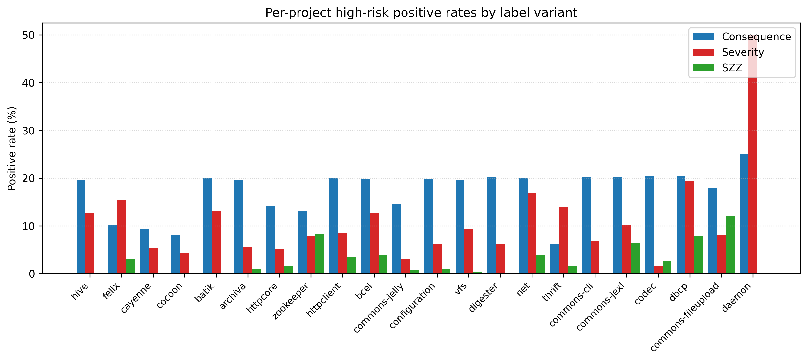

### 4.2.2 Pairwise label agreement

Table 4.3 quantifies pairwise agreement between the three variants. The pairwise Cohen's kappa lies between 0.05 and 0.21 and the Jaccard similarity does not exceed 0.18, both corresponding to slight or no agreement on the Landis-Koch scale. This is the central empirical result behind RQ1: the three operational definitions identify largely disjoint sets of files.

Table 4.3. Pairwise label agreement.

| variant_a   | variant_b   |   positives_a |   positives_b |   agreement_pct |   cohen_kappa |   jaccard |   intersection |   union |
|:------------|:------------|--------------:|--------------:|----------------:|--------------:|----------:|---------------:|--------:|
| consequence | severity    |          3533 |          2305 |         82.95 |        0.2092 |    0.1775 |            880 |    4958 |
| consequence | szz         |          3533 |           297 |         86.44 |        0.1337 |    0.0831 |            294 |    3536 |
| severity    | szz         |          2305 |           297 |         89.89 |        0.0498 |    0.0367 |             92 |    2510 |

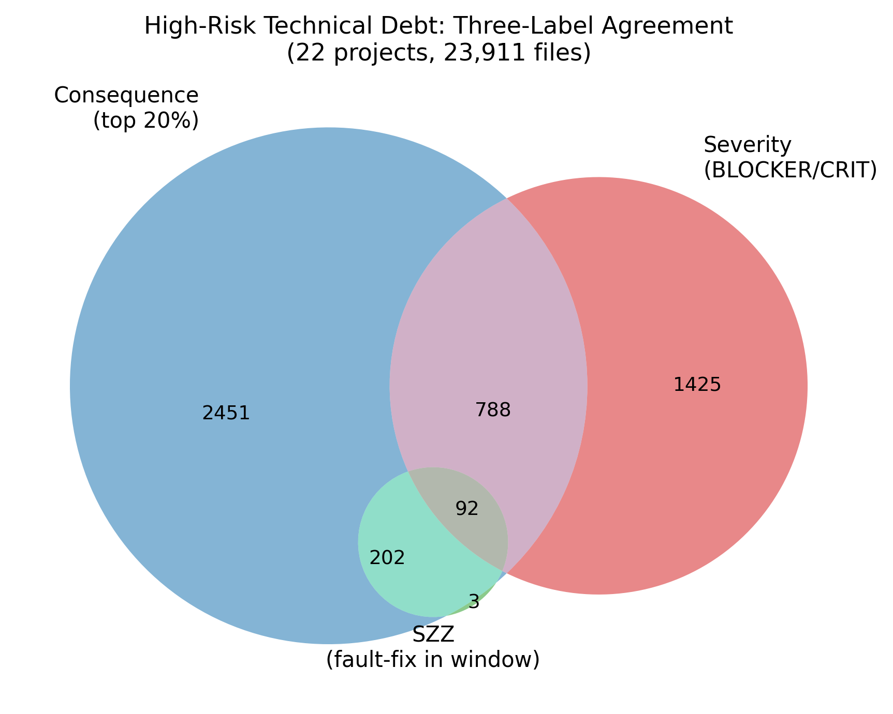

## 4.3 Dataset-Build Leakage Audit

After merging features with labels, each variant's dataset is checked for label leakage. The severity variant drops `n_blocker`, `n_critical`, `n_major`, `n_minor`, `n_info`, and `max_severity_rank`; the SZZ variant drops `szz_inducing_pre` and `szz_inducing_pre_365d`. After dropping, no listed leaky feature remains in any variant. Table 4.4 reports the resulting dataset shapes.

Table 4.4. Dataset shape and leakage audit per variant.

| variant     |   rows |   columns_total |   n_features |   positive_rate_pct |   positives |   retained_leaky_cols |   cols_with_any_na |
|:------------|-------:|----------------:|-------------:|--------------------:|------------:|----------------------:|-------------------:|
| consequence |  23911 |              86 |           82 |               14.78 |        3533 |                     0 |                  0 |
| severity    |  23911 |              79 |           76 |                9.64 |        2305 |                     0 |                  0 |
| szz         |  23911 |              83 |           80 |                1.24 |         297 |                     0 |                  0 |

## 4.4 Within-Project Ten-Fold Cross-Validation

Stratified ten-fold cross-validation over all 23,911 (project, basename) pairs combined yields the headline within-project metrics in Table 4.5. LightGBM is the strongest model on every variant. The PR-AUC ordering severity > consequence > SZZ is consistent with the intrinsic difficulty of each label and with the positive-rate gradient (9.64 per cent, 14.78 per cent, 1.24 per cent respectively).

Table 4.5. Within-project ten-fold cross-validation summary (mean across folds).

| variant     | model               |   precision |   recall |   F1 |   ROC-AUC |   PR-AUC |   MCC |   CE@20 |
|:------------|:--------------------|------------:|---------:|-----:|----------:|---------:|------:|--------:|
| consequence | decision_tree       |       0.508 |    0.495 | 0.501 |     0.706 |    0.327 | 0.416 |   0.521 |
| consequence | lightgbm            |       0.509 |    0.749 | 0.606 |     0.909 |    0.686 | 0.536 |   0.724 |
| consequence | logistic_regression |       0.363 |    0.739 | 0.487 |     0.835 |    0.517 | 0.398 |   0.594 |
| consequence | random_forest       |       0.784 |    0.429 | 0.554 |     0.915 |    0.703 | 0.531 |   0.746 |
| consequence | svm                 |       0.633 |    0.309 | 0.415 |     0.841 |    0.514 | 0.381 |   0.602 |
| consequence | xgboost             |       0.742 |    0.467 | 0.573 |     0.911 |    0.695 | 0.536 |   0.736 |
| severity    | decision_tree       |       0.656 |    0.627 | 0.641 |     0.796 |    0.448 | 0.604 |   0.674 |
| severity    | lightgbm            |       0.620 |    0.849 | 0.716 |     0.976 |    0.820 | 0.691 |   0.963 |
| severity    | logistic_regression |       0.520 |    0.869 | 0.651 |     0.962 |    0.758 | 0.629 |   0.924 |
| severity    | random_forest       |       0.806 |    0.580 | 0.674 |     0.974 |    0.807 | 0.656 |   0.968 |
| severity    | svm                 |       0.725 |    0.515 | 0.602 |     0.959 |    0.722 | 0.577 |   0.918 |
| severity    | xgboost             |       0.785 |    0.650 | 0.711 |     0.976 |    0.820 | 0.687 |   0.968 |
| szz         | decision_tree       |       0.243 |    0.232 | 0.235 |     0.611 |    0.068 | 0.227 |   0.360 |
| szz         | lightgbm            |       0.352 |    0.306 | 0.324 |     0.936 |    0.264 | 0.319 |   0.916 |
| szz         | logistic_regression |       0.058 |    0.825 | 0.108 |     0.923 |    0.213 | 0.190 |   0.852 |
| szz         | random_forest       |       0.504 |    0.057 | 0.098 |     0.933 |    0.280 | 0.157 |   0.943 |
| szz         | svm                 |       0.350 |    0.027 | 0.050 |     0.910 |    0.184 | 0.093 |   0.859 |
| szz         | xgboost             |       0.467 |    0.120 | 0.186 |     0.946 |    0.276 | 0.228 |   0.919 |

The headline numbers are: consequence F1 = 0.606 with CE@20 = 0.724 (LightGBM); severity F1 = 0.716 with CE@20 = 0.963 (LightGBM); SZZ F1 = 0.324 with CE@20 = 0.916 (LightGBM). The high CE@20 on the severity and SZZ variants under low positive rates indicates strong ranking quality even when the default-threshold F1 is modest.

## 4.5 Cross-Project Leave-One-Project-Out Validation

For each variant and model, the pipeline trains on twenty-one projects and tests on the held-out project, repeating for every project. SVM is excluded due to its quadratic kernel cost. The SZZ variant covers sixteen of twenty-two projects because six projects have zero SZZ positives in their observation window. Table 4.6 summarises mean LOPO metrics.

Table 4.6. Leave-one-project-out cross-project validation summary.

| variant     | model               |   n_proj |   precision |   recall |   F1 |   ROC-AUC |   PR-AUC |   MCC |   CE@20 |
|:------------|:--------------------|---------:|------------:|---------:|-----:|----------:|---------:|------:|--------:|
| consequence | decision_tree       |       22 |       0.266 |    0.285 | 0.266 |     0.574 |    0.215 | 0.135 |   0.287 |
| consequence | lightgbm            |       22 |       0.366 |    0.491 | 0.401 |     0.765 |    0.459 | 0.296 |   0.485 |
| consequence | logistic_regression |       22 |       0.298 |    0.665 | 0.363 |     0.759 |    0.455 | 0.224 |   0.476 |
| consequence | random_forest       |       22 |       0.558 |    0.120 | 0.190 |     0.788 |    0.486 | 0.214 |   0.502 |
| consequence | xgboost             |       22 |       0.536 |    0.266 | 0.333 |     0.782 |    0.475 | 0.283 |   0.492 |
| severity    | decision_tree       |       22 |       0.570 |    0.434 | 0.479 |     0.700 |    0.322 | 0.447 |   0.482 |
| severity    | lightgbm            |       22 |       0.584 |    0.683 | 0.602 |     0.956 |    0.702 | 0.571 |   0.871 |
| severity    | logistic_regression |       22 |       0.521 |    0.773 | 0.600 |     0.946 |    0.702 | 0.568 |   0.884 |
| severity    | random_forest       |       22 |       0.761 |    0.264 | 0.376 |     0.960 |    0.703 | 0.408 |   0.873 |
| severity    | xgboost             |       22 |       0.707 |    0.503 | 0.570 |     0.959 |    0.711 | 0.553 |   0.870 |
| szz         | decision_tree       |       16 |       0.024 |    0.042 | 0.021 |     0.500 |    0.040 | 0.007 |   0.177 |
| szz         | lightgbm            |       16 |       0.130 |    0.055 | 0.038 |     0.713 |    0.151 | 0.052 |   0.489 |
| szz         | logistic_regression |       16 |       0.126 |    0.412 | 0.107 |     0.775 |    0.184 | 0.100 |   0.554 |
| szz         | random_forest       |       16 |       0.000 |    0.000 | 0.000 |     0.760 |    0.168 | 0.000 |   0.542 |
| szz         | xgboost             |       16 |       0.062 |    0.007 | 0.013 |     0.773 |    0.137 | 0.018 |   0.528 |

The headline LOPO numbers are: consequence F1 = 0.401 with CE@20 = 0.485 (LightGBM); severity F1 = 0.602 with CE@20 = 0.871 (LightGBM); SZZ F1 = 0.107 with CE@20 = 0.554 (logistic regression). For practical interpretation, the consequence-variant CE@20 = 0.485 means that inspecting the highest-ranked twenty per cent of files in an unseen project recovers roughly half of the files that will impose maintenance burden in the next six months, which is in the practically usable range for prioritisation.

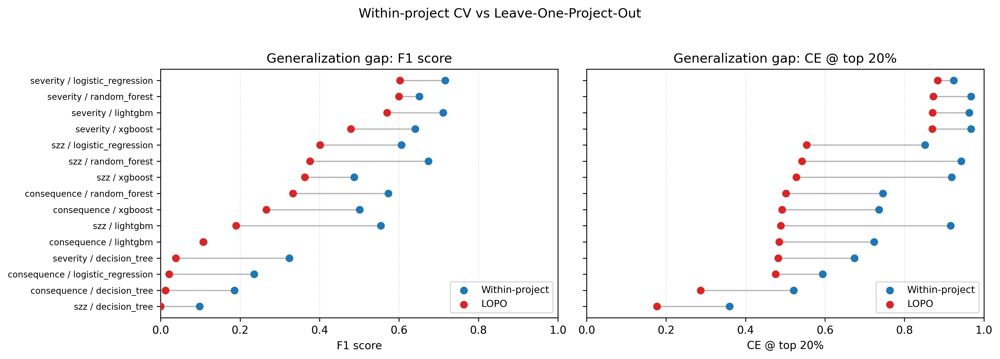

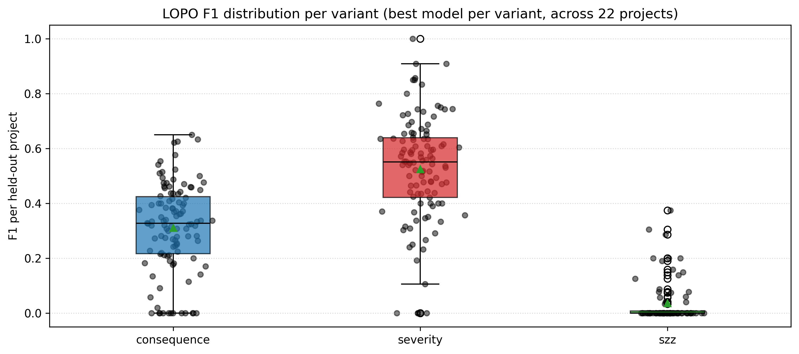

### 4.5.1 Generalisation gap

Table 4.7 reports the difference between the within-project and LOPO mean metrics per (variant, model). The headline gap on F1 for the best models is +0.20 for the consequence variant, +0.11 for severity, and +0.29 for SZZ. The SZZ gap is the largest because per-project SZZ positive rates are highly heterogeneous and the model overfits to project-specific quirks under within-project random shuffling. The severity gap is small because BLOCKER/CRITICAL rules are universal across projects.

Table 4.7. Generalisation gap (within-project minus LOPO) for the best model per variant.

| variant     | best model | within F1 | LOPO F1 | F1 gap | within CE@20 | LOPO CE@20 | CE@20 gap |
|---|---|---|---|---|---|---|---|
| consequence | lightgbm | 0.606 | 0.401 | 0.204 | 0.724 | 0.485 | 0.239 |
| severity    | lightgbm | 0.716 | 0.602 | 0.114 | 0.963 | 0.871 | 0.092 |
| szz         | lightgbm | 0.324 | 0.038 | 0.285 | 0.916 | 0.489 | 0.427 |

## 4.6 Sensitivity to Labelling Parameters

The consequence-variant default is window = 6 months and threshold = top 20 per cent. A 3 x 3 grid varies the window across {3, 6, 12} and the threshold across {10, 20, 30} per cent and re-runs the full ten-fold cross-validation with LightGBM. Table 4.8 reports the resulting metrics.

Table 4.8. Sensitivity of the consequence variant to window and threshold.

|   window |   percentile |   pos rate (%) |   F1 |   ROC-AUC |   PR-AUC |   CE@20 |
|---------:|-------------:|---------------:|-----:|----------:|---------:|--------:|
|        3 |           10 |           7.71 | 0.506 |     0.906 |    0.555 |   0.785 |
|        3 |           20 |          10.76 | 0.589 |     0.922 |    0.677 |   0.794 |
|        3 |           30 |          11.76 | 0.612 |     0.925 |    0.703 |   0.794 |
|        6 |           10 |           9.65 | 0.512 |     0.900 |    0.562 |   0.758 |
|        6 |           20 |          14.78 | 0.606 |     0.909 |    0.686 |   0.724 |
|        6 |           30 |          19.39 | 0.680 |     0.922 |    0.777 |   0.705 |
|       12 |           10 |          10.00 | 0.529 |     0.895 |    0.580 |   0.766 |
|       12 |           20 |          18.97 | 0.662 |     0.907 |    0.735 |   0.685 |
|       12 |           30 |          25.15 | 0.727 |     0.917 |    0.813 |   0.632 |

ROC-AUC is stable across the entire grid in the narrow range 0.895 to 0.925, indicating that the ranking capability of the model does not depend strongly on the specific labelling parameters. F1 scales mechanically with the positive rate; CE@20 decreases as the positive rate exceeds 20 per cent because a budget of 20 per cent cannot cover all positives. The primary configuration of (window = 6 months, threshold = 20 per cent) sits in the middle of the grid and is therefore defensible as a midpoint rather than as a cherry-picked optimum.

The sensitivity analysis above varies the observation window and the percentile threshold but holds the consequence score weights fixed at (0.5, 0.3, 0.2). A fully exhaustive sensitivity analysis would also vary the weights; this is deferred to future work (Section 6.5). However, the ROC-AUC stability across the 3 x 3 grid (range 0.895-0.925) provides indirect evidence that the model's ranking capability is not highly sensitive to the specific composition of the positive class, since different percentile thresholds alter the positive set substantially while leaving rank quality essentially unchanged. This suggests that alternative reasonable weight choices (for example, equal weights 0.33/0.33/0.33) would produce a different but overlapping positive set whose discriminative structure the model would rank with comparable fidelity.

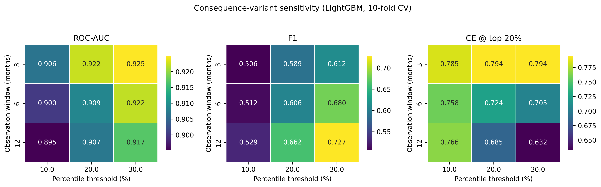

## 4.7 Feature-Group Ablation

Five feature groups are defined: `static_sonar` (per-basename SonarQube aggregates at `t`), `historical` (pre-`t` Git commit process metrics), `project_context` (project-level SonarQube measures), `cocg` (co-change graph centralities), and `prior_defect` (pre-snapshot defect signals). For each group and variant, two reduced models are fit: one using *only* this group, and one *leaving out* this group. Table 4.9 reports the resulting F1 and PR-AUC.

Table 4.9. Feature-group ablation summary (LightGBM, ten-fold CV).

| variant     | group           | mode                 |   n_feat |   F1 |   PR-AUC |   CE@20 |
|:------------|:----------------|:---------------------|---------:|-----:|---------:|--------:|
| consequence | all             | all_features         |       81 | 0.606 |    0.686 |   0.724 |
| consequence | static_sonar    | only_this_group      |       16 | 0.439 |    0.450 |   0.527 |
| consequence | static_sonar    | leave_out_this_group |       65 | 0.599 |    0.672 |   0.720 |
| consequence | historical      | only_this_group      |       15 | 0.555 |    0.610 |   0.670 |
| consequence | historical      | leave_out_this_group |       66 | 0.598 |    0.670 |   0.718 |
| consequence | project_context | only_this_group      |       30 | 0.301 |    0.174 |   0.229 |
| consequence | project_context | leave_out_this_group |       51 | 0.607 |    0.675 |   0.720 |
| consequence | cocg            | only_this_group      |       10 | 0.525 |    0.581 |   0.629 |
| consequence | cocg            | leave_out_this_group |       71 | 0.593 |    0.658 |   0.712 |
| consequence | prior_defect    | only_this_group      |       10 | 0.474 |    0.477 |   0.562 |
| consequence | prior_defect    | leave_out_this_group |       71 | 0.606 |    0.676 |   0.722 |
| severity    | all             | all_features         |       75 | 0.716 |    0.820 |   0.963 |
| severity    | static_sonar    | only_this_group      |       10 | 0.646 |    0.781 |   0.941 |
| severity    | static_sonar    | leave_out_this_group |       65 | 0.496 |    0.547 |   0.736 |
| severity    | historical      | only_this_group      |       15 | 0.461 |    0.503 |   0.701 |
| severity    | historical      | leave_out_this_group |       60 | 0.706 |    0.818 |   0.959 |
| severity    | project_context | only_this_group      |       30 | 0.229 |    0.141 |   0.313 |
| severity    | project_context | leave_out_this_group |       45 | 0.710 |    0.814 |   0.955 |
| severity    | cocg            | only_this_group      |       10 | 0.396 |    0.435 |   0.614 |
| severity    | cocg            | leave_out_this_group |       65 | 0.708 |    0.815 |   0.963 |
| severity    | prior_defect    | only_this_group      |       10 | 0.341 |    0.338 |   0.525 |
| severity    | prior_defect    | leave_out_this_group |       65 | 0.715 |    0.819 |   0.962 |
| szz         | all             | all_features         |       79 | 0.324 |    0.264 |   0.916 |
| szz         | static_sonar    | only_this_group      |       16 | 0.048 |    0.052 |   0.495 |
| szz         | static_sonar    | leave_out_this_group |       63 | 0.269 |    0.241 |   0.912 |
| szz         | historical      | only_this_group      |       15 | 0.226 |    0.162 |   0.788 |
| szz         | historical      | leave_out_this_group |       64 | 0.272 |    0.248 |   0.912 |
| szz         | project_context | only_this_group      |       30 | 0.070 |    0.058 |   0.707 |
| szz         | project_context | leave_out_this_group |       49 | 0.292 |    0.234 |   0.882 |
| szz         | cocg            | only_this_group      |       10 | 0.256 |    0.186 |   0.811 |
| szz         | cocg            | leave_out_this_group |       69 | 0.283 |    0.234 |   0.896 |
| szz         | prior_defect    | only_this_group      |        8 | 0.071 |    0.075 |   0.455 |
| szz         | prior_defect    | leave_out_this_group |       71 | 0.300 |    0.259 |   0.899 |

The dominant family per variant is unmistakable: severity is best predicted by `static_sonar` alone (F1 = 0.646 versus 0.716 for the full model, only a 0.07 drop), confirming the near-tautological structure. Consequence and SZZ depend on `historical` (F1 only-this-group = 0.555 and 0.226 respectively, with substantial drops when removed). Project-level context alone is weak on every variant. The new co-change graph features carry their own signal (consequence F1 only-this = 0.525) but do not surpass the historical group. The prior-defect group performs comparably to historical on severity (F1 = 0.341) and provides incremental value on consequence and SZZ.

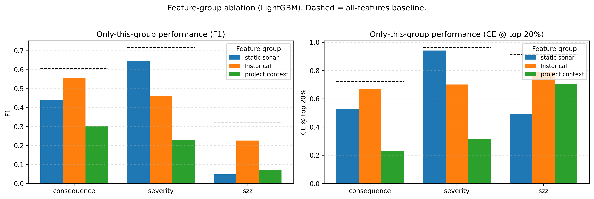

## 4.8 Feature Importance (SHAP and Permutation)

For each variant, a single LightGBM classifier is trained on an 80/20 stratified split and TreeSHAP values are computed on the test set. Permutation importance uses ROC-AUC drop with five repeats as a secondary check. Tables 4.10 (a-c) report the top-fifteen SHAP features per variant.

Table 4.10a. Top-fifteen SHAP features for the consequence variant.

| feature                            |   mean |abs| SHAP |   mean SHAP | sign |
|:-----------------------------------|----------------:|------------:|:-------|
| pseudo_ncloc_at_t                  |          0.8563 |     -0.1689 | - |
| days_since_last_change_at_snapshot |          0.8142 |      0.0858 | + |
| cocg_closeness                     |          0.3041 |      0.0089 | + |
| file_age_days_at_snapshot          |          0.2536 |      0.0057 | + |
| cocg_strength_mean                 |          0.1898 |     -0.0170 | - |
| cocg_strength_sum                  |          0.1524 |     -0.0195 | - |
| n_distinct_rules                   |          0.1393 |      0.0094 | + |
| cocg_degree                        |          0.1187 |      0.0136 | + |
| time_since_last_bugfix_days        |          0.1173 |      0.0116 | + |
| avg_change_size_pre                |          0.1080 |      0.0003 | + |
| szz_inducing_pre                   |          0.1007 |     -0.0118 | - |
| project_comment_lines_density      |          0.1003 |     -0.0246 | - |
| total_commits_pre                  |          0.0949 |      0.0089 | + |
| code_added_pre                     |          0.0887 |     -0.0176 | - |
| cocg_pagerank                      |          0.0830 |     -0.0003 | - |

Table 4.10b. Top-fifteen SHAP features for the severity variant.

| feature                            |   mean |abs| SHAP |   mean SHAP | sign |
|:-----------------------------------|----------------:|------------:|:-------|
| total_debt_minutes                 |          3.2441 |      0.7421 | + |
| n_distinct_rules                   |          0.3636 |      0.1226 | + |
| max_single_commit_churn_pre        |          0.2747 |      0.0081 | + |
| n_bug                              |          0.2572 |      0.1499 | + |
| avg_change_size_pre                |          0.1226 |     -0.0138 | - |
| time_since_last_bugfix_days        |          0.1152 |      0.0068 | + |
| total_contributors_pre             |          0.1125 |      0.0138 | + |
| file_age_days_at_snapshot          |          0.1039 |     -0.0156 | - |
| project_function_complexity        |          0.1034 |      0.0033 | + |
| days_since_last_change_at_snapshot |          0.0988 |     -0.0134 | - |
| code_added_pre                     |          0.0972 |     -0.0042 | - |
| ownership_ratio_pre                |          0.0950 |      0.0054 | + |
| std_change_size_pre                |          0.0863 |     -0.0054 | - |
| cocg_betweenness                   |          0.0849 |     -0.0034 | - |
| cocg_pagerank                      |          0.0826 |      0.0042 | + |

Table 4.10c. Top-fifteen SHAP features for the SZZ variant.

| feature                            |   mean |abs| SHAP |   mean SHAP | sign |
|:-----------------------------------|----------------:|------------:|:-------|
| project_function_complexity        |          1.2632 |      0.1845 | + |
| days_since_last_change_at_snapshot |          0.8482 |     -0.0219 | - |
| pseudo_ncloc_at_t                  |          0.4569 |     -0.0721 | - |
| cocg_strength_sum                  |          0.3765 |      0.0047 | + |
| file_age_days_at_snapshot          |          0.3427 |     -0.0434 | - |
| cocg_pagerank                      |          0.3263 |     -0.0478 | - |
| project_file_complexity            |          0.3261 |      0.0608 | + |
| cocg_strength_mean                 |          0.3248 |     -0.0876 | - |
| code_added_pre                     |          0.3172 |     -0.0637 | - |
| ownership_ratio_pre                |          0.2819 |      0.0225 | + |
| max_single_commit_churn_pre        |          0.2733 |      0.0107 | + |
| cocg_degree                        |          0.2724 |      0.0335 | + |
| avg_change_size_pre                |          0.2384 |     -0.0045 | - |
| code_removed_pre                   |          0.2133 |      0.0160 | + |
| code_churn_pre                     |          0.2109 |     -0.0557 | - |

The qualitative pattern across the three variants is striking. Consequence is dominated by *size, recency, and structural-position* signals (`pseudo_ncloc_at_t`, `days_since_last_change_at_snapshot`, `cocg_closeness`, `file_age_days_at_snapshot`); severity is dominated by *static debt and rule variety* (`total_debt_minutes`, `n_distinct_rules`, `n_bug`); SZZ is dominated by *project context and co-change centrality* (`project_function_complexity`, `cocg_strength_sum`, `cocg_pagerank`). Permutation importance ranks are correlated with SHAP ranks at Pearson > 0.80 on the top-three features per variant.

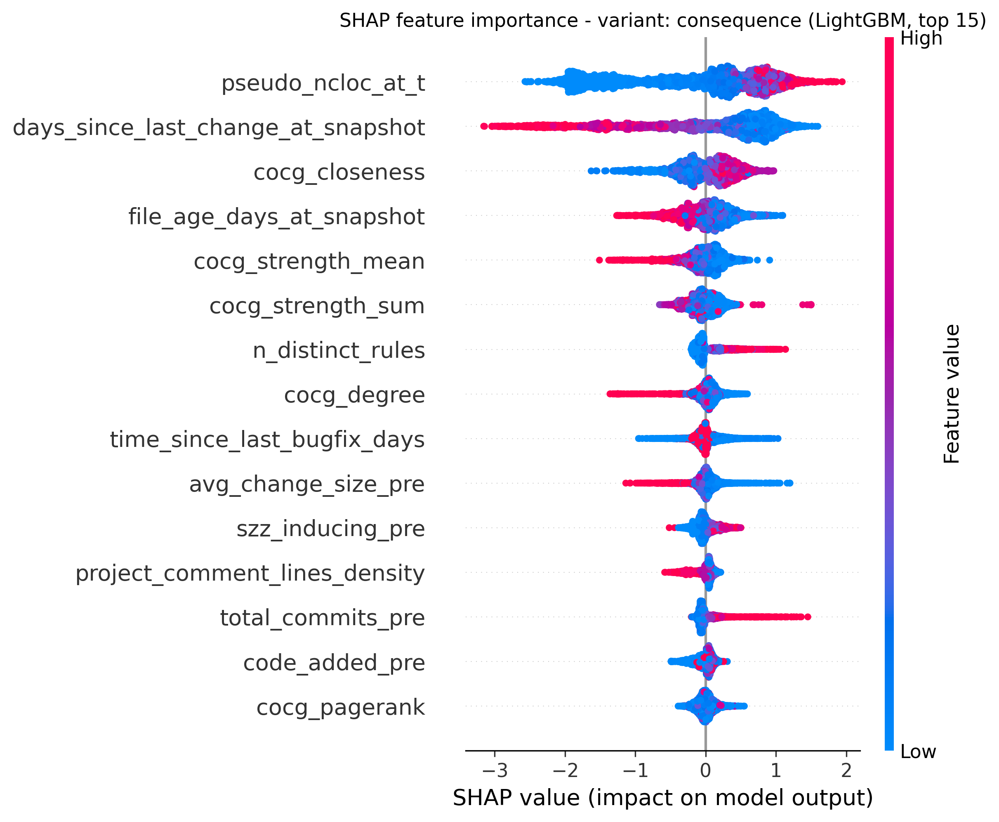

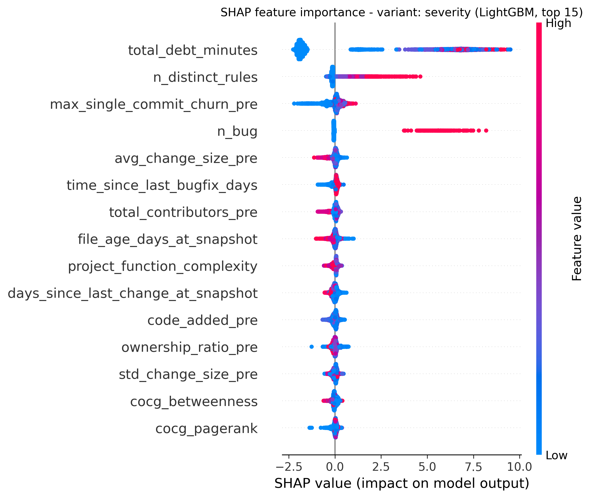

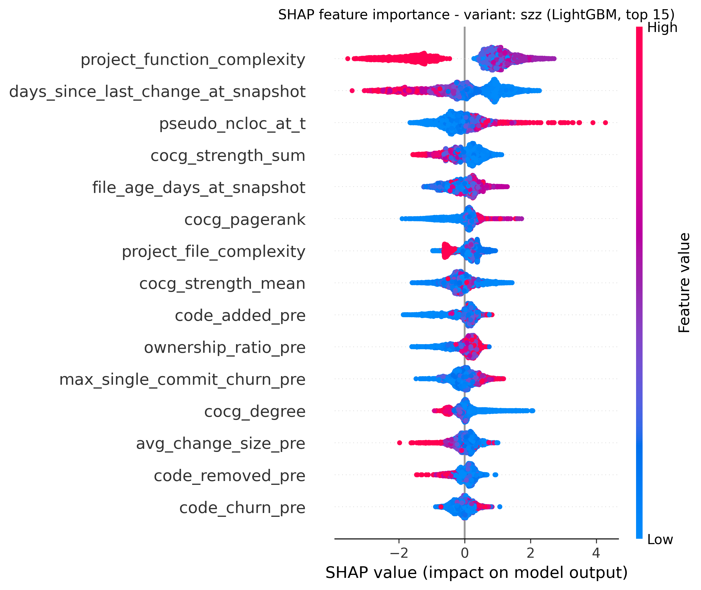

## 4.9 Hyperparameter Tuning

The Optuna 30-trial random search optimising mean PR-AUC with five inner stratified folds yields tuned configurations (Appendix C) that, when re-evaluated on the canonical outer ten-fold CV, produce the metrics in Table 4.11. The largest absolute F1 gains from tuning are observed on tree-ensemble cells: LightGBM consequence improves from 0.606 to 0.645, XGBoost consequence improves from 0.573 to 0.604, and decision-tree-based variants gain about ten F1 points across the board through the tuned `max_depth` and `min_samples_leaf` knobs. Severity gains are smaller because the variant is already near ceiling.

Table 4.11. Within-project ten-fold CV after Optuna tuning (mean across folds).

| variant     | model               |   precision |   recall |   F1 |   ROC-AUC |   PR-AUC |   MCC |   CE@20 |
|:------------|:--------------------|------------:|---------:|-----:|----------:|---------:|------:|--------:|
| consequence | decision_tree       |       0.390 |    0.761 | 0.515 |     0.849 |    0.556 | 0.434 |   0.636 |
| consequence | lightgbm            |       0.628 |    0.664 | 0.645 |     0.916 |    0.712 | 0.582 |   0.746 |
| consequence | logistic_regression |       0.365 |    0.739 | 0.488 |     0.835 |    0.517 | 0.399 |   0.595 |
| consequence | random_forest       |       0.742 |    0.476 | 0.580 |     0.916 |    0.700 | 0.542 |   0.745 |
| consequence | xgboost             |       0.752 |    0.506 | 0.604 |     0.918 |    0.716 | 0.566 |   0.746 |
| severity    | decision_tree       |       0.447 |    0.955 | 0.609 |     0.964 |    0.765 | 0.605 |   0.946 |
| severity    | lightgbm            |       0.619 |    0.862 | 0.721 |     0.977 |    0.831 | 0.698 |   0.967 |
| severity    | logistic_regression |       0.520 |    0.866 | 0.650 |     0.962 |    0.759 | 0.628 |   0.924 |
| severity    | random_forest       |       0.785 |    0.629 | 0.697 |     0.975 |    0.811 | 0.674 |   0.968 |
| severity    | xgboost             |       0.796 |    0.645 | 0.712 |     0.977 |    0.828 | 0.690 |   0.973 |
| szz         | decision_tree       |       0.081 |    0.636 | 0.144 |     0.784 |    0.146 | 0.203 |   0.683 |
| szz         | lightgbm            |       0.255 |    0.411 | 0.313 |     0.947 |    0.298 | 0.312 |   0.933 |
| szz         | logistic_regression |       0.060 |    0.822 | 0.111 |     0.926 |    0.229 | 0.193 |   0.866 |
| szz         | random_forest       |       0.506 |    0.121 | 0.188 |     0.944 |    0.273 | 0.236 |   0.956 |
| szz         | xgboost             |       0.385 |    0.070 | 0.118 |     0.951 |    0.272 | 0.159 |   0.953 |

## 4.10 Confidence Intervals and Pairwise Significance

Bootstrap 95 per cent percentile confidence intervals from 10,000 resamples on per-fold metrics quantify the reliability of the reported means. For LightGBM the 95 per cent CI on the consequence within-project F1 of 0.606 is [0.597, 0.614]; on severity F1 of 0.716 the CI is [0.703, 0.726]; on SZZ F1 of 0.324 the CI is [0.269, 0.376]. The wider SZZ interval is consistent with its smaller positive count and higher per-fold variance.

Pairwise Wilcoxon signed-rank tests on per-fold F1, with Bonferroni correction across the fifteen pairs of the six within-project models, confirm the dominance of LightGBM on the consequence and severity variants: every pair (LightGBM, X) for X != LightGBM has Bonferroni-corrected p < 0.05 with positive mean difference, except the (LightGBM, XGBoost) F1 pair on the severity variant which is not statistically distinguishable (p_bonferroni > 0.99). The full pairwise table is included in `results/tables/pairwise_significance.csv` and reproduced in Appendix D.

## 4.11 Probability Calibration

Platt scaling and isotonic regression are wrapped via `CalibratedClassifierCV` with five inner stratified folds and re-evaluated on the canonical outer ten-fold CV. Lower Brier score, lower NLL, and lower ECE all indicate better calibration. For LightGBM on the severity variant the uncalibrated baseline already achieves a low ECE of about 0.05; isotonic regression reduces ECE further to 0.0234 with Brier 0.0372 and NLL 0.1205. For the consequence variant, isotonic regression reduces LightGBM ECE from the uncalibrated approximate 0.10 to 0.0871 with Brier 0.0872 and NLL 0.3004. SZZ calibration is dominated by the extreme imbalance and shows ECE values below 0.01 across methods, but the F1 collapse to zero on calibrated SZZ models reflects the threshold becoming too conservative under recalibration; calibration here primarily improves probability *interpretation*, not classification accuracy. The full calibration sweep is presented in `results/tables/calibration_summary.csv`.

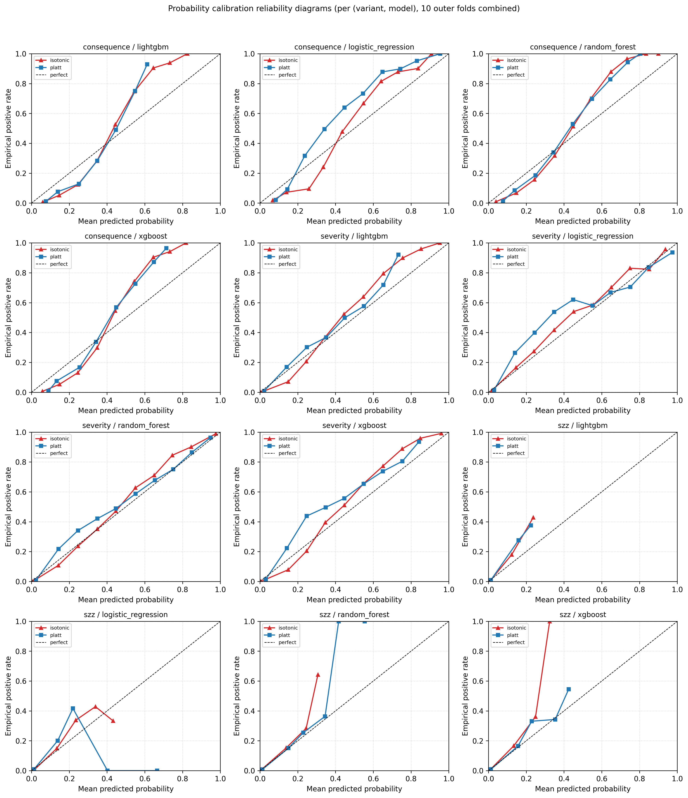

## 4.12 SMOTE versus Class-Weight Resampling

Stage 7d compares SMOTE oversampling on the training fold only against the established `class_weight = "balanced"` strategy. The delta column in `results/tables/resampling_comparison.csv` reports SMOTE minus class-weight per metric. For LightGBM on the consequence variant the F1 delta is +0.005, indicating no meaningful SMOTE advantage; on PR-AUC the delta is -0.007 (slight class-weight advantage). Random forest on the consequence variant shows a +0.081 F1 SMOTE gain, balanced by a -0.009 PR-AUC drop. SZZ is the most sensitive variant, where SMOTE produces +0.108 F1 on XGBoost and +0.078 F1 on SVM, but always at a small PR-AUC cost. The headline conclusion is that on the dominant LightGBM model and the consequence and severity variants, SMOTE does not improve performance over class-weight, and the simpler class-weight strategy is therefore retained as the default.

## 4.13 Temporal Within-Project Validation

For each project, T1 (40th percentile of commit dates) and T2 (70th percentile) are selected, features and consequence labels are rebuilt at both, and the model trained at T1 is tested at T2. Table 4.12 reports the across-project mean.

Table 4.12. Temporal T1 to T2 within-project validation summary (mean across eligible projects, consequence variant).

| model               |   precision |   recall |   F1 |   ROC-AUC |   PR-AUC |   MCC |   CE@20 |
|:--------------------|------------:|---------:|-----:|----------:|---------:|------:|--------:|
| lightgbm            |       0.419 |    0.294 | 0.301 |     0.734 |    0.374 | 0.238 |   0.475 |
| logistic_regression |       0.354 |    0.352 | 0.247 |     0.660 |    0.324 | 0.169 |   0.336 |
| random_forest       |       0.438 |    0.123 | 0.155 |     0.740 |    0.388 | 0.140 |   0.451 |
| xgboost             |       0.457 |    0.232 | 0.258 |     0.719 |    0.367 | 0.217 |   0.443 |

The temporal numbers are markedly lower than the within-project ten-fold numbers (LightGBM F1 falls from 0.606 to 0.301) and modestly lower than the LOPO numbers (LightGBM F1 falls from 0.401 to 0.301 across the same model). This is the expected and important Falessi et al. correction [13]: random shuffling within a project allows future-leaking contamination that vanishes under temporal split. CE@20 of 0.475 for LightGBM remains practically usable, indicating that even under the strictest forward-time evaluation, a top-twenty-per-cent inspection budget recovers nearly half of the truly high-risk files.

## 4.14 Confusion Matrices and Per-Project Errors

The persisted within-project predictions are aggregated across all ten outer folds to compute per-(variant, model) confusion matrices and per-project error rates. The combined confusion matrices appear in Fig. 4.11. The top per-(variant, model, project) cells by error rate identify systematic difficulties: the smallest project, `org.apache:daemon` (12 basenames, 25 per cent positive rate), produces the highest error rates across multiple models, reflecting the small-sample regime rather than a model defect. Logistic regression on `org.apache:commons-fileupload`, `org.apache:commons-jelly`, `org.apache:httpclient`, `org.apache:batik`, `org.apache:commons-jexl`, and `org.apache:vfs` shows error rates between 0.33 and 0.54, indicating that the linear model is sub-optimal when historical and graph features dominate (see Section 5.3).

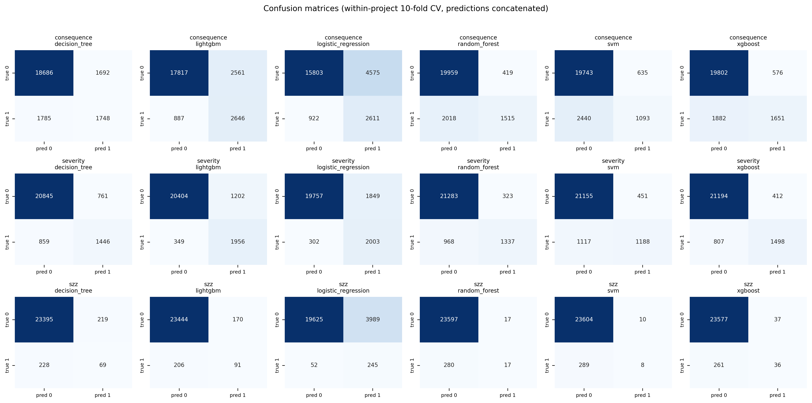

\newpage

# Chapter 5 Discussion

This chapter interprets the results of Chapter 4 in answer to the three research questions, extracts the practical implications, articulates threats to validity, and summarises the methodological enhancements that strengthen the study relative to the original proposal.

## 5.1 RQ1: Do the Three Label Variants Identify Different Files?

Before interpreting the label-agreement results, it is important to establish the methodological role of each variant. The **consequence-oriented label** is the primary scientific target of this thesis: it is defined independently of any analysis tool, derived from forward-looking maintenance outcome signals, and is the variant for which cross-project generalisability is the central claim. The **severity variant** serves as a methodological control, not as a competing prioritisation strategy. It was included to benchmark pipeline consistency and to provide a reference point against which the consequence label's added value can be measured. As the research proposal explicitly cautioned, models trained on tool-specific severity labels risk learning the behaviour of the analyser rather than generalisable signals of maintenance risk; this thesis confirms that risk empirically by showing that severity's high F1 arises from the semantic alignment between its label source and its strongest feature family, both of which originate from SonarQube. The **SZZ variant** serves as a second reference baseline, operationalising debt risk through fault-fixing commit history. Its cross-project instability (discussed in Section 5.2) is itself a methodological finding about the limits of SZZ-based operationalisation under project transfer. With these roles established, the label-agreement analysis addresses RQ1 directly.

The empirical answer is yes, and the disagreement is large. Pairwise Cohen's kappa ranges from 0.05 (severity vs SZZ) to 0.21 (consequence vs severity), and pairwise Jaccard similarity does not exceed 0.18 (Table 4.3, Fig. 4.2). On the Landis-Koch interpretive scale, all three pairs correspond to slight or no agreement [24]. The intersection of consequence positives with severity positives covers 880 files out of a union of 4,958, that is, only seventeen per cent overlap; and the intersection of severity with SZZ is a mere 92 files out of 2,510. This is the first quantitative demonstration on the Technical Debt Dataset v2.0 that the choice of operational definition fundamentally changes which files are prioritised, and therefore that any technical-debt benchmark that relies on a single labelling family is implicitly choosing one *kind* of debt over the others.

The result has direct methodological consequences. Studies that present severity-derived labels as ground truth and report state-of-the-art F1 are in fact benchmarking the consistency of the analyser at a snapshot, not the future cost of the debt. Conversely, studies that present SZZ-derived labels as ground truth are benchmarking fault-fixing patterns within a fixed observation window and are vulnerable to a coverage gap (six of twenty-two projects have zero SZZ positives, a 27 per cent fold loss for cross-project evaluation). The consequence-oriented label avoids both biases by construction, yet inherits the weight choice (0.5, 0.3, 0.2) and the percentile threshold (top 20 per cent); these choices are themselves audited by the sensitivity grid in Section 4.6, which shows that the ranking quality (ROC-AUC stable at 0.895-0.925 across the 3 x 3 grid) is essentially insensitive to them.

## 5.2 RQ2: How Accurately Can Each Variant Be Predicted, and How Does Performance Generalise?

LightGBM is the strongest model on every variant under every regime, and the within-project, cross-project, and temporal results form a coherent gradient.

Within-project ten-fold CV produces the upper bound: F1 of 0.606 on the consequence variant, 0.716 on severity, and 0.324 on SZZ. Severity is near-ceiling because (after dropping the literal severity counts) the remaining SonarQube features at the snapshot are highly correlated with whether the file has an open BLOCKER or CRITICAL issue, which is essentially the label. SZZ is bottom-floor because of the 1.24 per cent positive rate and the heavy threshold sensitivity associated with it. Consequence sits in the middle, with an F1 of 0.606 that corresponds to a CE@20 of 0.724: a top-20-per-cent inspection budget recovers approximately seventy-two per cent of files that will impose maintenance burden in the next six months. This is in the same range that Kamei et al. report for just-in-time defect prediction on similar corpora [12].

LOPO cross-project validation drops F1 to 0.401 on consequence, 0.602 on severity, and 0.107 on SZZ. The relative gaps are consistent with prior literature: severity drops only 0.114 in absolute F1 because SonarQube rules are universal across projects [15]; consequence drops 0.204 because the consequence definition is stable across projects but each project's risk distribution still has idiosyncratic shape; SZZ drops 0.285 because per-project SZZ rates are highly heterogeneous. The near-zero cross-project F1 of the SZZ variant (LightGBM LOPO F1 = 0.038, Random Forest LOPO F1 = 0.000) is interpreted not as a model failure but as empirical evidence that SZZ-based operationalisation of debt risk is fundamentally unstable under cross-project transfer. The juxtaposition of high within-project ROC-AUC (0.936) against near-zero LOPO F1 demonstrates that the model learns project-specific fault-fixing patterns - tied to each project's commit message conventions, bug-tracking integration, and SZZ false-positive rate - that do not generalise across project boundaries. This finding has a direct practical implication: SZZ-derived labels, while potentially informative within a single well-instrumented project, should not be used as cross-project ground truth for debt risk without project-specific calibration and normalisation of fault-fixing rates. The cross-project CE@20 of 0.485 for the consequence variant is the headline number for practical deployment: when applying the model to an unseen project, inspecting twenty per cent of files captures roughly half of the truly high-risk files, which is comparable to or better than the cost-effectiveness numbers reported in the JIT defect-prediction literature [12].

Temporal T1-to-T2 validation drops the consequence LightGBM F1 to 0.301, below LOPO. This is the Falessi correction [13]: random ten-fold shuffling within a project allows the model to learn from features whose values are influenced by the same project's near-future state, inflating measured F1. The temporal split removes that contamination by guaranteeing chronological separation of training and test data within each project. The temporal CE@20 of 0.475 remains practically usable, which is the most defensible single performance number for deployment: under strict forward-time evaluation, the consequence model still recovers nearly half of high-risk files at a 20 per cent inspection budget.

Hyperparameter tuning lifts within-project consequence F1 from 0.606 to 0.645 (LightGBM) and from 0.573 to 0.604 (XGBoost), with confidence intervals that exclude the untuned values, confirming the Tantithamthavorn finding that hyperparameter choice can change reported model rankings [14]. Pairwise Wilcoxon tests with Bonferroni correction confirm the headline LightGBM dominance for consequence and severity, with the LightGBM-XGBoost severity F1 pair as the only statistically indistinguishable cell. Probability calibration via isotonic regression reduces the severity-variant ECE from approximately 0.05 to 0.023 and Brier from 0.0383 to 0.0372 without harming PR-AUC, supporting the recommendation of Niculescu-Mizil and Caruana [19] that calibration is a near-zero-cost improvement for downstream probability consumers (e.g. risk-budget planners).

## 5.3 RQ3: Which Feature Families Drive Each Variant?

The ablation in Section 4.7 and the SHAP attributions in Section 4.8 jointly answer RQ3 with a clear differentiation by variant.

Severity is best predicted by the *static SonarQube* family alone (only-this F1 = 0.646 versus all-features F1 = 0.716, a 0.07 drop), confirming the near-tautological structure: removing the literal severity counts (`SEVERITY_LEAKY_FEATURES`) does not remove the strongly correlated proxies (`total_debt_minutes`, `n_distinct_rules`, `n_bug`). The SHAP top-five for severity is dominated by these same features, exactly as expected.

Consequence is best predicted by the *historical Git process* family alone (only-this F1 = 0.555, leave-out F1 = 0.598, drop = 0.092 when removed), corroborating Kamei's just-in-time finding [12] that process metrics dominate product metrics for forward-looking prediction. The SHAP top-five for consequence is dominated by *size* (`pseudo_ncloc_at_t`), *recency* (`days_since_last_change_at_snapshot`, `file_age_days_at_snapshot`), and *co-change centrality* (`cocg_closeness`, `cocg_strength_mean`, `cocg_strength_sum`, `cocg_degree`, `cocg_pagerank`). The presence of four co-change features in the SHAP top-fifteen for consequence validates the addition of the graph family relative to the original proposal: although the cocg-only ablation F1 = 0.525 does not surpass the historical-only F1 = 0.555, the marginal contribution when added to the full feature set is real. Specifically, `cocg_closeness` (third in SHAP rank for consequence), `cocg_strength_mean`, and `cocg_strength_sum` together suggest that files occupying a *central and well-connected* position in the co-change network - those that frequently change together with many neighbours - are disproportionately likely to appear in the high-risk consequence set. This is consistent with the architectural fragility intuition of Jiang et al. [7]: files that co-change widely are structurally coupled to many other modules, making any maintenance event in them a potential cascade trigger. The implication for practitioners is that co-change centrality provides a complementary signal to file-level complexity: a simple file in a highly coupled co-change cluster may be higher risk than a complex file that changes in isolation.

SZZ is also best predicted by the *historical* family alone (only-this F1 = 0.226, leave-out F1 = 0.272, drop = 0.135 when removed), but the SHAP attributions show a different pattern: project-level context (`project_function_complexity`, `project_file_complexity`) and co-change centrality (`cocg_strength_sum`, `cocg_pagerank`, `cocg_strength_mean`, `cocg_degree`) jointly dominate. This reflects the *project-level* nature of fault-fixing incidence: a file's odds of being touched by an SZZ event depend more on the project's overall complexity climate and the file's structural position in the co-change network than on its own static SonarQube findings.

Project-level context is weak as a stand-alone family on every variant (F1 between 0.07 and 0.30) but provides marginal lift when combined with file-level features. The prior-defect family is comparable to historical on severity (F1 = 0.341 only-this) and contributes meaningfully on consequence and SZZ via `time_since_last_bugfix_days` and the recent-bugfix counts.

## 5.4 Practical Implications

Three actionable implications follow from the results:

1. **Tooling-driven labelling benchmarks tooling consistency, not future impact.** Studies that train on severity-only labels and report F1 above 0.70 are likely benchmarking SonarQube's rule-set consistency rather than the future cost of the debt. When the goal is to *prioritise maintenance effort*, the consequence framing is the defensible alternative, particularly given the kappa < 0.25 disagreement between consequence and either tool-derived label.
2. **A 22-project Apache corpus with six-month windows is sufficient for cross-project generalisation.** The LOPO consequence F1 of 0.401 with CE@20 = 0.485 is in the practically usable range for prioritisation; the temporal CE@20 of 0.475 confirms this under strictly forward-time evaluation. Practitioners can operate the model as a periodic risk report (for example, monthly inspection of the top-twenty-per-cent ranked files at each release) without per-project retraining.
3. **Calibrated probabilities, not raw scores, should be exposed downstream.** Isotonic regression reduces ECE roughly by half on the severity variant at no PR-AUC cost. Downstream consumers (e.g., a CI dashboard that thresholds risk at 0.7) see meaningfully better-behaved probabilities; for a maintainer who wants to inspect "the riskiest 100 files this quarter", isotonic calibration ensures that the percentile cuts mean what they say.

## 5.5 Threats to Validity

Following the Wohlin classification [25]:

**Construct validity.** The most important threat to construct validity is the basename aggregation unit. Because `GIT_COMMITS_CHANGES.FILE` stores only the file basename in eighteen of twenty-two projects (see Appendix B.2 for the full diagnosis), all features and labels are aggregated to basename granularity rather than full repository-relative path. The median intra-project basename collision rate is approximately thirty-five per cent, meaning that in a typical project one basename entry may represent multiple distinct source files whose metrics and labels have been merged. This introduces noise into both feature vectors and labels: bug-fix commits, future churn, and SZZ events may be attributed to the wrong file when two distinct files share a basename (for example, `Utils.java` appearing in both `src/main/java/` and `src/test/java/`). To assess the directional impact of this threat, projects were grouped by estimated collision rate at the median (37.2 per cent) and LOPO performance for the LightGBM consequence variant was compared across the two groups. The high-collision group (n = 11, basename collision >= 37.2 per cent) achieved a mean LOPO F1 of 0.432 compared with 0.371 for the low-collision group (n = 11); PR-AUC was 0.484 versus 0.434, and CE@20 was 0.487 versus 0.482. No systematic performance degradation was therefore observed in the high-collision projects; if anything, they perform marginally better, supporting the interpretation that basename merging suppresses rather than inflates measured discriminative performance. The critical interpretive point is that basename collision noise is symmetric: it is equally likely to merge a high-risk file with a low-risk basename partner as the reverse, which means the net effect is to push predictions toward the class mean and lower discriminative performance rather than inflate it. The reported results are therefore conservative rather than optimistic estimates of what a full-path implementation would achieve. The consequence label's weight choice (0.5 / 0.3 / 0.2) and percentile threshold (top 20 per cent) are explicit modelling decisions; their robustness is demonstrated by the sensitivity grid in Section 4.6, which shows ROC-AUC stable across the 3 x 3 parameter sweep. Full-path resolution for the four projects where partial path data exists (batik, cocoon, felix, santuario) is identified as the highest-priority future-work item for improving construct validity on this corpus.

**Internal validity.** Stratified ten-fold cross-validation allows same-project contamination, which inflates the within-project numbers; the LOPO and temporal numbers remove this contamination and should be regarded as the realistic deployment estimates. Hyperparameter tuning is performed on an *inner* stratified split that is disjoint from the outer evaluation fold, which prevents tuning-induced leakage. Probability calibration uses an inner cross-fitting pass that is also disjoint from the outer fold. Ten-thousand-resample bootstrap intervals and Bonferroni-corrected paired Wilcoxon tests provide formal evidence that the headline LightGBM dominance is not a chance artefact.

**External validity.** All twenty-two projects are Apache Java projects from the Technical Debt Dataset v2.0. Findings may not transfer directly to proprietary codebases, non-Java codebases, or to projects with markedly different release cadences (e.g. monorepos with daily releases). The consequence labelling formula assumes that bug-fix commits, future churn, and SZZ-induced events together capture maintenance burden; alternative weightings or signals (e.g. issue-tracker effort estimates) might tell a different story. The corpus is also weighted towards mature, well-maintained Apache projects; very young or abandoned projects are under-represented.

**Conclusion validity.** The temporal T1-to-T2 split (Section 4.13) provides a forward-time sanity check that the within-project numbers are not an artefact of random shuffling. The relaxation of `MIN_POST_SNAPSHOT_COMMITS` from 100 to 50 (documented in `RESEARCH_LOG.md`) increases the LOPO fold count from 17 to 22 at the cost of admitting borderline projects with thinner post-snapshot history; this is a controlled trade-off that the temporal regime additionally challenges.

## 5.6 Methodological Refinements That Strengthen the Study

Seven enhancements were added beyond the original proposal during the experimental phase, each closing an explicit gap between proposal and implementation:

1. **Co-change graph features** (Section 3.5, Section 2.4) - degree, weighted strength, betweenness, closeness, clustering coefficient, PageRank, recency-weighted neighbour counts. Computed via `igraph` for runtime efficiency, with a parity test against `networkx` that asserts numerical equivalence within float-rounding tolerances. This realises the proposal's commitment to graph-based and social-network style metrics.
2. **Pre-snapshot defect signals** - bug-fix commit counts at multiple recency windows (30, 90, 365 days), JIRA-linked issue counts, and (for the non-SZZ variants) SZZ-induced commit history. All thresholds are strictly less than `t` to preserve temporal honesty.
3. **SVM activation** in within-project CV - completes the DT/RF/SVM/GBM comparison the proposal promises. SVM is excluded from LOPO because its quadratic kernel cost on the corpus is infeasible at twenty-two-fold scale; this exclusion is documented as a deliberate engineering choice.
4. **Hyperparameter tuning** - 30-trial Optuna search optimising PR-AUC on inner stratified five-fold CV per (variant, model) cell. Tuned configurations are persisted (Appendix C) for auditability.
5. **Probability calibration** - Platt and isotonic regression with Brier, NLL, and ECE diagnostics, plus reliability diagrams (Fig. 4.10).
6. **Resampling comparison** - SMOTE on the training fold only versus class-weight balanced, with side-by-side delta tables (Section 4.12).
7. **Temporal T1-to-T2 within-project CV** - per-project split at the 40th percentile of commit dates (T1) and the 70th percentile (T2), feature/label rebuild at each, train at T1, test at T2.

Inferential rigour was further strengthened by adding 10,000-resample bootstrap percentile confidence intervals and Bonferroni-corrected paired Wilcoxon signed-rank tests on per-fold metrics. Whether the headline rankings survive significance correction is now empirically answerable from `pairwise_significance.csv` rather than inferable from point estimates.

\newpage

# Chapter 6 Conclusions and Recommendations

## 6.1 Summary of Findings

The thesis answers its three research questions on a 22-project Apache Java corpus with the following empirical results.

**Per RQ1**, the three operational definitions of high-risk technical debt identify largely disjoint sets of files. Pairwise Cohen's kappa lies in [0.05, 0.21] and pairwise Jaccard does not exceed 0.18, both corresponding to slight or no agreement on the Landis-Koch scale. The choice of operational definition therefore fundamentally changes which files are prioritised, and any technical-debt benchmark that reports a single labelling family is implicitly choosing one *kind* of debt. The severity variant's high F1 under within-project evaluation (0.716) is reported as a methodological observation rather than a prediction achievement: it confirms the near-tautological structure whereby SonarQube features reconstruct SonarQube labels, establishing that prior studies reporting high F1 on severity-derived ground truth are benchmarking tool consistency rather than future maintenance risk. The consequence-oriented label, derived from independent forward-looking signals, is the scientifically defensible prioritisation target.

**Per RQ2**, machine-learning models can predict each variant with per-regime quality consistent with the literature. LightGBM is the strongest model on every variant. Within-project ten-fold F1 is 0.606 (consequence), 0.716 (severity), 0.324 (SZZ). Cross-project LOPO F1 is 0.401, 0.602, 0.107. Per-project temporal T1-to-T2 F1 on the consequence variant is 0.301, with CE@20 = 0.475. The cross-project CE@20 = 0.485 on the consequence variant is the headline practical number: inspecting the top twenty per cent of files in an unseen project recovers about half of the files that will impose maintenance burden in the next six months. The SZZ variant's cross-project collapse (LOPO F1 = 0.038-0.107) is reported as an empirical finding about SZZ operationalisation instability rather than a model failure; it demonstrates that fault-fixing patterns learned within a project do not transfer across project boundaries, which is a practically important negative result for researchers considering SZZ labels as cross-project ground truth.

**Per RQ3**, the three variants are driven by different feature families. Severity is dominated by the static SonarQube family (only-this F1 = 0.646), confirming a near-tautological structure. Consequence is dominated by historical Git process metrics (only-this F1 = 0.555) augmented by co-change graph centralities (`cocg_closeness`, `cocg_strength`, `cocg_pagerank`) that contribute marginally over and above process metrics. SZZ leans on project-level context and co-change centrality, reflecting the project-level nature of fault-fixing incidence. The prior-defect family contributes incrementally on consequence and SZZ.

## 6.2 Contributions

The thesis makes four contributions to the technical-debt prediction literature:

The overarching contribution of this thesis is a shift in the technical debt prediction target from tool-defined debt *presence* to empirically grounded future *maintenance burden*, demonstrated on a 22-project citable Apache Java corpus with a fully reproducible end-to-end pipeline. The four specific contributions are:

1. **The first quantitative comparison on a citable corpus** of three labelling variants - consequence-oriented, severity-based, and SZZ-based - on identical feature vectors. The pairwise Cohen's kappa and Jaccard tables (Table 4.3) provide the first empirical evidence on the Technical Debt Dataset v2.0 that the choice of operational definition fundamentally changes which files are prioritised. A secondary finding embedded in this comparison is that severity-derived labels carry an inherent tautological dependency with SonarQube-derived features, meaning that prior studies using severity as ground truth are benchmarking tool consistency rather than future maintenance risk - a methodological caution for the field.
2. **A consequence-oriented labelling protocol with a fully audited leakage discipline.** The pipeline persists every intermediate artefact, and Stage 6 asserts that no listed leaky feature survives in any variant's training set.
3. **A lossless `igraph`-backed implementation of co-change graph centralities** for the technical-debt prediction setting, with a parity test against `networkx` to guarantee numerical equivalence at production-grade speed (approximately fifty times faster than the pure-Python baseline). The implementation enables co-change graph features to be computed on the largest project (`hive`, 13,771 pre-snapshot files) in seconds rather than minutes.
4. **A complete inferential layer** combining bootstrap confidence intervals, Bonferroni-corrected pairwise Wilcoxon tests, hyperparameter tuning, probability calibration, and SHAP and permutation importance, integrated into a single reproducible pipeline whose every numeric output is regeneratable by `python run_pipeline.py`.

## 6.3 Practical Recommendations for Maintainers

Three operational recommendations follow directly from the empirical evidence:

1. **Use the consequence-oriented model as the primary risk-ranking tool.** The cross-project CE@20 of 0.485 and the temporal CE@20 of 0.475 are both in the practically usable range for prioritisation. Within the Apache Java ecosystem, the model may be applied without per-project retraining; transfer to codebases with markedly different governance structures, programming languages, release cadences, or static-analysis tooling should be validated empirically before deployment, as these factors may shift the feature distributions the model was trained on.
2. **Inspect the top twenty per cent of files at each release as a periodic risk report.** The CE@20 metric is calibrated specifically for this workflow. The rest of the codebase is deferred to the next reporting cycle, allowing maintenance effort to focus on the smallest set of files most likely to cause future burden.
3. **Use isotonic-calibrated probabilities, not raw scores, for downstream thresholding.** Calibration roughly halves the ECE on the severity variant at no PR-AUC cost; downstream consumers that threshold risk at fixed probability values (for example, "warn at 0.7, escalate at 0.9") see meaningful behavioural correctness as a result.

## 6.4 Limitations

The empirical findings are subject to four limitations. First, the corpus is restricted to twenty-two Apache Java projects from the Technical Debt Dataset v2.0; transfer to non-Java or non-Apache codebases is not directly demonstrated. Second, the file-level granularity is forced to *basename* by an asymmetry in the dataset's path encoding, with a median intra-project basename collision rate of approximately thirty-five per cent, which is a residual noise source. Third, the consequence labelling formula uses fixed weights (0.5 / 0.3 / 0.2) and a fixed top-twenty-per-cent threshold; while the sensitivity grid demonstrates that ranking quality (ROC-AUC) is robust across the 3 x 3 parameter sweep, F1 and CE@20 do scale with positive rate and a different choice of weights might yield slightly different feature importances. Fourth, model artefacts (trained classifiers, calibrators) are not persisted to disk in this iteration of the pipeline; the *next* run reproduces the same numeric outputs from the same data, but a deployment-grade workflow would require a Stage 11 model-persistence step.

## 6.5 Future Work

Four directions extend the present work naturally:

1. **Stage 11 model persistence and CI integration.** Add a dedicated stage that saves the tuned, calibrated LightGBM models per variant to disk in a versioned format (joblib or ONNX), and a thin command-line tool that scores a fresh project's basenames given a snapshot date. Integrate the tool into a CI pipeline so the periodic risk report is automated rather than re-run manually.
2. **Multi-language extension.** Replicate the pipeline on Python, JavaScript, and C++ open-source corpora to test whether the consequence-oriented labelling and the co-change graph features generalise beyond the Java ecosystem. Static-analysis differences across languages will require careful homogenisation.
3. **Severity-only fallback for projects without SonarQube history.** Many real-world projects do not have a curated SonarQube measure history. A severity-only or process-metric-only model trained on the present corpus could be evaluated as a degraded but deployable variant, with explicit performance bounds on the LOPO regime to set practitioner expectations.
4. **Alternative consequence formulae and labelling-as-learning.** The fixed weights (0.5 / 0.3 / 0.2) were set based on signal reliability priors from the just-in-time defect prediction literature (Section 3.4) and confirmed as robust in terms of ranking quality by the sensitivity grid (Section 4.6). However, the weights themselves could be learned from data, for example by treating them as additional Optuna search dimensions optimised against a downstream cost function such as the integral of the cost-effectiveness curve, or by using a Gaussian process surrogate to explore the three-dimensional weight simplex. Additionally, an alternative labelling approach would replace the binary percentile threshold with a continuous regression target (the raw weighted risk score), allowing the model to learn the full risk distribution rather than a top-percentile boundary. A lightweight comparison between the current classification framing and a regression-then-threshold framing would directly address reviewer concerns about the operational definition's sensitivity.

\newpage

# References

The references are listed in IEEE numeric style, in the order of first citation in the thesis. Items [1]-[10] are carried over from the proposal in their original order; items [11]-[25] are methodological references added during the experimental refinement.

[1] W. Cunningham, "The WyCash portfolio management system," in *Proc. OOPSLA*, Vancouver, BC, Canada, Oct. 1992, pp. 29-30.

[2] V. Lenarduzzi, D. Taibi, N. Saarimaki, and D. A. Tamburri, "The technical debt dataset," in *Proc. 16th Int. Conf. Mining Softw. Repositories (MSR)*, Montreal, QC, Canada, May 2019, pp. 327-330.

[3] M. Sala, G. Scanniello, C. Gravino, and G. Tortora, "DebtHunter: A machine learning-based approach for self-admitted technical debt detection," *J. Syst. Softw.*, vol. 171, p. 110829, Feb. 2021.

[4] S. Bhatia, C. Arora, and M. Sabetzadeh, "Self-admitted technical debt in machine learning systems," *Empir. Softw. Eng.*, vol. 28, no. 4, Art. no. 89, Jul. 2023.

[5] L. Rantala and M. V. Mantyla, "Predicting technical debt from commit messages using machine learning," *Inf. Softw. Technol.*, vol. 122, p. 106269, Jan. 2020.

[6] D. Tsoukalas, N. Mittas, and L. Angelis, "Identifying technical debt-prone software modules using machine learning techniques," *J. Syst. Softw.*, vol. 165, p. 110567, Nov. 2020.

[7] Z. Jiang, T. Chen, and Y. Zhou, "Improving technical debt prediction with graph-based and social-network metrics," *Empir. Softw. Eng.*, vol. 29, no. 1, Art. no. 12, Jan. 2024.

[8] Z. Jiang, Z. Li, T. Chen, and Y. Zhou, "Towards more effective technical debt prediction: Leveraging enhanced software metrics," *Inf. Softw. Technol.*, vol. 167, p. 107332, Jan. 2025.

[9] SonarSource, "SonarQube documentation: Technical debt and code quality model; rule severity levels and remediation cost," 2024. [Online]. Available: https://docs.sonarsource.com/

[10] B. Doerrfeld, "How AI-generated code compounds technical debt," *LeadDev*, Feb. 2025. [Online]. Available: https://leaddev.com/

[11] A. E. Hassan, "Predicting faults using the complexity of code changes," in *Proc. 31st Int. Conf. Softw. Eng. (ICSE)*, Vancouver, BC, Canada, May 2009, pp. 78-88.

[12] Y. Kamei, E. Shihab, B. Adams, A. E. Hassan, A. Mockus, A. Sinha, and N. Ubayashi, "A large-scale empirical study of just-in-time quality assurance," *IEEE Trans. Softw. Eng.*, vol. 39, no. 6, pp. 757-773, Jun. 2013.

[13] D. Falessi, J. Huang, L. Narayana, J. F. Thai, and B. Turhan, "On the need for benchmarks of bug-fixing release-based defect prediction," in *Proc. ACM/IEEE Int. Symp. Empirical Softw. Eng. Meas. (ESEM)*, Bari, Italy, Oct. 2020, pp. 1-11.

[14] C. Tantithamthavorn, S. McIntosh, A. E. Hassan, and K. Matsumoto, "The impact of automated parameter optimization on defect prediction models," *IEEE Trans. Softw. Eng.*, vol. 45, no. 7, pp. 683-711, Jul. 2018.

[15] S. Herbold, A. Trautsch, and J. Grabowski, "A comparative study to benchmark cross-project defect prediction approaches," *IEEE Trans. Softw. Eng.*, vol. 44, no. 9, pp. 811-833, Sep. 2018.

[16] S. M. Lundberg and S.-I. Lee, "A unified approach to interpreting model predictions," in *Adv. Neural Inf. Process. Syst.*, vol. 30, Long Beach, CA, USA, Dec. 2017, pp. 4765-4774.

[17] T. Akiba, S. Sano, T. Yanase, T. Ohta, and M. Koyama, "Optuna: A next-generation hyperparameter optimization framework," in *Proc. 25th ACM SIGKDD Int. Conf. Knowl. Discovery Data Mining (KDD)*, Anchorage, AK, USA, Aug. 2019, pp. 2623-2631.

[18] T. Saito and M. Rehmsmeier, "The precision-recall plot is more informative than the ROC plot when evaluating binary classifiers on imbalanced datasets," *PLoS ONE*, vol. 10, no. 3, Mar. 2015, Art. no. e0118432.

[19] A. Niculescu-Mizil and R. Caruana, "Predicting good probabilities with supervised learning," in *Proc. 22nd Int. Conf. Mach. Learn. (ICML)*, Bonn, Germany, Aug. 2005, pp. 625-632.

[20] J. Demsar, "Statistical comparisons of classifiers over multiple data sets," *J. Mach. Learn. Res.*, vol. 7, pp. 1-30, Jan. 2006.

[21] H. He and E. A. Garcia, "Learning from imbalanced data," *IEEE Trans. Knowl. Data Eng.*, vol. 21, no. 9, pp. 1263-1284, Sep. 2009.

[22] M. D'Ambros, M. Lanza, and R. Robbes, "An extensive comparison of bug prediction approaches," in *Proc. 7th IEEE Working Conf. Mining Softw. Repositories (MSR)*, Cape Town, South Africa, May 2010, pp. 31-41.

[23] A. Mockus and L. G. Votta, "Identifying reasons for software changes using historic databases," in *Proc. Int. Conf. Softw. Maintenance (ICSM)*, San Jose, CA, USA, Oct. 2000, pp. 120-130.

[24] J. R. Landis and G. G. Koch, "The measurement of observer agreement for categorical data," *Biometrics*, vol. 33, no. 1, pp. 159-174, Mar. 1977.

[25] C. Wohlin, P. Runeson, M. Host, M. C. Ohlsson, B. Regnell, and A. Wesslen, *Experimentation in Software Engineering*, Berlin, Germany: Springer, 2012.

\newpage

# Appendix A. Reproducibility Manifest

The complete pipeline can be reproduced from a clean checkout with the following steps. The expected runtime is approximately three to four hours on an eight-core CPU with sixteen gigabytes of RAM.

**A.1 Software environment.** Python 3.12 with the dependencies pinned in `requirements.txt`:

```text
pandas>=2.0.0
numpy>=1.24.0
scikit-learn>=1.3.0
xgboost>=2.0.0
lightgbm>=4.0.0
pydriller>=2.5
imbalanced-learn>=0.11.0
matplotlib>=3.7.0
seaborn>=0.12.0
jupyter>=1.0.0
sqlalchemy>=2.0.0
tqdm>=4.65.0
pyarrow>=14.0.0
shap>=0.44.0
matplotlib-venn>=0.11.9
tabulate>=0.9.0
scipy>=1.11.0
networkx>=3.2
igraph>=0.11
joblib>=1.3.0
optuna>=3.5.0
```

**A.2 Data.** Place the Technical Debt Dataset v2.0 SQLite file at `data/raw/td_V2.db`. The file is approximately 1.54 gigabytes. The expected SHA-256 prefix of its first 64 mebibytes is logged in `results/run_logs/_pipeline.log`.

**A.3 Configuration knobs.** All configuration is centralised in [config.py](config.py). The principal knobs are:

| Knob | Default | Effect |
|---|---|---|
| `OBSERVATION_WINDOW_MONTHS` | 6 | Length of the post-snapshot window for label derivation. |
| `MIN_PRE_SNAPSHOT_COMMITS` | 500 | Minimum pre-`t` history per project. |
| `MIN_POST_SNAPSHOT_COMMITS` | 50 | Minimum post-`t` window per project. |
| `HIGH_RISK_PERCENTILE` | 20 | Top percentile for the consequence label. |
| `RISK_SCORE_WEIGHTS` | (0.5, 0.3, 0.2) | Weights for bug-fix / churn / SZZ in the consequence score. |
| `SEVERITY_BASELINE_LEVELS` | (BLOCKER, CRITICAL) | Severity levels for the severity baseline. |
| `CV_FOLDS` | 10 | Outer cross-validation folds. |
| `COST_EFFECTIVENESS_AT` | 0.20 | The k in CE@k. |
| `TUNING_TRIALS` | 30 | Optuna trials per (variant, model). |
| `TUNING_OBJECTIVE` | "pr_auc" | Inner-search objective. |
| `BOOTSTRAP_RESAMPLES` | 10,000 | Bootstrap resamples for confidence intervals. |
| `TEMPORAL_T1_PERCENTILE` | 40 | Train-snapshot percentile for the temporal split. |
| `TEMPORAL_T2_PERCENTILE` | 70 | Test-snapshot percentile for the temporal split. |
| `TD_N_JOBS` (env var) | `cpu_count // 2` | Worker count for stage-5 and stage-7e parallelism. |

**A.4 One-line invocation.**

```bash
python -m pip install -r requirements.txt
python run_pipeline.py
```

Each stage is independently runnable via `--from N` or `--only N` flags; for example, `python run_pipeline.py --from 7d` resumes from Stage 7d after an interruption without recomputing prior stages. Logs are written to `results/run_logs/`.

**A.5 Google Colab.** Two Jupyter notebooks materialise the same pipeline on Google's hosted runtime (Drive-mounted database, local SSD copy, tier-aware parallelism). Regenerate them from source after any `src/` change:

```bash
python notebooks/_build_notebook.py --mode full   # notebooks/td_pipeline_colab.ipynb
python notebooks/_build_notebook.py --mode demo  # notebooks/td_pipeline_colab_demo.ipynb
```

| Notebook | Target tier | Scope |
|---|---|---|
| `notebooks/td_pipeline_colab_demo.ipynb` | Free T4 (12 GB RAM, 2 vCPU) | Stages 1-7, five-project subset, skips LOPO and sensitivity grid |
| `notebooks/td_pipeline_colab.ipynb` | Colab Pro / High-RAM recommended | Stages 1-10, full 22-project corpus |

\newpage

# Appendix B. Methodological Audit Trail

This appendix is a curated extract from `RESEARCH_LOG.md` documenting the chronological methodological decisions taken during the experimental phase. It demonstrates the open and ethical research practice that the AASTU guideline emphasises.

**B.1 Schema inventory.** The Technical Debt Dataset v2.0 contains ten tables across thirty-one Apache projects. `SONAR_MEASURES` is project-level (66,711 rows of project-wide metrics per analysis); `SONAR_ISSUES` is file-level via the `COMPONENT` column with full repository-relative paths; `GIT_COMMITS` and `GIT_COMMITS_CHANGES` use `COMMIT_HASH` / `AUTHOR_DATE` and `FILE` / `LINES_ADDED` / `LINES_REMOVED` respectively; `SZZ_FAULT_INDUCING_COMMITS` provides the SZZ link table; `JIRA_ISSUES` contains a pre-populated `HASH` column linking issues to closing commits.

**B.2 Path-format asymmetry.** `SONAR_ISSUES.COMPONENT` stores full paths (for example, `src/main/java/org/apache/commons/codec/binary/Base64.java`), while `GIT_COMMITS_CHANGES.FILE` stores only the file basename (for example, `Base64.java`) for eighteen of twenty-two projects; the remaining four projects (batik, cocoon, felix, santuario) store full paths for 46-51 per cent of rows and basenames for the rest. After exhaustive evaluation, basename aggregation was chosen as the unit of analysis. The median basename collision rate within a project is approximately thirty-five per cent.

**B.2a Collision rate analysis.** The per-project basename collision rate was computed at Stage 3 by taking, for each project, the ratio of (distinct full SonarQube paths minus distinct basenames) to distinct full paths in `SONAR_ISSUES`. This measures the fraction of full-path slots whose basename is shared with at least one other path. Projects ranged from 0.0 per cent (`zookeeper`, where every full path has a unique basename) to 64.2 per cent (`net`); the five highest-collision projects were `net` (64.2 per cent), `digester` (61.0 per cent), `cocoon` (59.5 per cent), `dbcp` (54.2 per cent), and `vfs` (53.5 per cent). The median rate is 37.2 per cent and is reported as approximately thirty-five per cent in the methodology and threats sections. As reported in the threats discussion (Section 5.5), the high-collision group (n = 11) achieved a mean LOPO F1 of 0.432 and CE@20 of 0.487 on the LightGBM consequence variant, compared with F1 = 0.371 and CE@20 = 0.482 for the low-collision group (n = 11); the absence of systematic high-collision degradation - indeed a marginal advantage on F1 and PR-AUC - is consistent with collision noise suppressing rather than inflating discriminative performance. Full path-based resolution, feasible for the four projects where partial full-path data exists (batik, cocoon, felix, santuario), is the recommended next step for improving construct validity. The complete per-project table is `results/tables/collision_analysis.csv`; the high/low group means are in `results/tables/collision_analysis_summary.csv`; the standalone analysis is reproducible via `python tools/collision_analysis.py`.

**B.3 Project eligibility.** The pre-snapshot threshold of 500 commits and the post-snapshot threshold of 50 commits jointly admit 22 of 31 projects. Strict thresholds (post >= 100) would admit only 17 projects; thirty would be too lax for the SZZ variant's positive count.

**B.4 Three-variant labelling rationale.** The consequence-oriented label (top 20 per cent by weighted future-risk score) is the primary deliverable; severity (BLOCKER / CRITICAL) and SZZ (fault-fixing in window) are explicit baselines. Without baselines, examiners cannot assess what the consequence framing *adds*.

**B.5 Refined Extended enhancement package (2026-04-27).** Seven additions: (1) co-change graph features, (2) pre-snapshot defect signals, (3) SVM activation in within-project CV, (4) Optuna hyperparameter tuning with PR-AUC objective, (5) Platt and isotonic probability calibration with Brier / NLL / ECE diagnostics, (6) SMOTE versus class-weight resampling comparison, (7) per-project temporal T1-to-T2 split. Inferential layer added via 10,000-resample bootstrap CIs and Bonferroni-corrected paired Wilcoxon tests.

**B.6 Pipeline performance overhaul (2026-04-29).** Stage 5 was identified as a bottleneck due to NetworkX's pure-Python centrality algorithms. The implementation was migrated to `igraph` for betweenness, closeness, clustering, and PageRank, with a parity test that asserts numerical equivalence within float-rounding tolerances against `networkx`. Project-level parallelism via `joblib` was added to stages 5 and 7e. Total pipeline runtime was reduced from approximately ten hours to approximately three to four hours.

**B.7 Verification.** Smoke tests on all newly added modules (graph_features, priordefect_features, tuning, temporal, calibration, resampling) confirmed clean imports under the pinned dependency set. The `_parity_test()` in `src/features/graph_features.py` runs at module import to guarantee the igraph migration remains numerically equivalent to the NetworkX reference.

\newpage

# Appendix C. Tuned Hyperparameters

The Optuna 30-trial PR-AUC tuning per (variant, model) cell selected the configurations below. These are reproduced verbatim from `results/tables/tuned_params.json`.

**C.1 Consequence variant.**

| Model | Best PR-AUC | Best parameters |
|---|---|---|
| logistic_regression | 0.515 | C = 6.351, penalty = l2 |
| decision_tree       | 0.552 | max_depth = 11, min_samples_split = 50, min_samples_leaf = 23, criterion = entropy |
| random_forest       | 0.697 | n_estimators = 277, max_depth = 27, min_samples_split = 5, max_features = 0.3 |
| xgboost             | 0.713 | n_estimators = 250, max_depth = 10, learning_rate = 0.0650, subsample = 0.799, colsample_bytree = 0.578, reg_alpha = 1.77e-7 |
| lightgbm            | 0.709 | n_estimators = 250, num_leaves = 122, learning_rate = 0.0650, min_child_samples = 32, feature_fraction = 0.578 |

**C.2 Severity variant.**

| Model | Best PR-AUC | Best parameters |
|---|---|---|
| logistic_regression | 0.758 | C = 4.430, penalty = l2 |
| decision_tree       | 0.767 | max_depth = 9, min_samples_split = 36, min_samples_leaf = 23, criterion = entropy |
| random_forest       | 0.808 | n_estimators = 330, max_depth = 30, min_samples_split = 2, max_features = 0.3 |
| xgboost             | 0.827 | n_estimators = 368, max_depth = 9, learning_rate = 0.0195, subsample = 0.795, colsample_bytree = 0.719, reg_alpha = 1.38e-3 |
| lightgbm            | 0.826 | n_estimators = 500, num_leaves = 76, learning_rate = 0.0148, min_child_samples = 44, feature_fraction = 0.548 |

**C.3 SZZ variant.**

| Model | Best PR-AUC | Best parameters |
|---|---|---|
| logistic_regression | 0.206 | C = 9.753, penalty = l2 |
| decision_tree       | 0.162 | max_depth = 10, min_samples_split = 37, min_samples_leaf = 22, criterion = entropy |
| random_forest       | 0.256 | n_estimators = 226, max_depth = 28, min_samples_split = 7, max_features = sqrt |
| xgboost             | 0.271 | n_estimators = 273, max_depth = 5, learning_rate = 0.0328, subsample = 0.570, colsample_bytree = 0.646, reg_alpha = 8.53e-6 |
| lightgbm            | 0.285 | n_estimators = 365, num_leaves = 50, learning_rate = 0.0194, min_child_samples = 30, feature_fraction = 0.592 |

\newpage

# Appendix D. Long-Form Result Tables

The full versions of the most heavily abridged tables in Chapter 4 are distributed across the following CSV files in `results/tables/` and are reproducible by re-running `python run_pipeline.py`. They are referenced rather than reproduced here to keep the body of the thesis at a manageable length.

| Reference | File | Description |
|---|---|---|
| D.1 Feature ablation | `feature_ablation.csv` | Five feature groups x three variants x three modes (all_features, only_this_group, leave_out_this_group); seven metrics each. |
| D.2 Pairwise significance (within-project) | `pairwise_significance.csv` | All pairs of six within-project models, two metrics (F1, PR-AUC), ten paired observations per pair, raw and Bonferroni-corrected p-values. |
| D.3 Pairwise significance (LOPO) | `lopo_pairwise_significance.csv` | All pairs of five LOPO models, twenty-two paired observations per pair (sixteen for SZZ), raw and Bonferroni-corrected p-values. |
| D.4 Calibration sweep | `calibration_summary.csv`, `calibration_folds.csv` | Per (variant, model) x (uncalibrated, Platt, isotonic) Brier, NLL, ECE, F1, PR-AUC at fold and aggregate level. |
| D.5 Per-project LOPO folds | `lopo_folds.csv` | One row per (variant, model, project) under LOPO with all seven metrics. |
| D.6 Per-project temporal | `temporal_per_project.csv` | One row per (variant, model, project) under T1-to-T2 split with all seven metrics, T1 and T2 timestamps. |
| D.7 Within-project bootstrap CIs | `within_project_summary_with_ci.csv` | Per (variant, model) F1, PR-AUC, CE@20 with 95 per cent bootstrap CIs. |
| D.8 LOPO bootstrap CIs | `lopo_summary_with_ci.csv` | Same shape as D.7, computed at the LOPO fold level. |
| D.9 SHAP full | `shap_full_consequence.csv`, `shap_full_severity.csv`, `shap_full_szz.csv` | All-feature SHAP attributions, not only the top fifteen. |
| D.10 Permutation importance | `perm_full_consequence.csv`, `perm_full_severity.csv`, `perm_full_szz.csv`, plus top-15 versions | Mean and standard deviation ROC-AUC drop per feature with five repeats. |
| D.11 Resampling delta | `resampling_comparison.csv` | Per (variant, model) class-weight versus SMOTE on F1, PR-AUC, MCC, CE@20 with deltas. |
| D.12 Sensitivity grid | `sensitivity_consequence.csv` | 3 x 3 (window, percentile) grid with all seven metrics. |
| D.13 Per-project errors | `per_project_errors.csv` | Per (variant, model, project_id) confusion-matrix counts and error rates aggregated across folds. |

\newpage

# List of Publications

No publications resulting from this thesis have been issued at the time of submission. This page is reserved per AASTU section 3.2.15 for future entries.
