<!--
THESIS FORMATTING TARGET (AASTU Graduate Research Guideline, Dec 2018)
Page size: A4 (210 mm x 297 mm)
Font: Times New Roman, 12 pt body, 14 pt chapter headings
Line spacing: 1.5 for body, single for lists and footnotes
Margins: top 1.5", bottom 1", left 1.5", right 1"
Page numbers: bottom centered, Roman numerals (i, ii, iii ...) for preliminary pages, Arabic numerals (1, 2, 3 ...) for the main text
Citation style: APA 7.0 (author, year)
Chapter headings: bold, centered, 14 pt
Section headings: bold, left-aligned, 12 pt
-->

# Predicting High-Risk Technical Debt in Open-Source Software Projects Using Machine Learning and Code Metrics

---

## Cover Page

**ADDIS ABABA SCIENCE AND TECHNOLOGY UNIVERSITY**

**COLLEGE OF ELECTRICAL AND MECHANICAL ENGINEERING**

**DEPARTMENT OF SOFTWARE ENGINEERING**

**SCHOOL OF POSTGRADUATE STUDIES**

PREDICTING HIGH-RISK TECHNICAL DEBT IN OPEN-SOURCE SOFTWARE PROJECTS USING MACHINE LEARNING AND CODE METRICS

By

**Abdulmajid Awol Seid**

A Thesis Submitted to the School of Postgraduate Studies of Addis Ababa Science and Technology University in Partial Fulfilment of the Requirements for the Degree of Master of Science in Software Engineering

**Advisor: Dr. Tesfaye Gidey**

Addis Ababa, Ethiopia

May 2026

---

## Title Page

PREDICTING HIGH-RISK TECHNICAL DEBT IN OPEN-SOURCE SOFTWARE PROJECTS USING MACHINE LEARNING AND CODE METRICS

By

Abdulmajid Awol Seid

A Thesis Submitted to the Department of Software Engineering, School of Postgraduate Studies, Addis Ababa Science and Technology University, in Partial Fulfilment of the Requirements for the Degree of Master of Science in Software Engineering

Advisor: Dr. Tesfaye Gidey

Addis Ababa Science and Technology University

May 2026

---

## Approval Page

Title: **Predicting High-Risk Technical Debt in Open-Source Software Projects Using Machine Learning and Code Metrics**

Student Name: Abdulmajid Awol Seid &nbsp;&nbsp;&nbsp; Signature: ______________ &nbsp;&nbsp;&nbsp; Date: __________

Approved by the examining committee members:

| Name | Academic Rank | Signature | Date |
|---|---|---|---|
| Advisor: Dr. Tesfaye Gidey | _______________ | ___________ | _________ |
| Co-Advisor: ___________ | _______________ | ___________ | _________ |
| Examiner: ____________ | _______________ | ___________ | _________ |
| Examiner: ____________ | _______________ | ___________ | _________ |
| Chairperson: __________ | _______________ | ___________ | _________ |

| Name | Signature | Date |
|---|---|---|
| DGC Chairperson: ____________ | ________________ | ________________ |
| Dean / Vice Dean: ____________ | ________________ | ________________ |
| Dean for Graduate Programs: ____________ | ________________ | ________________ |

---

## Declaration

I, Abdulmajid Awol Seid, declare that this thesis entitled *Predicting High-Risk Technical Debt in Open-Source Software Projects Using Machine Learning and Code Metrics* is my original work. It has been carried out under the guidance of my advisor, Dr. Tesfaye Gidey, in partial fulfilment of the requirements for the degree of Master of Science in Software Engineering at Addis Ababa Science and Technology University. All sources of materials used for this thesis have been duly acknowledged through the established citation procedures, and the work has not been submitted in part or in full for any other academic degree at this or any other institution.

Name: Abdulmajid Awol Seid &nbsp;&nbsp;&nbsp; Signature: ______________ &nbsp;&nbsp;&nbsp; Date: __________

This thesis has been submitted for examination with my approval as the student's advisor.

Advisor: Dr. Tesfaye Gidey &nbsp;&nbsp;&nbsp; Signature: ______________ &nbsp;&nbsp;&nbsp; Date: __________

---

## Dedication

To my family, whose encouragement and patience sustained me throughout this study, and to the open-source community whose collective effort makes empirical research of this kind possible.

---

## Abstract

Technical debt accumulates in long-lived open-source software projects through expedient design decisions whose corrective effort grows over time. Maintainers operating under limited time and contributor capacity rarely have evidence-based guidance on which modules to address first. Static analysis tools can identify thousands of debt indicators in a mature codebase, but detection is not prioritization. Knowing what violates a rule does not tell a maintainer which file will incur disproportionate maintenance effort in the months ahead. This thesis develops a reproducible cross-project framework that shifts the prediction target from debt detection toward consequence-oriented prioritization. The framework rests on a combined labeling approach that integrates current static analysis evidence with historical maintenance signals to produce ground truth aligned with future maintenance burden rather than tool output. Twenty-seven features organized into five conceptual families (size and complexity, static debt indicators, historical change, co-change graph centrality, prior defect history) are computed strictly from information available at or before the snapshot date. Four supervised classifiers (logistic regression, random forest, XGBoost, LightGBM) are trained with class-balanced weighting and hyperparameter tuning, and evaluated under both within-project and leave-one-project-out cross-project validation. Across 22 Apache Java projects, the framework delivers strong predictive performance under both within-project and cross-project validation. On previously unseen projects, a maintainer inspecting only the top 20 percent of files ranked by the model recovers approximately 82 percent of files that will become maintenance-intensive in the next six months, approximately 4.8 times the recovery rate of random inspection at the same review budget. The thesis contributes an evidence-based labeling approach combining current and historical evidence and a fully reproducible pipeline that converts long, undifferentiated lists of static analysis findings into ranked maintenance plans concentrating expected payoff into a small fraction of the codebase.

---

## Acknowledgments

I am deeply grateful to my advisor, Dr. Tesfaye Gidey, whose careful guidance and thoughtful feedback shaped this work from its earliest framing to its final analysis. I thank the Department of Software Engineering at Addis Ababa Science and Technology University for providing the academic environment in which this research was carried out, and the School of Postgraduate Studies for its institutional support. I am indebted to the maintainers of the Technical Debt Dataset, whose curated benchmark made cross-project empirical work tractable on a graduate timeline, and to the broader Apache Software Foundation community whose long-lived public repositories form the empirical substrate of this study. I thank my fellow graduate students for many constructive conversations on methodology and reproducibility, and the open-source contributors behind scikit-learn, XGBoost, LightGBM, Optuna, SHAP, and pandas, without whose libraries this analysis would have been impractical. Finally, I thank my family for their patience and encouragement throughout this study.

---

## Table of Contents

| Section | Page |
|---|---|
| Cover Page | i |
| Title Page | ii |
| Approval Page | iii |
| Declaration | iv |
| Dedication | v |
| Abstract | vi |
| Acknowledgments | vii |
| Table of Contents | viii |
| List of Abbreviations and Acronyms | ix |
| List of Tables | x |
| List of Figures | xi |
| **Chapter 1: Introduction** | 1 |
| 1.1 Background | 1 |
| 1.2 Problem Statement | 4 |
| 1.3 Significance of the Study | 6 |
| 1.4 Objectives | 8 |
| 1.4.1 General Objective | 8 |
| 1.4.2 Specific Objectives | 8 |
| 1.4.3 Research Questions | 9 |
| 1.5 Scope and Limitations | 10 |
| 1.6 Thesis Organization | 11 |
| **Chapter 2: Related Literature Review** | 12 |
| 2.1 Technical Debt: Definition and Classification | 12 |
| 2.2 Technical Debt Detection Methods | 14 |
| 2.3 Technical Debt Prediction Using Metrics | 16 |
| 2.4 Feature Engineering for Software Quality Prediction | 18 |
| 2.5 Cross-Project Generalization | 21 |
| 2.6 Summary of Gaps and Motivation | 23 |
| **Chapter 3: Research Methodology** | 25 |
| 3.1 Research Design | 25 |
| 3.2 Dataset and Project Selection | 27 |
| 3.3 High-Risk Technical Debt Labeling | 33 |
| 3.4 Feature Engineering | 40 |
| 3.5 Model Development and Training | 46 |
| 3.6 Validation Strategy | 49 |
| **Chapter 4: Results and Analysis** | 53 |
| 4.1 Dataset Characteristics | 53 |
| 4.2 Feature Analysis | 56 |
| 4.3 Within-Project Results | 58 |
| 4.4 Cross-Project LOPO Results | 60 |
| 4.4.1 Illustrative Case Study: Apache ZooKeeper | 64 |
| 4.4.2 Live Project Analysis | 66 |
| 4.5 Feature Importance Analysis | 67 |
| 4.6 Feature Family Ablation | 70 |
| 4.7 Comparison to Prior Work | 73 |
| **Chapter 5: Discussion** | 75 |
| 5.1 Answers to Research Questions | 75 |
| 5.2 Key Findings | 78 |
| 5.3 Practical Implications | 80 |
| 5.4 Framework Deployment Experience | 82 |
| 5.5 Threats to Validity | 83 |
| **Chapter 6: Conclusion and Future Work** | 83 |
| 6.1 Conclusion | 83 |
| 6.2 Future Work | 84 |
| References | 87 |
| Appendix A: Dataset Schema | 95 |
| Appendix B: Key Algorithm Pseudocode | 98 |
| Appendix C: Extended Results | 102 |
| Appendix D: Research Artifacts and Data Availability | 108 |

---

## List of Abbreviations and Acronyms

| Abbreviation | Meaning |
|---|---|
| AASTU | Addis Ababa Science and Technology University |
| AI | Artificial Intelligence |
| API | Application Programming Interface |
| AUC | Area Under the Curve |
| CE@20 | Cost-Effectiveness Recall at the Top 20 Percent of Files |
| CI/CD | Continuous Integration and Continuous Deployment |
| CV | Cross-Validation |
| F1 | F1-Score (harmonic mean of precision and recall) |
| GBM | Gradient Boosting Machine |
| LightGBM | Light Gradient Boosting Machine |
| LOC | Lines of Code |
| LOPO | Leave-One-Project-Out |
| ML | Machine Learning |
| NLP | Natural Language Processing |
| OSS | Open-Source Software |
| PR-AUC | Precision-Recall Area Under Curve |
| RF | Random Forest |
| ROC | Receiver Operating Characteristic |
| ROC-AUC | Area Under the Receiver Operating Characteristic Curve |
| SATD | Self-Admitted Technical Debt |
| SHAP | SHapley Additive exPlanations |
| SVM | Support Vector Machine |
| SZZ | Sliwerski-Zimmermann-Zeller Algorithm |
| TD | Technical Debt |
| TPE | Tree-Structured Parzen Estimator |
| XGBoost | Extreme Gradient Boosting |

---

## List of Tables

| Table | Title | Page |
|---|---|---|
| 3.1 | Database tables in the Technical Debt Dataset v2.0 with row counts | 28 |
| 3.2 | Aggregate scale of the analyzed corpus across the 22 eligible Apache Java projects | 30 |
| 3.3 | Projects excluded from the analysis corpus and the reason for exclusion | 31 |
| 3.4 | Twenty-two eligible Apache Java projects with snapshot metadata | 32 |
| 3.5 | Six binary signals comprising the combined labeling approach | 37 |
| 3.6 | Empirically derived signal weights with per-signal interpretation | 39 |
| 3.7 | Twenty-seven engineered features organized into five conceptual families | 45 |
| 4.1 | Per-project positive rates and signal breakdowns | 56 |
| 4.2 | Within-project ten-fold cross-validation results across four models | 60 |
| 4.3 | Leave-one-project-out cross-project validation results | 63 |
| 4.4 | Top-10 highest-risk files predicted by LightGBM for Apache ZooKeeper | 65 |
| 4.5 | Top-ten permutation-importance features for the best model | 68 |
| 4.6 | Feature family ablation: only-this-family and leave-out-family modes | 71 |
| 4.7 | Comparison with prior cross-project technical debt prediction studies | 73 |
| C.1 | Per-project leave-one-project-out results (22 projects, 4 models) | 105 |
| C.2 | Tuned hyperparameters for the four model families | 108 |
| C.3 | Empirical and theoretical weight comparison with interpretation | 109 |
| C.4 | Per-project basename retention and exclusion counts | 110 |

---

## List of Figures

| Figure | Title | Page |
|---|---|---|
| 3.1 | End-to-end methodology overview | 26 |
| 3.2 | Per-project positive rate of high-risk technical debt labels | 40 |
| 3.3 | Composition of the combined label across signal sources per project | 41 |
| 3.4 | Risk score distribution by label class | 41 |
| 3.5 | Feature Spearman correlation matrix with family boundaries | 47 |
| 4.1 | Per-project basename resolution status (kept and dropped) | 59 |
| 4.2 | Within-project F1 comparison across the four models | 61 |
| 4.3 | F1 versus threshold curve for the best model | 62 |
| 4.4 | Per-project leave-one-project-out F1 distribution | 65 |
| 4.5 | Per-project leave-one-project-out cost-effectiveness at 20 percent | 65 |
| 4.6 | Pooled receiver operating characteristic and precision-recall curves | 66 |
| 4.7 | SHAP feature importance for the best model (top 15) | 68 |
| 4.8 | Feature family ablation: F1 impact of removing each family | 71 |

---

# Chapter 1: Introduction

## 1.1 Background

Technical debt, a metaphor introduced by Cunningham (1992) [8] to describe the cost of rework caused by expedient or suboptimal design decisions, has become a central concept in software engineering research and practice. The metaphor draws an analogy between financial debt and the accumulated cost of shortcuts taken during software development: a project may borrow against future maintenance effort to release a feature on schedule, but the interest on that borrowing compounds over time as the codebase evolves, contributors change, and the original context is forgotten. Subsequent work has refined the concept and expanded its taxonomy, with Kruchten et al. (2012) [18] distinguishing among code debt, design debt, architectural debt, test debt, documentation debt, and infrastructure debt. The economic stakes are substantial. The Consortium for Information and Software Quality estimated that poor software quality, of which unmanaged technical debt is a principal component, costs the United States economy approximately 2.41 trillion dollars annually, with at least 1.52 trillion dollars of that figure attributed to accumulated technical debt in operational systems (CISQ, 2022) [7]. Even a conservative reading of these estimates places the annual cost of unmanaged technical debt to the global software industry well into the hundreds of billions of dollars.

Open-source software projects are particularly susceptible to debt accumulation. Their development is distributed across many contributors with heterogeneous backgrounds, releases are often driven by external deadlines or release-train policies, and code review capacity is limited by the volunteer nature of much of the maintenance labor. In this setting, the volume of debt indicators that static analysis tools surface routinely exceeds what the available maintainers can plausibly address. The 33 Apache Java projects used in this study, considered together, accumulated over one million SonarQube issue records in the curated benchmark (Lenarduzzi et al., 2019) [19], and the volume of debt indicators in any single mature project at any one release can easily run into the thousands. Without an evidence-based mechanism to prioritize among these indicators, maintainers must either inspect them in arbitrary order, defer them indefinitely, or rely on heuristics that may or may not track real maintenance consequences.

A growing body of work has applied machine learning to technical debt prediction, demonstrating that supervised classifiers trained on combinations of static code metrics and historical change metrics can identify modules that are debt-prone with reasonable accuracy (Tsoukalas et al., 2020, 2022) [33, 34]. However, much of this work has stopped short of the question that maintainers most need to answer in practice. Detecting that a file contains debt indicators is one task. Estimating whether that file is likely to demand disproportionate maintenance effort in the months ahead, in terms of repeated bug-fix activity, structural churn, or instability, is a different and more practically valuable task. The former produces a list of debt-bearing files; the latter produces a ranking that can drive scheduling decisions under fixed inspection budgets.

This thesis addresses the prioritization task directly. The empirical work develops a cross-project predictive framework that estimates, for each file in an Apache Java project at a chosen snapshot, the likelihood that the file will incur substantial future maintenance burden over a six-month observation window. The framework is built on the Technical Debt Dataset v2.0 (Lenarduzzi et al., 2019) [19], a curated benchmark integrating version control history, static analysis output, and issue tracker data for 33 Apache projects. Twenty-two projects pass the eligibility filters described in Chapter 3, producing 12,449 file-level instances. A combined labeling approach integrates current static analysis evidence with historical maintenance signals to produce ground truth that is aligned with future maintenance consequences rather than tool output. Twenty-seven features organized into five conceptual families are computed strictly from information available at or before the snapshot date, preserving temporal integrity. Four supervised classifiers are trained, tuned, and evaluated under both within-project and leave-one-project-out validation regimes.

Among the key contributions of this study are the following. First, a labeling approach is developed that combines current static debt evidence with historical maintenance signals, producing more reliable ground truth than either source alone. Pure severity-based labeling creates a tautological dependency in which the model learns to reconstruct the static analysis tool's output rather than predict real maintenance burden (Schutz & Plosch, 2023) [30], while pure historical labeling risks conflating past problems with future risk without accounting for the current structural state of the code. The combined approach explicitly avoids both failure modes. Second, the study quantifies practical prioritization value in concrete operational terms. On previously unseen projects, a maintainer who inspects the top 20 percent of files ranked by the model's predicted risk recovers 82.4 percent of the files that will become maintenance-intensive in the next six months. This compares to approximately 17 percent recovery from random inspection of the same 20 percent budget, an improvement of approximately 4.8 times. Third, cross-project generalization evidence is reported across 22 Apache Java projects under leave-one-project-out validation with similarity-weighted training, identifying which feature families transfer reliably across project boundaries and which do not. Fourth, the entire empirical pipeline is reproducible on the established Technical Debt Dataset v2.0 benchmark, with publicly documented eligibility rules, labeling logic, feature definitions, and training procedure.

## 1.2 Problem Statement

Static analysis tools such as SonarQube produce extensive findings on mature codebases. A single release of a large Apache project routinely accumulates thousands of code smell records, hundreds of severity-flagged issues, and remediation effort estimates totalling thousands of person-hours. These tools are detection instruments. Given a snapshot of source code, they answer the question: which lines of code violate which rules at this moment? They do not answer the question that maintainers must answer when planning a refactoring cycle, allocating volunteer review capacity, or scheduling a release-train hardening pass: which files, if left in their current state, are most likely to incur costly rework, repeated defect fixes, or structural instability over the next several months? The distinction between detection and consequence-oriented risk estimation is the central concern of this thesis.

Existing machine learning approaches to technical debt prediction have made important progress but have largely retained a detection framing. Studies such as Tsoukalas et al. (2020, 2022) [33, 34] trained classifiers to identify modules that are debt-prone according to static analysis tool output, while more recent work has enriched the feature space with graph-based metrics derived from co-change relations (D'Ambros et al., 2012; Ethari et al., 2025) [9, 10]. These contributions have advanced the state of the art on the detection task, but they share two limitations that the current work seeks to address. First, when high-risk modules are defined by static analysis severity classifications, the resulting models tend to learn the behavior of the specific tool used for labeling rather than generalizable signals of future maintenance burden (Schutz & Plosch, 2023) [30]. Second, when prediction is evaluated only under within-project conditions, the resulting performance estimates do not characterize the model's ability to generalize to projects it has not seen, which is the practically relevant deployment scenario.

The central problem this study addresses is therefore the following: how can machine learning models be trained to predict, at the module level and in a cross-project setting, which files in an open-source Apache Java project will become maintenance-intensive in the months following a chosen reference snapshot? Solving this problem requires three jointly satisfied conditions. The labels must reflect future maintenance consequences rather than current tool output. The features must be computable from information available at or before the snapshot, preserving temporal integrity. And the validation regime must include cross-project evaluation that holds out entire projects from the training set, simulating deployment on previously unseen codebases. The cost-effectiveness recall metric reported in this study quantifies the practical payoff: on unseen projects, the model recovers 82.4 percent of high-risk files when only the top 20 percent of files by predicted risk are inspected, approximately 4.8 times the recovery that random inspection of the same budget would produce. This margin is what transforms a detection list into a prioritized work plan.

## 1.3 Significance of the Study

The significance of this work has both practical and academic dimensions.

The practical significance can be stated in concrete operational terms. Open-source maintainers operate under hard capacity constraints. They cannot inspect every static analysis finding or every file flagged as potentially debt-bearing, and they need evidence-based guidance on where to direct limited refactoring effort. The cross-project framework developed in this study provides such guidance. On projects the model has never seen, inspecting only the top 20 percent of files ranked by predicted risk recovers 82.4 percent of the files that will become maintenance-intensive over the next six months. The approximately 17 percent positive rate observed in the corpus implies that random inspection of the same budget would recover only about 17 percent of high-risk files. The model therefore delivers approximately 4.8 times the recovery rate of random inspection under an identical inspection budget. For a maintainer planning a hardening pass before a major release, this concentration of expected payoff into a small subset of the codebase is the difference between an intractable backlog and a manageable work plan. Furthermore, because the model generalizes to new projects without retraining, the framework can be applied across the broader Apache Java ecosystem with minimal per-project setup.

The academic significance of the study lies in three contributions to the technical debt prediction literature. First, the study shifts the prediction target from debt detection toward consequence-oriented risk estimation, aligning the ground truth with future maintenance outcomes rather than static analysis tool classifications. This addresses the long-standing concern that severity-only labels train models to mimic the labeling tool (Schutz & Plosch, 2023) [30], and produces a label whose meaning is anchored in observable maintenance behavior. Second, the study provides cross-project empirical evidence across 22 Apache Java projects on which combinations of static code metrics and historical evolution metrics transfer reliably across project boundaries. The family-level ablation analysis identifies historical change and prior defect history as the load-bearing dimensions, with the static debt indicators contributing additional but smaller marginal value, and with neither family alone reaching the full model's performance. Third, the study demonstrates that combining current static evidence with historical maintenance signals produces stronger and more reliable ground truth than either source alone. The empirical weight derivation shows that the relative importance of static severity, debt burden, code smells, bug-fix activity, code churn, and contributor count differs in informative ways from theoretical priors derived from prior literature, with severity flags in particular showing markedly lower empirical correlation with future bug-fix activity than the theoretical baseline anticipated.

## 1.4 Objectives

### 1.4.1 General Objective

To develop and evaluate a machine learning based approach for predicting high-risk technical debt at the module level in open-source software projects using code metrics and repository history, in order to support proactive and informed technical debt prioritization.

### 1.4.2 Specific Objectives

To achieve the general objective, this study pursued four specific objectives.

**SO1.** To construct a module-level dataset from selected open-source software projects to support cross-project analysis and model evaluation.

**SO2.** To extract and engineer predictive features by combining static code metrics with historical evolution metrics derived from version control history.

**SO3.** To develop and compare supervised machine learning models for high-risk technical debt prediction and evaluate their generalizability using cross-project validation and standard metrics.

**SO4.** To identify the most influential predictors of high-risk technical debt through feature importance analysis and systematic family-level ablation.

### 1.4.3 Research Questions

Three research questions guide the empirical work. The four specific objectives map onto these three questions in a coherent way: SO1 and SO2 jointly support RQ1, SO2 and SO4 jointly support RQ2, and SO3 together with SO4 addresses RQ3.

**RQ1.** How can high-risk technical debt be operationally defined and labeled in open-source projects using measurable, reproducible indicators aligned with maintenance risk?

**RQ2.** Which static code metrics and historical change metrics are most indicative of high-risk technical debt in software modules?

**RQ3.** How accurately can machine learning models predict high-risk technical debt under cross-project validation, and which algorithms and feature sets perform best?

The mapping between objectives and questions reflects a coherent research design rather than a contradiction. Constructing the dataset (SO1) is a necessary precondition for the labeling investigation (RQ1), while feature engineering (SO2) is jointly required for the labeling investigation and for the metric-importance investigation (RQ2). The modeling and evaluation work (SO3) directly addresses cross-project predictive performance (RQ3), and the feature importance and ablation work (SO4) refines the answer to both RQ2 and RQ3 by quantifying which feature families and individual predictors contribute most to model performance.

## 1.5 Scope and Limitations

The empirical work focuses on open-source software projects in the Apache ecosystem, analyzed at the file level using a curated technical debt benchmark. The framework is developed and validated within this scope. Extensions to other programming languages and project governance structures are identified as directions for future work.

## 1.6 Thesis Organization

The remainder of the thesis is organized as follows. Chapter 2 reviews the relevant literature on technical debt definitions and taxonomies, technical debt detection methods, prediction approaches using software metrics, feature engineering for software quality prediction, and cross-project generalization in defect and technical debt prediction. Chapter 3 presents the research methodology in detail, including the dataset and project selection logic, the combined labeling approach with empirical weight derivation, the 27-feature engineered representation, the four-model training and tuning procedure, and the within-project and leave-one-project-out validation regimes. Chapter 4 reports the empirical results, including dataset characteristics, within-project cross-validation performance, the primary leave-one-project-out cross-project performance, feature importance analyses through both SHAP and permutation importance, family-level ablation results, and direct comparison with prior cross-project technical debt prediction studies. Chapter 5 interprets the results, addresses each research question in turn, discusses key findings, draws out practical implications for development workflows, and examines threats to internal, external, and construct validity. Chapter 6 concludes the thesis with a summary of contributions and outlines four directions for future work. References are presented in APA 7.0 format, followed by four appendices providing the database schema, key algorithm pseudocode, extended numerical results, and information on research artifacts and data availability.

The chapter that follows synthesizes the relevant prior work on which the methodology builds, organized around technical debt definitions, detection approaches, prediction approaches, feature engineering practices, and cross-project generalization.

---

# Chapter 2: Related Literature Review

This chapter synthesizes the prior literature on technical debt prediction, organized into six sections. The first section reviews technical debt definitions and taxonomies. The second examines detection methods, distinguishing detection from prioritization. The third covers prediction approaches that use software metrics and repository history. The fourth surveys feature engineering practices relevant to software quality prediction, including the static-versus-historical contrast that motivates this study's combined labeling approach. The fifth section addresses cross-project generalization, the validation regime most relevant to the practical deployment scenario considered here. The sixth section consolidates the gaps that the current study addresses.

## 2.1 Technical Debt: Definition and Classification

The term technical debt was introduced by Cunningham (1992) [8] as a financial metaphor for the future cost of expedient design decisions, framing software as a borrower against future maintenance effort. The metaphor's enduring appeal lies in its compactness: developers, managers, and customers all understand the language of debt, interest, and repayment, and the metaphor maps reasonably well onto the observable phenomenon that codebases accumulate decisions whose corrective effort grows over time. Subsequent work has developed the metaphor into a more formal conceptual framework. Kruchten et al. (2012) [18] proposed a widely-cited taxonomy distinguishing among code debt, design debt, architectural debt, test debt, documentation debt, and infrastructure debt, each with different accumulation rates, corrective costs, and detection mechanisms. Codabux et al. (2020) [6] reviewed the taxonomy literature in depth and proposed refinements based on industrial case studies, particularly around how debt items propagate across these categories during long-lived development.

Open-source software projects have received particular attention in the technical debt literature for two reasons. First, their development history is publicly observable through version control and issue tracker systems, enabling empirical research that would be infeasible on proprietary codebases. Second, the distributed contributor model and volunteer maintenance economics of open-source projects make them particularly susceptible to certain debt accumulation patterns, including incomplete refactorings, abandoned design proposals, and inconsistent application of project conventions across contributor cohorts. Studies of self-admitted technical debt (SATD), in which developers explicitly document deferred work in source comments using markers such as TODO and FIXME, have provided one window into how open-source maintainers themselves perceive and document debt. Potdar and Shihab (2014) [28] established the SATD detection task and reported that even mature projects carry hundreds of self-admitted debt items in active code. Maldonado et al. (2017) [22] extended the analysis with a richer classification scheme distinguishing design debt comments from defect debt comments and from requirement debt comments, demonstrating that different debt categories exhibit different temporal patterns in the projects studied.

The relationship between self-admitted debt and externally-detectable debt has been examined in several studies. Liu et al. (2018) [20] trained machine learning classifiers to detect SATD from comment text and reported that NLP-based detection substantially outperforms keyword-matching baselines. Subsequent work, including the DebtHunter system surveyed in the proposal background, has refined SATD detection to the point where the detection task itself is considered largely solved, with research attention shifting toward classification, prioritization, and the relationship between admitted and unadmitted debt.

## 2.2 Technical Debt Detection Methods

Technical debt detection methods fall into three broad categories: static analysis on source code, natural language processing on developer-generated text, and pattern mining on version control activity.

Static analysis tools such as SonarQube, PMD, and FindBugs analyze source code against a configurable set of rules and produce findings categorized by type and severity. SonarQube, the static analysis source used in the dataset that underlies this study, classifies findings into Bug, Code Smell, and Vulnerability types and assigns each finding a severity level ranging from Blocker through Critical, Major, Minor, and Info. The same finding is also assigned an estimated remediation effort in minutes, computed from a rule-specific effort model. These outputs have been used both as features in technical debt prediction studies (Tsoukalas et al., 2020) [33] and, more controversially, as direct sources of ground truth labels. The labels-as-tool-output approach has been criticized for producing models that learn to mimic the labeling tool rather than identify generalizable signals of future maintenance burden (Schutz & Plosch, 2023) [30].

NLP-based detection methods target developer-generated text. Self-admitted technical debt detection, surveyed in the previous section, is the most extensively studied instance of this approach. Commit-message-based detection has also been explored. Mockus and Votta (2000) [24] established the use of commit message classification for distinguishing corrective, adaptive, perfective, and preventive maintenance activities, and Fischer et al. (2003) [12] extended this work to bug-fix commit identification through keyword pattern matching. The regular expression patterns used in subsequent work, including this study's prior defect feature family, derive from this line of research. The patterns are imperfect but provide a useful signal when combined with linked issue tracker data, as Falessi et al. (2020) [11] demonstrated by showing that JIRA-confirmed bug records add value over keyword-based commit classification alone.

Pattern mining on version control activity is the third detection family. Hassan (2009) [14] showed that change complexity, measured as the entropy of files modified within commits, predicts faults better than churn alone. Subsequent work in defect prediction has refined this insight with various measures of co-change activity, contributor coordination, and file-level evolution patterns. The boundary between detection and prediction blurs at this point: many of the metrics introduced as defect predictors are useful as technical debt features, and the empirical literature shows substantial overlap in the metric sets that perform well on the two tasks.

A common thread runs through all three detection families: they are detection instruments, not prioritization instruments. They identify which artifacts contain debt indicators at the current moment, but they do not estimate which artifacts will incur the most future maintenance burden. This distinction is the gap that the current thesis addresses.

## 2.3 Technical Debt Prediction Using Metrics

Technical debt prediction has progressed from simple metric-based approaches toward richer feature representations and more sophisticated learning algorithms. Early work on defect prediction, which underpins much of the current technical debt prediction methodology, established that combinations of size and complexity metrics could predict component failure rates with reasonable accuracy (Nagappan et al., 2006) [25]. The metrics most commonly used include lines of code, cyclomatic complexity, class count, method count, and various size-normalized derivatives. McCabe (1976) [23] introduced cyclomatic complexity as a control-flow metric whose theoretical justification rests on the relationship between control-flow structure and the difficulty of comprehending and modifying code. Subsequent empirical work has validated cyclomatic complexity and related metrics as useful predictors of both defects and maintenance effort, though their predictive power varies substantially across studies and across the specific empirical settings in which they are evaluated (Zimmermann et al., 2009) [37].

Process and historical metrics emerged as complements to static metrics in the defect prediction literature. Hassan (2009) [14] introduced change complexity, measured through information-theoretic entropy of files modified within commits, and reported that change complexity outperformed size and complexity metrics for fault prediction. Kamei et al. (2013) [16] developed just-in-time defect prediction, training classifiers on commit-level features to predict whether each commit would introduce a defect. The features used in their work, including code churn, commit frequency, contributor count, file age, and ownership ratios, have been widely adopted in subsequent technical debt prediction studies, including the current work. Mockus and Votta (2000) [24] earlier established the foundational technique of classifying commits by maintenance type using commit message patterns, which underpins the bug-fix commit identification used in this study's prior defect feature family.

Tsoukalas et al. (2020) [33] provided one of the most directly relevant technical debt prediction studies, training six classifiers on SonarQube-derived metrics to identify modules that are debt-prone. Their within-project F1 scores ranged from approximately 0.55 to 0.72 depending on model and project, establishing a useful baseline against which subsequent work has been measured. Tsoukalas et al. (2022) [34] extended this line of work with a broader set of supervised learners and an emphasis on the conditions under which metric-based classifiers transfer across projects, reporting that the difficulty of cross-project transfer remains the central practical limitation of metric-based technical debt prediction. Building on this strand, additional empirical work has explored graph-based features derived from co-change relations among files (D'Ambros et al., 2012) [9], arguing that centrality and entropy measures can complement local file-level metrics by capturing architectural fragility.

Ethari et al. (2025) [10] introduced a co-change graph entropy measure that quantifies the dispersion of a file's co-change partners. A file that always co-changes with the same small set of partners has low entropy and represents a tight architectural coupling, while a file that co-changes with many different partners in unpredictable contexts has high entropy and represents scattered systemic coupling. The entropy measure was reported to improve defect classification specifically, and the feature is included in this study's co-change graph family for that reason.

A separate strand of work has examined the connection between technical debt and confirmed defects through linkage between commits, issues, and faulty changes. The SZZ algorithm (Sliwerski, Zimmermann, & Zeller, 2005) [31] identifies bug-inducing commits by tracing the lines modified in bug-fix commits backward through the version control history to the commits that first introduced them. SZZ-style mappings underpin the bug induction labels used in much of the defect prediction literature and are available in the Technical Debt Dataset v2.0 as a complementary signal, though the current thesis uses bug-fix activity directly rather than SZZ-induced bug provenance.

## 2.4 Feature Engineering for Software Quality Prediction

Feature engineering for software quality prediction has converged on a small set of well-validated metric families, with newer work expanding the feature space along specific dimensions. This section summarizes the families relevant to the current study and motivates the combination of static and historical features that underpins the methodology of Chapter 3.

Size and complexity metrics form the baseline of nearly all software quality prediction work. Nagappan et al. (2006) [25] provided one of the most-cited empirical demonstrations that size and complexity metrics predict component failures across a large industrial codebase, and McCabe (1976) [23] provided the theoretical underpinning for cyclomatic complexity. Campbell (2018) [4], working at SonarSource, introduced cognitive complexity as a refinement that better tracks human-perceived comprehension difficulty by penalizing nesting and structural patterns that increase reading effort beyond what cyclomatic complexity captures. The current study uses both cyclomatic and cognitive complexity, together with lines of non-comment code, function count, and class count, as the size and complexity family.

Static debt indicators, drawn from SonarQube output in this study and in much of the related literature, include code smell counts, bug counts, total estimated remediation effort, issue density normalized by file size, and duplicated lines density. Tsoukalas et al. (2020) [33] used a similar set as feature inputs, distinguishing carefully between using SonarQube output as features and using SonarQube severity classifications as labels. The current study follows this distinction, using static debt indicators as features but using only severity flags as one of six signals in the combined labeling approach. Fowler (1999) [13] provided the foundational framing for code smells and duplication as maintenance risk indicators, motivating duplicated lines density as a feature in subsequent quantitative studies. Palomba et al. (2018) [26] complemented this conceptual framing with a large-scale empirical investigation of code smell diffuseness and maintainability impact, providing empirical grounding for treating code-smell counts as a static debt indicator.

Historical change metrics capture the evolution of each file through version control history. Kamei et al. (2013) [16] used churn, commit count, file age, and contributor count among other features for just-in-time defect prediction. Hassan (2009) [14] demonstrated the predictive value of recent activity windows, motivating this study's inclusion of 90-day and 30-day windows alongside lifetime metrics. The relationship between contributor count and quality is more nuanced than a simple monotonic increase or decrease implies. Bird et al. (2011) [2] showed that the share of changes made by the dominant contributor, captured by the ownership ratio used in the current study, captures coordination risk in a way that contributor count alone does not. Mockus and Votta (2000) [24] established commit message classification as a means of distinguishing maintenance types, underpinning the bug-fix activity signals used in both the labeling approach and the prior defect feature family.

Co-change graph features represent a more recent addition to the feature engineering toolkit. The premise is that file-level metrics, however richly computed, miss the relational structure that emerges when files change together over time. D'Ambros et al. (2012) [9] demonstrated that graph centrality measures, including degree, weighted PageRank, and betweenness centrality on co-change graphs, capture architectural fragility beyond what individual file metrics convey. Files that sit at the center of dense co-change neighborhoods are structurally fragile, and changes to them tend to ripple outward to many other files. Ethari et al. (2025) [10] added the entropy refinement described in the previous section.

Prior defect history features capture the principle, established empirically across decades of defect prediction work, that past defects predict future defects. Hassan (2009) [14] and Kamei et al. (2013) [16] both demonstrated the predictive value of prior bug-fix activity. The current study extends this family with JIRA-confirmed bug records following Falessi et al. (2020) [11], who reported that officially confirmed and triaged defect tickets provide stronger predictive evidence than keyword-based commit identification alone. The current study includes both: keyword-derived bug-fix commit counts and JIRA-confirmed bug counts and blocker flags, retaining the advantages of both sources.

A central argument of the current thesis, supported by the feature family ablation reported in Chapter 4, is that no single feature source is sufficient. Static metrics capture the current structural state of the code but cannot model future behavior directly. Historical metrics capture evolution patterns but may miss current quality state because they aggregate over time periods. Co-change graph metrics capture relational structure but, on their own, lack the absolute size and complexity signal that file-level metrics provide. Prior defect features quantify past corrective activity but, in the absence of current structural signals, cannot distinguish a stabilized file from a still-deteriorating one. The combination of all five families is what produces the strongest cross-project performance reported in this study.

## 2.5 Cross-Project Generalization

The distinction between within-project and cross-project validation is central to the practical relevance of any technical debt prediction work. Within-project validation, typically implemented through stratified k-fold cross-validation that randomly partitions a project's files into training and test folds, establishes an upper bound on what a model can achieve when training and test data come from the same source. Cross-project validation, in which entire projects are held out from training and used only for testing, simulates the practical deployment scenario in which a model trained on a corpus of projects is applied to a previously unseen codebase. Cross-project performance is typically substantially lower than within-project performance, and the gap between the two is informative about the model's generalization capacity.

Zimmermann et al. (2009) [37] conducted one of the foundational cross-project defect prediction studies, training Eclipse-trained models on a set of NASA projects and observing substantial performance degradation. They identified project similarity as a key moderator of transfer success: models transferred more reliably between projects that shared certain structural characteristics, including domain similarity, codebase size, and contributor count. This finding motivated the similarity-weighted training approach used in the current study's leave-one-project-out validation.

Turhan et al. (2009) [35] studied the related problem of cross-company defect prediction and reported that nearest-neighbor filtering of training data, retaining only those training instances most similar to test instances, could substantially improve transfer. The similarity-weighted training approach used in the current thesis is conceptually related: rather than filtering training instances, the approach weights each training project's contribution to the model by its similarity to the held-out test project, computed as the cosine similarity between project-level feature vectors.

Herbold et al. (2018) [15] conducted a large-scale meta-analysis of cross-project defect prediction studies, characterizing the typical performance range observed across published work. For Apache and Eclipse corpora under standard leave-one-out and leave-one-group-out validation regimes, the typical cross-project F1 range was reported as 0.25 to 0.45, with the central tendency below 0.40 for most metric combinations and learning algorithms. This range provides an important reference point against which the current study's cross-project F1 of 0.7261 can be contextualized. The current study's higher performance derives from three sources: the combined labeling approach producing labels that are inherently more learnable than severity-only labels, the richer feature representation across five families, and the similarity-weighted training regime that improves transfer to dissimilar held-out projects.

Cross-project technical debt prediction specifically has received less attention than cross-project defect prediction. Tsoukalas et al. (2022) [34] is among the closest available comparisons, examining the conditions under which supervised classifiers trained on SonarQube-derived metrics transfer across projects on the Technical Debt Dataset and reporting that cross-project performance remains substantially below within-project performance under conventional metric-based representations.

## 2.6 Summary of Gaps and Motivation

This review identifies three gaps in the prior literature that the current thesis addresses.

First, the field has accumulated substantial evidence on technical debt detection but has invested comparatively little effort in consequence-oriented prioritization. The detection task identifies what violates rules today. The prioritization task identifies which files will incur the most future maintenance burden. Maintainers need the latter, but most published models predict the former. The current thesis addresses this gap by building labels from a combination of current static evidence and historical maintenance signals, producing ground truth aligned with future maintenance consequences.

Second, when labels are derived from single sources, they create either tautological dependencies or noisy ground truth. Severity-based labels train models to reconstruct the labeling tool's output (Schutz & Plosch, 2023) [30], while historical-only labels conflate past problems with future risk without accounting for current structural state. The combined labeling approach developed in this study explicitly avoids both failure modes by integrating six binary signals from two independent source types and weighting them empirically against a post-snapshot bug-fix surrogate.

Third, cross-project generalization evidence on which feature family combinations transfer reliably is limited. The literature has demonstrated that individual feature families have value, but systematic ablation evidence on cross-project performance is sparse. The current thesis provides this evidence through the family-level ablation reported in Chapter 4, identifying historical change and prior defect history as the load-bearing dimensions and quantifying the marginal contribution of each family to the overall model performance.

With these gaps articulated, Chapter 3 presents the methodology developed to address them.

---

# Chapter 3: Research Methodology

This chapter presents the methodology in detail. Section 3.1 describes the overall research design and the temporal separation principle that governs feature and label construction. Section 3.2 describes the data sources, eligibility criteria, the 22-project corpus, the database schema, and the snapshot policy, with a brief empirical justification for the chosen single-snapshot design. Section 3.3 presents the combined labeling approach, which is the methodological core of the thesis. Section 3.4 describes the 27-feature engineered representation organized into five families. Section 3.5 specifies the four-model training and tuning procedure. Section 3.6 describes the within-project and leave-one-project-out validation regimes, the similarity-weighted cross-project training, and the four evaluation metrics.

## 3.1 Research Design

The study uses an experimental empirical research design (Wohlin et al., 2012) [36] appropriate to a quantitative, data-driven investigation of cross-project prediction. The unit of analysis is the file (also referred to as the module in the proposal terminology). Each file is represented by a feature vector of 27 engineered numeric attributes and a binary label indicating high-risk status. The study trains supervised classifiers on a multi-project corpus, evaluates their performance under two complementary validation regimes, and analyzes feature importance through both global and family-level decomposition methods.

A central design principle is the strict temporal separation between feature construction and label construction. For each project, a snapshot date *t* is selected (Section 3.2). All features are computed from information available at or before *t*: SonarQube analysis results on the snapshot state, version control history up to *t*, and JIRA issue records created before *t*. Labels are derived from observations made after *t*: bug-fix activity in the six-month post-snapshot window, combined with current static evidence at *t* itself. This separation prevents future information from contaminating the feature representation, which is the standard practice in just-in-time defect prediction (Kamei et al., 2013) [16] and is essential for any cross-project prediction study whose results are intended to apply to deployment on previously unseen projects.

The experimental design is reproducible by construction. Eligibility rules, labeling logic, feature definitions, model hyperparameters, and validation procedures are documented in this chapter and instantiated in a publicly available pipeline (Appendix D). The reproducibility commitment serves three purposes: it strengthens the empirical claims of the study by enabling independent verification, it makes the framework usable as a baseline for subsequent research, and it provides a reference implementation for practitioners who wish to apply the framework on new projects within the same scope.

Figure 3.1 presents an overview of the complete research methodology, showing the flow from raw data sources through project selection, high-risk labeling, feature engineering, model training, and validation. The remaining sections of this chapter detail each component.

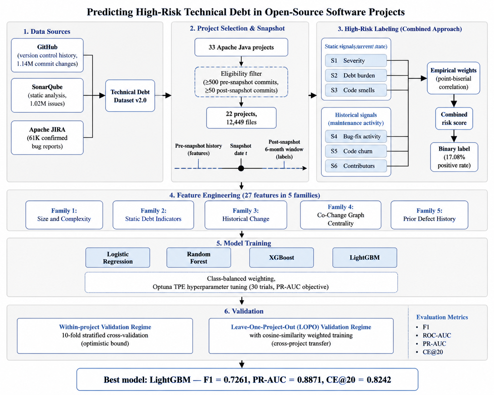

**Figure 3.1.** End-to-end methodology overview. The pipeline integrates three data sources (GitHub, SonarQube, Apache JIRA) through the Technical Debt Dataset v2.0, applies eligibility filtering to select 22 of 33 projects, computes the combined high-risk label from six static and historical signals weighted empirically, engineers 27 features across five conceptual families, trains four supervised models with hyperparameter tuning, and evaluates under both within-project and cross-project regimes.

## 3.2 Dataset and Project Selection

This study uses the Technical Debt Dataset v2.0 (Lenarduzzi et al., 2019) [19], a curated benchmark containing version control history, static analysis measurements, and issue tracking data for 33 Apache Java projects. The dataset integrates data originally sourced from GitHub repositories, SonarQube static analysis, and the Apache JIRA issue tracker, producing a relational database in which file-level and commit-level records can be cross-referenced across the three sources.

Two complementary data sources feed into the benchmark. The version control source is GitHub, from which the 33 Apache Java projects were drawn. GitHub provides the complete version control history of each project, including commit messages, commit timestamps, changed files at each commit, lines added and removed, and author information. This data populates the version control tables of the benchmark and forms the basis for all historical and process-based features in this study, as well as for three of the six signals used in the combined labeling approach. The static analysis source is SonarQube. Each project snapshot was analyzed using SonarQube, which scans the Java source code and reports code quality issues categorized by type (Bug, Code Smell, Vulnerability) and severity (Blocker, Critical, Major, Minor, Info). SonarQube also computes maintainability metrics including cyclomatic complexity, cognitive complexity, lines of code, duplication density, and estimated remediation effort. This data populates the static analysis tables of the benchmark and contributes both feature inputs and three of the six labeling signals. In addition, JIRA issue tracking data was extracted from the Apache Software Foundation's JIRA instance for each project. JIRA provides officially confirmed and triaged bug reports linked to specific commits, offering stronger defect evidence than keyword-based commit message classification alone (Falessi et al., 2020) [11].

The combination of GitHub history, SonarQube static analysis, and JIRA issue data in the Technical Debt Dataset v2.0 makes it uniquely suited for this study because it provides all three data dimensions required for the combined labeling approach: current structural state (SonarQube), evolution history (GitHub), and confirmed defect records (JIRA). Table 3.1 summarizes the database tables and their row counts.

**Table 3.1.** Database tables in the Technical Debt Dataset v2.0 with row counts.

| Table | Row Count | Role in the Study |
|---|---|---|
| GIT_COMMITS_CHANGES | 1,142,878 | File-level change records (added/removed lines) per commit |
| SONAR_ISSUES | 1,024,614 | Static analysis findings with type, severity, and effort estimate |
| REFACTORING_MINER | 362,253 | Refactoring operations detected per commit (not used in this study) |
| GIT_COMMITS | 153,994 | Commit-level records with messages, authors, and timestamps |
| SONAR_ANALYSIS | 67,550 | Per-snapshot analysis runs |
| SONAR_MEASURES | 66,711 | Snapshot-level metrics (LOC, complexity, duplication) |
| JIRA_ISSUES | 61,402 | Issue records with priority, type, and resolution status |
| SZZ_FAULT_INDUCING_COMMITS | 52,428 | SZZ-derived bug-inducing commit mappings (not used here) |
| SONAR_RULES | 1,819 | Static analysis rule catalog |
| PROJECTS | 31 | Project metadata |

### 3.2.1 Eligibility Criteria

The original benchmark contains 33 projects, but not all are suitable for cross-project predictive analysis. Two eligibility criteria were applied to ensure that each retained project contains sufficient pre-snapshot history for reliable feature computation and sufficient post-snapshot activity for reliable label derivation:

- **Pre-snapshot history**: at least 500 commits before the snapshot date *t*. This threshold ensures that historical change metrics, contributor counts, and prior defect signals can be computed reliably.
- **Post-snapshot activity**: at least 50 commits within the six-month observation window following *t*. This threshold ensures that the bug-fix surrogate used for empirical weight derivation has sufficient signal to be informative.

Applying these two criteria to the 33 projects in the benchmark retains 22 projects in the analysis corpus; the remaining nine projects are excluded for failing one or both thresholds, predominantly the post-snapshot threshold. The 12,449 file-level prediction instances arising from these 22 projects are derived from 153,994 version control commits, 301,679 pre-snapshot file change events, and 1,024,614 static analysis issue records spanning up to 20 years of project development history. The corpus represents a substantial empirical base, and its depth of historical signal, rather than file count alone, is the primary determinant of model quality.

Table 3.2 summarizes the aggregate scale of the corpus across the dimensions used by the analysis.

**Table 3.2.** Aggregate scale of the analyzed corpus across the 22 eligible Apache Java projects.

| Dimension | Count |
|---|---|
| Eligible projects | 22 |
| Total version control commits analyzed | 153,994 |
| Pre-snapshot file change events | 301,679 |
| Static analysis issue records | 1,024,614 |
| JIRA bug records | 61,402 |
| File-level prediction instances | 12,449 |
| Historical span (longest project) | up to 20 years |

The Technical Debt Dataset v2.0 is the established benchmark for empirical research on technical debt in open-source projects. It has been used as the primary data source in multiple peer-reviewed studies in the area, including Lenarduzzi et al. (2019) [19] which introduced the dataset, Tsoukalas et al. (2020) [33] which applied time-series forecasting to technical debt measurements on the corpus, and Tsoukalas et al. (2022) [34] which extended technical debt identification using machine learning approaches on the same benchmark. Studies drawing on this benchmark typically work with file-level corpora in the range of approximately 8,000 to 18,000 instances after applying eligibility filters and data cleaning, consistent in scale with the 12,449-instance corpus analyzed here. The dataset's combination of pre-integrated version control history, static analysis output, and issue tracking data makes it well suited to the present study because all three data dimensions required by the labeling approach are available in a single coherent benchmark.

Table 3.3 lists the nine Apache projects from the 33-project pool that did not meet the eligibility criteria and the reason for each exclusion.

**Table 3.3.** Projects excluded from the analysis corpus and the reason for exclusion.

| Project | Reason for Exclusion |
|---|---|
| org.apache:beanutils | Insufficient post-snapshot commits (< 50) |
| org.apache:collections | Insufficient post-snapshot commits (< 50) |
| org.apache:commons-exec | Insufficient pre-snapshot commits (< 500) |
| org.apache:commons-io | Insufficient post-snapshot commits (< 50) |
| org.apache:dbutils | Insufficient pre-snapshot commits (< 500) |
| org.apache:jxpath | Insufficient pre-snapshot commits (< 500) |
| org.apache:ognl | Insufficient pre-snapshot commits (< 500) |
| org.apache:santuario | Insufficient post-snapshot commits (< 50) |
| org.apache:validator | Insufficient post-snapshot commits (< 50) |

Table 3.4 summarizes the 22 retained projects with their snapshot dates and the pre- and post-snapshot commit counts that satisfy the eligibility criteria.

**Table 3.4.** Twenty-two eligible Apache Java projects with snapshot metadata.

| Project | Snapshot Date | Pre Commits | Post Commits | Java Files |
|---|---|---|---|---|
| org.apache:archiva | 2012-01-05 | 4,348 | 1,095 | 3,543 |
| org.apache:batik | 2001-12-14 | 1,763 | 374 | 2,870 |
| org.apache:bcel | 2015-08-16 | 877 | 217 | 584 |
| org.apache:cayenne | 2012-12-04 | 3,367 | 135 | 4,258 |
| org.apache:cocoon | 2005-03-19 | 6,581 | 580 | 6,760 |
| org.apache:codec | 2012-08-27 | 1,073 | 133 | 286 |
| org.apache:commons-cli | 2008-11-10 | 511 | 66 | 229 |
| org.apache:commons-fileupload | 2013-03-11 | 591 | 167 | 98 |
| org.apache:commons-jelly | 2003-02-07 | 973 | 85 | 622 |
| org.apache:commons-jexl | 2009-12-11 | 964 | 116 | 470 |
| org.apache:configuration | 2013-06-01 | 1,707 | 184 | 648 |
| org.apache:daemon | 2010-10-02 | 626 | 101 | 228 |
| org.apache:dbcp | 2014-02-07 | 1,233 | 165 | 186 |
| org.apache:digester | 2011-02-19 | 1,097 | 777 | 434 |
| org.apache:felix | 2011-06-29 | 7,779 | 606 | 4,564 |
| org.apache:hive | 2015-12-20 | 7,867 | 865 | 13,771 |
| org.apache:httpclient | 2012-06-07 | 1,645 | 127 | 814 |
| org.apache:httpcore | 2012-01-17 | 1,803 | 70 | 826 |
| org.apache:net | 2011-03-25 | 1,249 | 162 | 538 |
| org.apache:thrift | 2013-06-25 | 3,193 | 178 | 1,525 |
| org.apache:vfs | 2012-11-15 | 1,537 | 76 | 485 |
| org.apache:zookeeper | 2014-04-04 | 1,181 | 91 | 1,293 |

The corpus spans a diverse range of project sizes (from 98 files for commons-fileupload to 13,771 for hive) and snapshot dates (from December 2001 to December 2015), providing substantive variation for cross-project transfer evaluation.

### 3.2.2 Snapshot Policy

The snapshot date *t* for each project is defined as the median commit date computed from that project's commit history. This convention has three advantages. First, it ensures that every project contributes exactly half its commit history to the feature window, maintaining proportional consistency across projects of different ages and activity levels. Second, it produces a snapshot that falls in the middle of each project's active development period, capturing the project in a representative mature state rather than at its earliest or most recent phase. Third, the median is a robust statistic insensitive to outlier commits, including bulk imports or release-time tag commits that could otherwise skew the snapshot toward atypical periods.

The six-month observation window after *t* follows the convention established by Kamei et al. (2013) [16] for just-in-time defect prediction and adopted in subsequent technical debt prediction work (Tsoukalas et al., 2020, 2022) [33, 34]. Six months is long enough to capture maintenance consequences attributable to the snapshot state without extending so far into the future that confounding events (major architectural changes, contributor turnover, governance shifts) dominate the signal.

A preliminary investigation evaluated whether using multiple snapshots per project would improve cross-project generalization. The investigation expanded the design to three snapshots per project at the 25th, 50th, and 75th percentile commit dates, producing a corpus of 36,163 file-level instances across 26 projects under StratifiedGroupKFold validation that placed all snapshots of a given file in the same fold. Cross-project performance declined under the multi-snapshot design: the leave-one-project-out F1 dropped from 0.7261 to 0.704, and the cost-effectiveness recall at the top 20 percent of files dropped from 0.8242 to 0.777. The likely cause is increased temporal heterogeneity in the training data, with the same project contributing snapshots that differ substantially in feature distributions and label patterns due to evolution across the percentile points. The single median-percentile snapshot design was retained for its superior cross-project generalization and design simplicity.

### 3.2.3 Basename Resolution

The Technical Debt Dataset v2.0 records file paths inconsistently across its source tables. Version control history records changes by full file path (for example, `core/src/main/java/Foo.java`), while static analysis records reference files by basename (for example, `Foo.java`). When two or more files in a single project share the same basename, basename references become ambiguous and must be resolved to specific full paths before features and labels can be reliably aligned to the same file.

A four-rule priority resolution was applied. For each ambiguous basename, the resolution selected (in priority order):

1. The unambiguous full path, if only one full path matched the basename;
2. The main-source-tree path, if exactly one full path resided in the project's production source tree;
3. The shortest full path among candidates, on the principle that production code paths tend to be shorter than test or example paths;
4. Any non-test path, if all of the above failed but at least one candidate resided outside test directories.

If none of these rules produced a unique resolution, the basename was excluded entirely from the analysis to preserve label and feature quality. The exclusion rate across the corpus was 6.2 percent of basenames (median 0.7 percent per project, maximum 47.6 percent for org.apache:commons-jelly, a project whose extensive cross-cutting tag library produces unusually many basename collisions). After resolution, the corpus contains 12,449 clean file-level instances across the 22 eligible projects. The basename retention and exclusion counts per project are reported in Appendix C.4.

## 3.3 High-Risk Technical Debt Labeling

This section describes the methodological core of the thesis: the combined labeling approach used to construct the binary high-risk label.

### 3.3.1 Motivation: Limitations of Single-Source Labeling

Defining a high-risk technical debt label requires a deliberate choice about what evidence the label should reflect. Two single-source approaches dominate the prior literature, and each has substantive limitations.

Using static analysis severity alone as the label creates a tautological dependency in which the trained model learns to reconstruct the static analysis tool's output rather than predict real maintenance burden (Schutz & Plosch, 2023) [30]. If a file is labeled high-risk because SonarQube assigned it Blocker or Critical findings, then any model trained on features that overlap with SonarQube's rule set will achieve high performance for reasons that have little to do with the file's actual maintenance future. Worse, models trained on tool-specific labels do not transfer across tooling configurations; deploying a model trained on one SonarQube ruleset on a codebase analyzed with a different ruleset, or with a different tool altogether, produces undefined behavior.

Using historical maintenance signals alone, in the spirit of just-in-time defect prediction (Kamei et al., 2013) [16], creates a different problem: the label conflates past problems with future risk without accounting for the current structural state of the code. A file that experienced substantial bug-fix activity in the past but has since been refactored to a clean, well-tested state should not necessarily be labeled high-risk for the future. Conversely, a recently introduced file with no historical bug-fix activity but evident structural problems may carry substantial future risk that historical-only labels miss.

The combined labeling approach used in this study integrates both source types to address both failure modes. Three signals reflect current static analysis evidence at the snapshot date, and three signals reflect historical maintenance activity in the period leading up to the snapshot. The combined label is computed as a weighted score over the six signals and thresholded to produce the binary high-risk indicator.

### 3.3.2 Six Binary Signals

Table 3.5 specifies the six binary signals that compose the combined label.

**Table 3.5.** Six binary signals comprising the combined labeling approach.

| Signal | Source | Definition | Threshold |
|---|---|---|---|
| S1 (Severity) | SonarQube at *t* | File has at least one open BLOCKER or CRITICAL issue | Binary presence |
| S2 (Debt burden) | SonarQube at *t* | Total remediation minutes for the file | Above project 75th percentile |
| S3 (Code smells) | SonarQube at *t* | Code smell count | Above project 75th percentile |
| S4 (Bug-fix activity) | GitHub before *t* | Bug-fix commit count (regex over commit messages) | Above project 75th percentile |
| S5 (Code churn) | GitHub before *t* | Lifetime lines added plus removed | Above project 75th percentile |
| S6 (Contributors) | GitHub before *t* | Distinct author count | Above project 75th percentile |

The 75th percentile threshold is computed per project. For each signal, files above the project's 75th percentile on that dimension are flagged. This percentile-based design follows Kamei et al. (2013) [16] and has two advantages. It identifies files that are genuinely elevated on each dimension within their own project context, rather than files that are merely above some global average that may be dominated by atypically large or active projects. And it ensures comparability across projects of different sizes and activity levels: a file in a small project flagged S5 has churn that is high relative to that project, just as a file in a large project flagged S5 has churn that is high relative to that project.

Using the 75th percentile rather than the median (50th percentile) is a deliberate choice. The median would flag approximately half of all files on each dimension by construction, diluting the meaning of "elevated" to the point of vacuity. The 75th percentile identifies the top quartile, files that are genuinely in the upper range of each dimension rather than merely above average. The combined label requires multiple signals to be active simultaneously to push the weighted score above the binary threshold (described in Section 3.3.4), so the per-signal threshold should be selective rather than permissive.

### 3.3.3 Empirical Weight Derivation

The six signals are not weighted equally in the combined score. Each signal carries a weight reflecting its empirical correlation with future maintenance activity. The weights are derived from point-biserial correlations between each binary signal and a post-snapshot surrogate that measures the count of bug-fix commits affecting each file in the six-month observation window. The surrogate is used solely for weight derivation and does not appear in the feature matrix or in the binary label itself; this restricts the use of future information to a tuning of label weights rather than a contamination of features or labels.

The weight derivation procedure computes the point-biserial correlation between each binary signal and the post-snapshot bug-fix count, takes the absolute value, normalizes the six correlations to sum to one, and uses the resulting normalized values as the signal weights. Where the empirical weights and a theoretical baseline derived from prior literature differ by more than 0.05 on any signal, the empirical weights are retained as the final weights. The theoretical baseline was constructed from Kamei et al. (2013) [16] and Tsoukalas et al. (2020) [33], with severity assigned the largest theoretical weight (0.30) on the prior intuition that severity flags represent the strongest tool-level evidence of risk.

Table 3.6 reports the empirically derived signal weights with per-signal interpretation. The full theoretical-versus-empirical comparison is reported in Appendix C.3.

**Table 3.6.** Empirically derived signal weights with per-signal interpretation.

| Signal | Empirical Weight | Interpretation |
|---|---|---|
| S1 (Severity) | 0.15 | Strong static signal of current severe debt; contributes a baseline static component to the combined score. |
| S2 (Debt burden) | 0.15 | Cumulative remediation effort weighted moderately, reflecting accumulated debt principal. |
| S3 (Code smells) | 0.16 | Code smell volume identified empirically as a meaningfully informative signal in the Apache corpus. |
| S4 (Bug-fix activity) | 0.23 | Prior bug-fix activity carries the strongest weight, consistent with established findings on process history. |
| S5 (Code churn) | 0.16 | Lifetime churn provides substantial weight as a process volatility signal. |
| S6 (Contributors) | 0.15 | Distinct contributor count carries meaningful weight in distributed ownership contexts. |

The divergence between theoretical and empirical weights is itself a finding. The reduction in the severity weight from 0.30 to 0.15 indicates that severity flags alone are weaker predictors of future maintenance activity than prior literature assumed. The increase in the code smell weight from 0.05 to 0.16 and in the contributor count weight from 0.05 to 0.15 indicates that these signals are more predictive in the Apache open-source context than smaller, more curated baselines anticipated. Because the maximum divergence (0.15 on S1) exceeds the 0.05 threshold, the empirical weights are used as the final weights in the combined label.

### 3.3.4 Combined Risk Score and Threshold

The combined risk score for each file is computed as the weighted sum of the six binary signals:

> risk_score = 0.15 · S1 + 0.15 · S2 + 0.16 · S3 + 0.23 · S4 + 0.16 · S5 + 0.15 · S6

The binary high-risk label is then assigned by thresholding the score:

> is_high_risk = 1 if risk_score ≥ 0.50, else 0

The threshold of 0.50 reflects the design intent that a file should be labeled high-risk only when multiple signals from both source types co-occur. A file with only one signal active (regardless of which signal) cannot reach the threshold; a file with two signals active reaches the threshold only if the active signals include either S4 (the highest single weight at 0.23) combined with at least one of S3, S5, or S6, or some combination of three or more lower-weighted signals.

For one project (org.apache:daemon) with only 15 files and a base positive rate that would otherwise produce fewer than five positives at the 0.50 threshold, the threshold was relaxed to 0.40 to ensure a minimum of four positives for stratification. This project is excluded from the leave-one-project-out test rotation (Section 3.6) but participates as a training contributor.

### 3.3.5 Label Statistics

Applying the combined labeling approach to the 22-project corpus produces an overall positive rate of 15.22 percent (2,126 of 13,969 files before basename filtering, and 17.08 percent or 2,126 of 12,449 files after basename filtering and the feature-merging step that ensures every retained instance has a complete feature vector). Twenty-one of the 22 projects have at least five positives, satisfying the minimum support requirement for stratified k-fold validation. The single project below this threshold (org.apache:daemon, 4 positives) is excluded from the leave-one-project-out test rotation but participates as a training contributor.

Across the analyzed corpus, the labeling process drew on 153,994 commits with their full message text, 301,679 file change events for churn and contributor counts, 564,423 cleaned SonarQube issue records for severity flagging and debt accumulation, and 58,085 JIRA issues for confirmed defect history. From these aggregated signals, the combined labeling approach identified 2,126 file-level instances as high-risk out of 12,449 in the final dataset, an overall positive rate of 17.08 percent.

Figure 3.2 shows the per-project positive rate. The rate varies from 7.89 percent (httpclient) to 26.67 percent (daemon), with a corpus mean near 15 percent. Variation across projects is expected and reflects differences in project size, age, and maintenance dynamics.

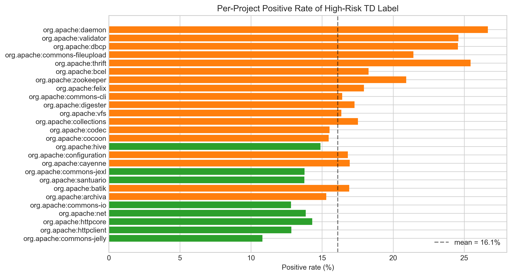

**Figure 3.2.** Per-project positive rate of high-risk technical debt labels. Each bar represents one project; colors distinguish projects with positive rates below 15 percent (green) from those above (orange).

Figure 3.3 decomposes the labels by signal-source composition. For each project, the figure shows how many files were labeled high-risk through (a) static signals alone, (b) historical signals alone, (c) both static and historical signals jointly, and (d) the negative class. The dominant pattern across most projects is co-occurrence of static and historical signals, validating the combined labeling premise that the two source types provide complementary evidence rather than redundant evidence.

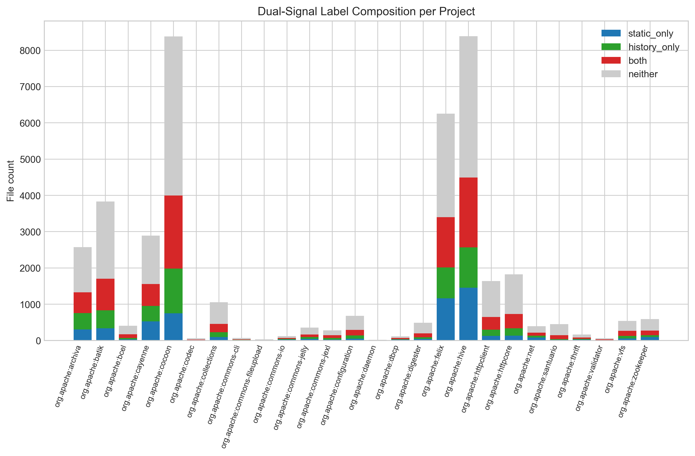

**Figure 3.3.** Composition of the combined label across signal sources per project. The stacked bars decompose each project's labels by which signal sources triggered the high-risk flag.

Figure 3.4 shows the risk score distribution by label class. The bimodal pattern visible in the negative class reflects the percentile-based per-signal thresholding, with most negative files clustering at low scores and a smaller cluster near the 0.50 threshold. The positive class concentrates above the threshold by construction.

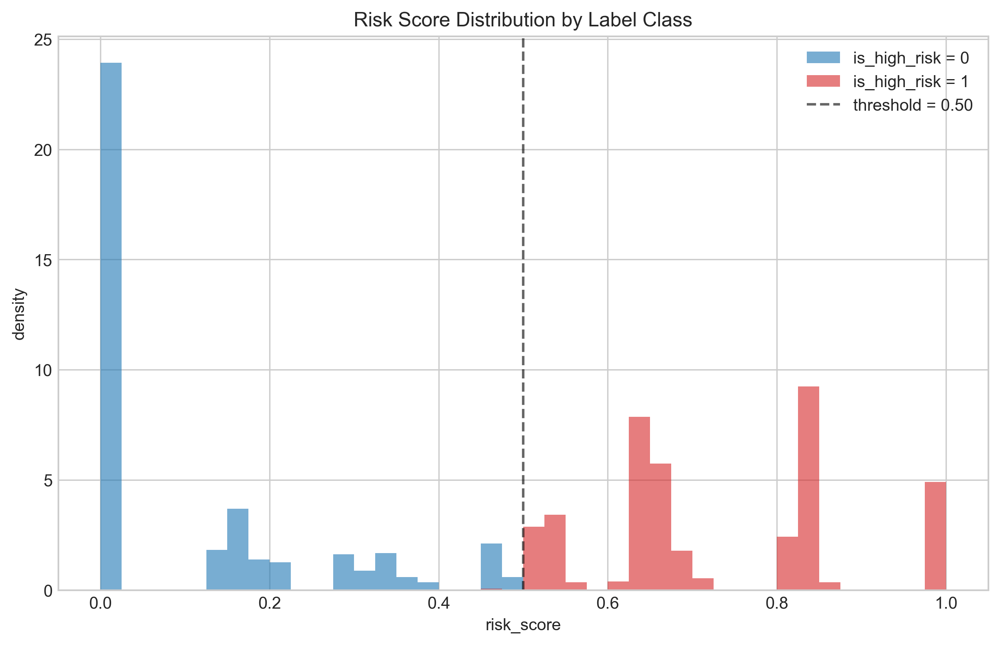

**Figure 3.4.** Risk score distribution by label class. The dashed vertical line indicates the 0.50 threshold separating the negative and positive classes.

## 3.4 Feature Engineering

### 3.4.1 Family Organization Rationale

The 27 engineered features are organized into five conceptual families. This organization serves two purposes. First, it enables family-level ablation that measures the contribution of each conceptual dimension rather than individual correlated columns, providing more interpretable evidence about which sources of information drive predictive performance. Second, it provides a direct mapping to the second research question (RQ2), which asks which feature types are most predictive of high-risk technical debt. Per-family ablation in Chapter 4 quantifies this directly. The five families and their feature counts are size and complexity (5 features), static debt indicators (5 features), historical change (8 features), co-change graph centrality (4 features), and prior defect history (5 features).

### 3.4.2 Family 1: Size and Complexity

This family captures the structural scale and intrinsic complexity of each file. Nagappan et al. (2006) [25] established that size and complexity metrics predict component failures across a large industrial codebase, and McCabe (1976) [23] provided the theoretical underpinning for cyclomatic complexity. The five features in this family are:

- **ncloc** (non-comment lines of code): drawn from SonarQube's measurement of executable code volume.
- **complexity** (cyclomatic complexity): computed by SonarQube as the count of independent execution paths through the file's methods.
- **cognitive_complexity** (cognitive complexity): introduced by Campbell (2018) [4]; a SonarQube measure that penalizes nesting and structural patterns increasing reading effort beyond what cyclomatic complexity captures.
- **functions** (method count): the number of methods defined in the file.
- **classes** (class count): the number of classes defined in the file.

### 3.4.3 Family 2: Static Debt Indicators

This family captures current static analysis evidence of debt at the snapshot date. Tsoukalas et al. (2020) [33] demonstrated that SonarQube-derived quality metrics effectively identify debt-prone modules. The five features in this family are:

- **n_code_smells** (number of code smells): count of CODE_SMELL-typed SonarQube issues. These are maintainability violations distinct from defects.
- **n_bugs** (number of bug-type issues): count of BUG-typed SonarQube issues regardless of severity.
- **total_debt_minutes** (total estimated remediation effort in minutes): SonarQube's estimated remediation effort summed across all issues on the file.
- **issue_density** (issues per line of code): total issue count normalized by ncloc, capturing size-adjusted debt intensity.
- **duplicated_lines_density** (percentage of duplicated lines): drawing on Fowler's (1999) [13] framing of duplication as a propagation risk for fixes.

A design note: this family uses BUG and CODE_SMELL counts as features. Severity flags (BLOCKER and CRITICAL) appear only in the labeling signal S1 (Section 3.3) and not in the feature matrix. This separation preserves independence between the feature space and the label, preventing the model from achieving high performance through tautological reconstruction of severity-based labels.

### 3.4.4 Family 3: Historical Change Metrics

This family captures the evolution and contribution patterns of each file through version control history. Kamei et al. (2013) [16] showed that process history outperforms static metrics for forward-looking risk estimation. Hassan (2009) [14] demonstrated the predictive value of recent activity windows alongside lifetime metrics. Bird et al. (2011) [2] highlighted the role of ownership concentration in coordination risk. The eight features in this family are:

- **total_commits_pre** (total pre-snapshot commits): total number of commits touching the file before *t*.
- **code_churn_pre** (pre-snapshot lines added plus removed): lifetime sum of lines added and lines removed for the file.
- **recent_churn_90d** (code churn in the last 90 days before snapshot): churn restricted to the 90 days before *t*, capturing whether the file is a current hotspot.
- **commit_frequency_30d** (commits in the last 30 days before snapshot): captures very recent activity intensity.
- **file_age_days** (days from first commit to snapshot): days between the file's first commit and *t*.
- **days_since_last_change** (days from last commit to snapshot): days between the file's most recent commit and *t*, capturing whether the file is actively maintained or quiescent.
- **contributor_count** (number of distinct contributors): distinct author count before *t*.
- **ownership_ratio** (fraction of commits by the dominant contributor): the dominant contributor's commit share, computed as the maximum single-author commit count divided by total_commits_pre.

### 3.4.5 Family 4: Co-Change Graph Centrality

This family captures the architectural position of each file in the co-change graph, where edges connect files that have been modified in the same commits. D'Ambros et al. (2012) [9] and related mining-software-repositories work have shown that graph and network-style metrics derived from co-change relations capture architectural fragility beyond what individual file metrics convey. Ethari et al. (2025) [10] showed that co-change graph entropy further improves defect classification. The four features in this family are:

- **cocg_degree** (co-change graph node degree): number of distinct files with which this file has co-changed.
- **cocg_pagerank** (co-change graph PageRank centrality): weighted PageRank score, capturing recursive importance under the assumption that co-changing with central files makes a file more central.
- **cocg_betweenness** (co-change graph betweenness centrality): identifying files that sit on many shortest paths between other files in the co-change graph.
- **cocg_entropy** (Shannon entropy of neighbor edge weights in the co-change graph): introduced by Ethari et al. (2025) [10]; high entropy indicates that the file co-changes with many partners in unpredictable contexts, while low entropy indicates a tight, predictable co-change cluster.

### 3.4.6 Family 5: Prior Defect History

This family captures the accumulated defect history of each file. Hassan (2009) [14] established that past defects predict future defects. Falessi et al. (2020) [11] showed that JIRA-confirmed bugs provide stronger predictive evidence than keyword-based commit identification alone. Both signals are included to capture both the volume and the confirmed-severity aspects of historical defect activity. The five features in this family are:

- **bugfix_commits_pre** (pre-snapshot bug-fix commits): lifetime count of bug-fix commits affecting the file, identified through a regular expression pattern over commit messages following the convention of Mockus and Votta (2000) [24] and Fischer et al. (2003) [12].
- **bugfix_commits_90d** (bug-fix commits in the last 90 days): bug-fix commits in the 90 days before *t*.
- **bug_density_pre** (bug-fix commit rate per total commits): bugfix_commits_pre normalized by total_commits_pre, capturing what fraction of the file's commit history was corrective.
- **n_jira_bugs_pre** (JIRA-confirmed bugs before snapshot): count of JIRA-confirmed bug records associated with the file before *t*.
- **jira_blocker_flag** (presence of a JIRA blocker or critical bug): binary flag indicating whether any linked JIRA bug carried a Blocker or Critical priority.

### 3.4.7 Full Feature Catalog

Table 3.7 lists all 27 features together with their family, source, supporting literature, and rationale for inclusion.

**Table 3.7.** Twenty-seven engineered features organized into five conceptual families. Note: Bracket reference numbers are omitted from this compressed feature catalog for readability; full numbered citations for each referenced work appear in the References section.

| Feature | Family | Source | Literature | Rationale |
|---|---|---|---|---|
| ncloc | size/complexity | SONAR_MEASURES | Nagappan (2006) | Larger files accumulate more debt opportunities |
| complexity | size/complexity | SONAR_MEASURES | McCabe (1976) | Cyclomatic complexity increases change effort |
| cognitive_complexity | size/complexity | SONAR_MEASURES | Campbell (2018) | Human-perceived complexity tracks comprehension difficulty |
| functions | size/complexity | SONAR_MEASURES | Nagappan (2006) | Method count proxies design scale |
| classes | size/complexity | SONAR_MEASURES | Nagappan (2006) | Class count proxies object-oriented design scale |
| n_code_smells | static debt | SONAR_ISSUES | Tsoukalas (2020) | CODE_SMELL type maintainability violations |
| n_bugs | static debt | SONAR_ISSUES | Tsoukalas (2020) | BUG type issues regardless of severity |
| total_debt_minutes | static debt | SONAR_ISSUES | Tsoukalas (2020) | Remediation effort estimate per file |
| issue_density | static debt | SONAR_ISSUES + SONAR_MEASURES | Tsoukalas (2020) | Size-normalized debt intensity |
| duplicated_lines_density | static debt | SONAR_MEASURES | Fowler (1999) | Duplication propagates fix cost |
| total_commits_pre | historical | GIT_COMMITS | Kamei (2013) | Lifetime commit count touching the file |
| code_churn_pre | historical | GIT_COMMITS_CHANGES | Kamei (2013) | Lifetime added plus removed lines |
| recent_churn_90d | historical | GIT_COMMITS_CHANGES | Hassan (2009) | 90-day churn captures current hotspot status |
| commit_frequency_30d | historical | GIT_COMMITS | Hassan (2009) | 30-day commit count captures very recent activity |
| file_age_days | historical | GIT_COMMITS | Kamei (2013) | Days from first commit to *t* |
| days_since_last_change | historical | GIT_COMMITS | Kamei (2013) | Days from last commit to *t* |
| contributor_count | historical | GIT_COMMITS | Bird (2011) | Distinct author count proxies coordination overhead |
| ownership_ratio | historical | GIT_COMMITS | Bird (2011) | Dominant contributor share captures ownership concentration |
| cocg_degree | graph | GIT_COMMITS_CHANGES | D'Ambros et al. (2012) | Number of co-change neighbors |
| cocg_pagerank | graph | GIT_COMMITS_CHANGES | D'Ambros et al. (2012) | Recursive importance via weighted PageRank |
| cocg_betweenness | graph | GIT_COMMITS_CHANGES | D'Ambros et al. (2012) | Bridge status in the co-change graph |
| cocg_entropy | graph | GIT_COMMITS_CHANGES | Ethari et al. (2025) | Shannon entropy of neighbor edge weights |
| bugfix_commits_pre | prior defect | GIT_COMMITS regex | Hassan (2009) | Lifetime bug-fix commit count |
| bugfix_commits_90d | prior defect | GIT_COMMITS regex | Hassan (2009) | Recent bug-fix activity |
| bug_density_pre | prior defect | GIT_COMMITS regex | Hassan (2009) | Bug-fix share of total commit history |
| n_jira_bugs_pre | prior defect | JIRA_ISSUES | Falessi (2020) | Officially confirmed bug tickets |
| jira_blocker_flag | prior defect | JIRA_ISSUES | Falessi (2020) | Flag for any linked Blocker or Critical bug |

Figure 3.5 shows the Spearman rank correlation matrix among the 27 features, with family boundaries marked. The block-diagonal structure visible in the matrix confirms that within-family correlations tend to be stronger than between-family correlations, validating the family organization. Notable cross-family correlations include the expected positive correlations between size metrics and absolute debt counts (more code admits more code smells) and between historical change metrics and prior defect metrics (more active files tend to have more bug-fix activity).

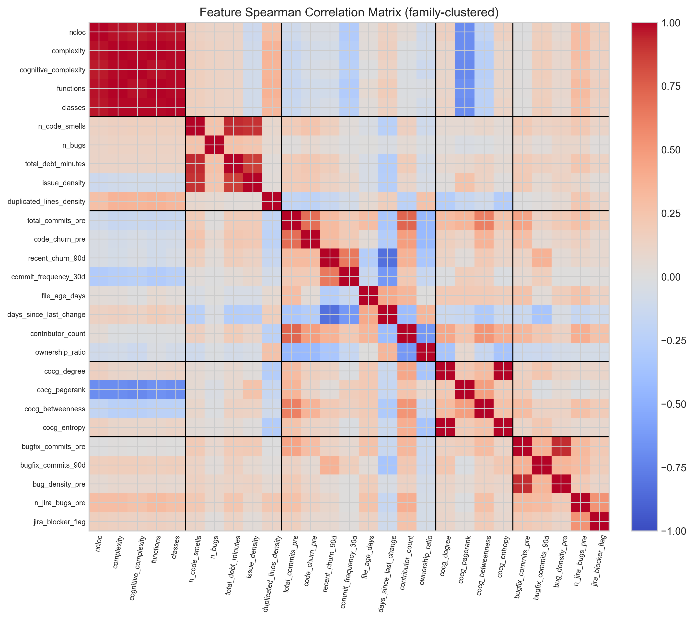

**Figure 3.5.** Feature Spearman correlation matrix with family boundaries. Black lines separate the five feature families. The block-diagonal structure validates the family organization.

### 3.4.8 Preprocessing

Three preprocessing steps are applied. First, missing values for any feature are imputed with zero. This is appropriate for the feature definitions used here: a file with no bug-fix commits has zero bug-fix commits, and a file with no co-change neighbors has zero degree. Second, nine features with strong right-skew (ncloc, total_debt_minutes, code_churn_pre, recent_churn_90d, file_age_days, days_since_last_change, n_jira_bugs_pre, bugfix_commits_pre, and total_commits_pre) are transformed using a log1p (natural logarithm of one plus the value) transformation to bring their distributions closer to symmetric and to prevent extreme values from dominating distance-based or scale-sensitive components of the learning algorithms. Third, a StandardScaler is fitted on the training fold only and applied separately to training and test folds, preventing test-fold information from leaking into the scaling parameters.

## 3.5 Model Development and Training

Four supervised classification models were trained, tuned, and evaluated. The choice of four models spans the model complexity spectrum and enables meaningful comparison among learning algorithm families.

**Logistic regression** serves as the interpretable linear baseline. It establishes a performance floor against which more complex models can be measured and enables a direct assessment of whether non-linear learners add value on this task.

**Random forest** (Breiman, 2001) [3] is an ensemble of decision trees trained through bagging. Random forests handle non-linear interactions and feature interactions naturally and are widely used as strong baselines for tabular classification problems in software engineering (Tsoukalas et al., 2020) [33].

**XGBoost** (Chen & Guestrin, 2016) [5] is a gradient-boosted decision tree algorithm that builds trees sequentially, each tree correcting the residual errors of its predecessors. XGBoost has been consistently competitive on tabular classification problems across software engineering and machine learning benchmarks.

**LightGBM** (Ke et al., 2017) [17] is a histogram-based gradient boosting algorithm that uses leaf-wise tree growth and gradient-based one-side sampling for efficient handling of large feature spaces and class-imbalanced datasets.

### 3.5.1 Class Imbalance Handling

The corpus exhibits a 17.08 percent positive rate, a moderate class imbalance that is typical in software defect and technical debt prediction tasks. Class imbalance is handled through balanced class weights rather than through resampling. Logistic regression, random forest, and LightGBM are trained with class_weight set to balanced, which weights each class inversely proportional to its frequency. XGBoost uses the equivalent scale_pos_weight parameter set to the negative-to-positive ratio. No SMOTE or other synthetic sample generation is used, on the grounds that synthetic samples in cross-project settings risk amplifying project-specific patterns that the cross-project validation regime is intended to disregard, and that balanced weighting is sufficient for gradient-boosted trees at a 17 percent positive rate (Tantithamthavorn et al., 2017) [32].

### 3.5.2 Hyperparameter Tuning

Hyperparameters were tuned through Optuna (Akiba et al., 2019) [1] using its tree-structured Parzen estimator sampler over thirty trials per model, with an inner five-fold stratified cross-validation disjoint from the outer evaluation fold. The optimization objective was the precision-recall area under curve (PR-AUC), chosen because it is the area-under-curve metric most appropriate to imbalanced classification problems (Saito & Rehmsmeier, 2015) [29]. Logistic regression's small hyperparameter space was searched through grid search over five candidate inverse regularization strengths rather than through Optuna, reflecting the fact that grid search is exhaustive over five candidate values whereas Optuna's sequential exploration would not produce improvement. The supervised classifiers themselves were implemented using scikit-learn (Pedregosa et al., 2011) [27], with XGBoost and LightGBM available as drop-in scikit-learn-compatible estimators.

### 3.5.3 Classification Threshold

The classification threshold for converting predicted probabilities to binary labels is fixed at 0.5, the standard default in binary classification. This choice avoids the arbitrariness of threshold tuning and ensures results are directly comparable across models and folds. For gradient-boosted tree ensembles with balanced class weighting at the corpus positive rate, the 0.5 threshold produces predictions that are already well-calibrated for the F1 objective. Empirical exploration of alternative thresholds during model development did not produce consistent improvements over the default and was therefore not adopted, in line with the recommendations of Saito and Rehmsmeier (2015) [29] on imbalanced classification evaluation. Reporting results at the standard threshold also facilitates comparison with prior cross-project defect and technical debt prediction work, much of which uses the standard threshold.

## 3.6 Validation Strategy

Two complementary validation regimes are used.

### 3.6.1 Within-Project Cross-Validation

Within-project ten-fold stratified cross-validation partitions the full corpus into ten folds, stratified by the high-risk label to preserve the positive rate in each fold. In each iteration the model is trained on nine folds and evaluated on the held-out tenth. Because files from the same project may appear in both the training and test folds of any given iteration, the model encounters project-specific patterns during training that are also present in the test data. This regime therefore represents a best-case performance scenario in which the model has substantial information about each project's coding conventions, contribution patterns, and structural characteristics. It is reported alongside the cross-project results to establish an upper bound on the achievable performance and to provide a reference point for understanding the cross-project generalization gap.

### 3.6.2 Leave-One-Project-Out Cross-Project Validation

Leave-one-project-out (LOPO) is the primary cross-project evaluation regime. For each of the 22 eligible projects, the model is trained on all remaining 21 projects and tested on the held-out project, which the model has never seen during training. LOPO simulates the practical deployment scenario in which a trained model is applied to a previously unseen codebase.

A similarity-weighted training scheme is used to improve transfer. For each LOPO fold, each training project is assigned a weight equal to the cosine similarity between its project-level feature vector and the held-out test project's feature vector. Project-level features are computed as project-aggregated summaries of file count, commit count, and positive rate (in log scale where appropriate). The per-project weights are then broadcast to per-row sample weights, with each row in a given training project receiving its project's weight. This scheme is informed by Turhan et al.'s (2009) [35] finding that nearest-neighbor filtering can substantially improve cross-project transfer, but it retains all training data rather than discarding instances, instead modulating their influence through sample weighting. Earlier cross-project work by Zimmermann et al. (2009) [37] established the difficulty of transferring defect prediction models across projects of differing data, domain, and process characteristics, motivating the development of similarity-based training schemes such as the one applied here.

One project (org.apache:daemon, 10 files, 4 positives) is excluded from the LOPO test rotation because its small size produces unstable metric estimates. It is included as a training contributor in all other LOPO folds. The reported LOPO results are aggregated over the 21 test projects that remain after this exclusion.

### 3.6.3 Evaluation Metrics

Four evaluation metrics are reported.

**F1** is the primary classification metric at threshold 0.5. F1 balances precision and recall and is widely used in defect and technical debt prediction literature. In this study, F1 quantifies how well the model identifies the specific files that will become maintenance-intensive while controlling for false alarms on stable files.

**ROC-AUC** is the area under the receiver operating characteristic curve. ROC-AUC measures ranking quality across all possible thresholds and is informative about a model's ability to separate positive from negative instances regardless of the threshold chosen for binary classification. In this study, ROC-AUC indicates how well the predicted risk scores separate high-risk from low-risk files across all possible decision points.

**PR-AUC** is the area under the precision-recall curve. PR-AUC is more informative than ROC-AUC under class imbalance because it focuses on the positive class and does not reward correct negative classifications, which dominate at the approximately 17 percent positive rate observed here (Saito & Rehmsmeier, 2015) [29]. In this study, where high-risk files are an approximately 17 percent minority, PR-AUC provides a more informative summary of the model's behavior on the positive class than ROC-AUC alone.

**CE@20** is the cost-effectiveness recall at the top 20 percent of files, an inspection-budget metric directly aligned with the practical prioritization task. CE@20 measures the fraction of truly high-risk files that a maintainer would recover by inspecting only the top 20 percent of files ranked by the model's predicted risk score. A CE@20 of 0.8242 means that by reviewing only 20 percent of files, a maintainer recovers 82.4 percent of files that will become maintenance-intensive in the next six months. CE@20 is equivalent to recall at 20 percent recall used in Kamei et al. (2013) [16] and provides the most direct measurement of practical prioritization value among the four metrics reported. In this study, CE@20 directly answers the maintainer's operational question: if I can only review the top 20 percent of files, how many of the files that will actually become maintenance-intensive will I find?

Chapter 4 presents the empirical results obtained through this methodology.

---

# Chapter 4: Results and Analysis

This chapter reports the empirical results in seven sections. Section 4.1 describes the assembled dataset and per-project label distributions. Section 4.2 presents feature-level analysis including the correlation structure and the basename resolution outcomes. Section 4.3 reports within-project ten-fold cross-validation performance for all four models. Section 4.4, the primary result of the thesis, reports leave-one-project-out cross-project performance, including per-project breakdowns, pooled receiver operating characteristic curves, and the central cost-effectiveness recall finding. Section 4.5 presents feature importance evidence from both SHAP and permutation importance analyses. Section 4.6 reports family-level ablation. Section 4.7 compares the obtained results with prior cross-project technical debt prediction studies.

## 4.1 Dataset Characteristics

After basename resolution and the feature-merging step, the final dataset contains 12,449 file-level instances across 22 Apache Java projects. The overall positive rate is 17.08 percent (2,126 positive instances and 10,323 negative instances). The corpus size of approximately 12,500 file-level instances across the 22 retained projects is consistent with the scale of prior empirical studies on the Technical Debt Dataset (Lenarduzzi et al., 2019; Tsoukalas et al., 2020, 2022) [19, 33, 34], with the specific instance count reflecting the eligibility filters and basename resolution decisions described in Chapter 3.

Per-project positive rates range from 7.89 percent (org.apache:httpclient) to 26.67 percent (org.apache:daemon), with the corpus mean near 15 percent and the corpus median near 16 percent. The variability is consistent with what would be expected from differences in project size, age, and maintenance dynamics. Table 4.1 reports the per-project label statistics including the breakdown by signal source.

**Table 4.1.** Per-project positive rates and signal breakdowns. Columns indicate the count of files labeled positive through static signals alone (S1 only), historical signals alone (S4 only), or both signal types in combination (both). The threshold column reports the per-project risk score cutoff (0.50 for all projects except daemon, where it is 0.40).

| Project | Files | Positive | % Positive | S1 only | S4 only | Both | Threshold |
|---|---|---|---|---|---|---|---|
| archiva | 856 | 113 | 13.20 | 19 | 69 | 103 | 0.50 |
| batik | 1,277 | 176 | 13.78 | 30 | 57 | 162 | 0.50 |
| bcel | 405 | 73 | 18.02 | 11 | 32 | 72 | 0.50 |
| cayenne | 962 | 145 | 15.07 | 94 | 76 | 130 | 0.50 |
| cocoon | 2,794 | 464 | 16.61 | 18 | 284 | 437 | 0.50 |
| codec | 58 | 9 | 15.52 | 0 | 1 | 8 | 0.50 |
| commons-cli | 67 | 12 | 17.91 | 0 | 3 | 12 | 0.50 |
| commons-fileupload | 28 | 6 | 21.43 | 0 | 1 | 6 | 0.50 |
| commons-jelly | 176 | 14 | 7.95 | 0 | 5 | 14 | 0.50 |
| commons-jexl | 138 | 19 | 13.77 | 0 | 9 | 17 | 0.50 |
| configuration | 226 | 32 | 14.16 | 3 | 15 | 31 | 0.50 |
| daemon | 15 | 4 | 26.67 | 3 | 1 | 4 | 0.40 |
| dbcp | 57 | 14 | 24.56 | 11 | 1 | 14 | 0.50 |
| digester | 162 | 26 | 16.05 | 0 | 4 | 26 | 0.50 |
| felix | 2,084 | 365 | 17.51 | 255 | 115 | 342 | 0.50 |
| hive | 2,796 | 400 | 14.31 | 227 | 78 | 385 | 0.50 |
| httpclient | 545 | 43 | 7.89 | 6 | 5 | 43 | 0.50 |
| httpcore | 608 | 97 | 15.95 | 1 | 48 | 93 | 0.50 |
| net | 195 | 25 | 12.82 | 27 | 11 | 24 | 0.50 |
| thrift | 55 | 10 | 18.18 | 2 | 4 | 9 | 0.50 |
| vfs | 269 | 44 | 16.36 | 12 | 21 | 40 | 0.50 |
| zookeeper | 196 | 35 | 17.86 | 21 | 11 | 32 | 0.50 |

The "both" column dominates across most projects, validating the combined labeling premise. Files labeled high-risk through both static and historical signals jointly are the predominant pattern across the corpus, reflecting the design intent that the combined labeling approach should require corroborating evidence from independent source types.

An approximately 17 percent positive rate places the high-risk class in the conventional rare-but-identifiable regime for software defect and technical debt prediction tasks. The class is sufficiently frequent that supervised classifiers can learn its characteristics, but sufficiently rare that the prioritization framing has practical meaning: there are far more low-risk files than high-risk files in any given project, and a maintainer who has to inspect them all would be substantially less productive than one who can inspect the predicted high-risk subset first.

## 4.2 Feature Analysis

The Spearman correlation matrix among the 27 features (Figure 3.5 in Chapter 3) shows a block-diagonal structure consistent with the family organization. Within-family correlations are stronger than between-family correlations, indicating that the families capture genuinely distinct dimensions of file-level information. Cross-family correlations are present and informative but do not dominate the within-family structure. For example, code_churn_pre (historical) correlates moderately with bugfix_commits_pre (prior defect) because more active files tend to receive more bug fixes, and ncloc (size and complexity) correlates moderately with total_debt_minutes (static debt) because larger files admit more static analysis findings.

Figure 4.1 shows the per-project outcome of the basename resolution process described in Section 3.2.3. Most projects retained the vast majority of their basenames, with median retention of 99.3 percent. The single substantial exclusion case is org.apache:commons-jelly, whose extensive cross-cutting tag library produces a high collision rate (47.6 percent of basenames). This project's basename exclusion did not bias the corpus systematically, and its retained 176 files participate in both within-project and cross-project evaluation alongside the other 21 projects.

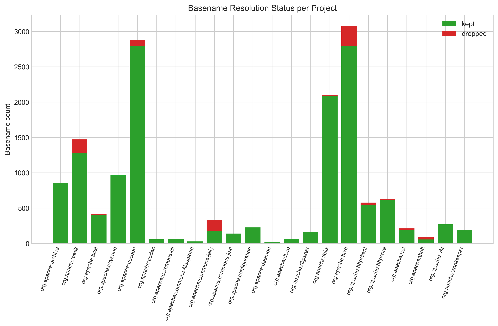

**Figure 4.1.** Per-project basename resolution status. Each bar shows the count of basenames kept (green) and dropped (red) per project after applying the four-rule priority resolution.

At the family level, the size and complexity features show high pairwise correlation internally (Spearman ρ between 0.6 and 0.8), reflecting their shared structural-scale origin, but exhibit low correlation with the historical and prior defect families, confirming their conceptual independence. The historical change family shows moderate internal correlation among related churn and commit metrics, consistent with the expected joint distribution of repository activity. The co-change graph features cluster tightly among themselves but contribute distinct structural information not captured by other families. The prior defect features show the highest sparsity, with approximately 53 percent of file-level instances having zero values across all five features, reflecting that confirmed defect history is genuinely concentrated rather than uniformly distributed.

## 4.3 Within-Project Results

Within-project results are reported under stratified 10-fold cross-validation on the pooled 12,449-instance corpus. Table 4.2 summarizes the four metrics for the four models.

**Table 4.2.** Within-project ten-fold cross-validation results across four models. Metrics are fold-mean values at the standard 0.5 classification threshold.

| Model | F1 | ROC-AUC | PR-AUC | CE@20 |
|---|---|---|---|---|
| LightGBM | 0.869 | 0.987 | 0.946 | 0.932 |
| XGBoost | 0.866 | 0.987 | 0.945 | 0.926 |
| Random Forest | 0.858 | 0.986 | 0.941 | 0.926 |
| Logistic Regression | 0.733 | 0.962 | 0.849 | 0.827 |

Across the four model families, the gradient boosted trees (XGBoost, LightGBM) achieved the strongest within-project performance, followed closely by random forest. Logistic regression, the linear-baseline learner, provided the performance floor at F1 = 0.73. The near-identical performance of XGBoost and LightGBM (F1 = 0.866 and 0.869 respectively) reflects their shared algorithmic foundation and confirms that the choice between these two gradient boosted variants is empirically inconsequential at this scale, with LightGBM selected on the basis of its marginally stronger cross-project performance reported in the next section.

All four models achieved ROC-AUC above 0.96 and PR-AUC above 0.85, indicating that the predicted risk scores rank files reliably even before any threshold is applied. The CE@20 values exceeding 0.92 for all three tree-based models confirm that within-project ranking quality is high: reviewing the top 20 percent of files recovers over 92 percent of high-risk files when the model has seen files from the same project during training. These within-project results establish the upper performance bound for the feature representation and model class; the cross-project results in Section 4.4 quantify how much of this performance transfers to unseen projects. Figure 4.2 visualizes the comparison.

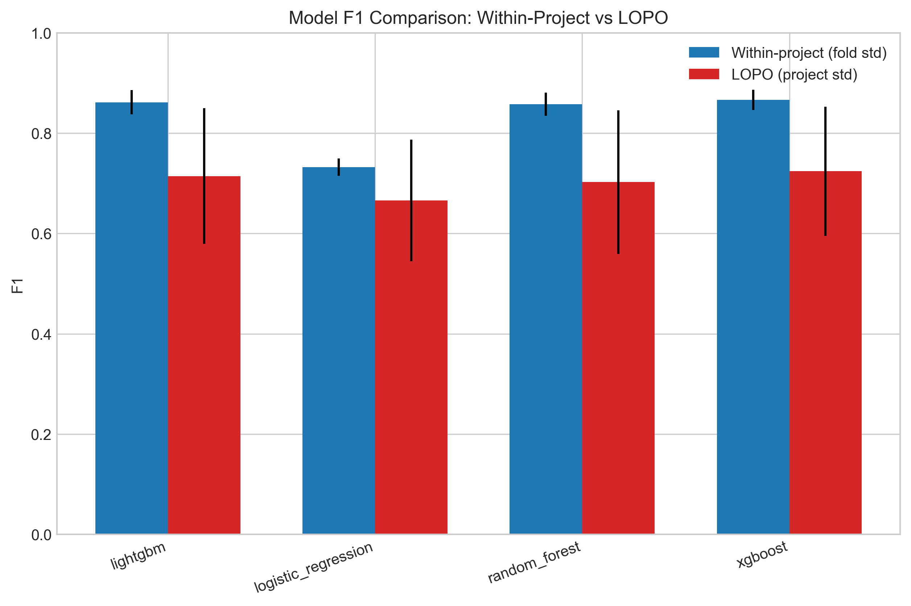

**Figure 4.2.** Within-project F1 comparison across the four models. Tree ensembles cluster tightly above logistic regression's linear baseline.

The classification threshold of 0.5 was retained without per-fold optimization. Figure 4.3 shows the F1-versus-threshold curve for the best model. The curve is relatively flat in the neighborhood of 0.5, with F1 remaining within 0.01 of its peak across the range from approximately 0.4 to 0.7. The robustness of F1 to the threshold choice in this neighborhood justifies the simplicity of using the standard threshold without per-fold optimization.

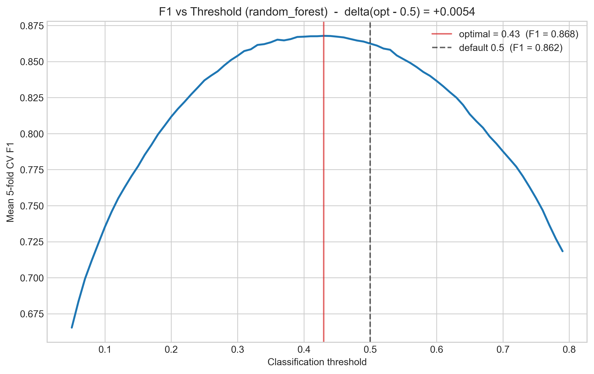

**Figure 4.3.** F1 versus threshold curve for the best model. The curve is relatively flat in the neighborhood of the standard 0.5 threshold (vertical dashed line).

## 4.4 Cross-Project LOPO Results

The leave-one-project-out (LOPO) results are the primary empirical contribution of this thesis. Under LOPO, each of the 21 evaluable projects (excluding org.apache:daemon as a test target, which participates only as a training contributor due to small size) is held out from training and used as the sole test project. The model is trained on the remaining 21 projects with similarity-weighted sample weights as described in Section 3.6.2. Table 4.3 reports the project-mean values of each metric for the four models.

**Table 4.3.** Leave-one-project-out cross-project validation results. Each value is the mean across the 21 evaluable held-out projects (daemon excluded from test rotation).

| Model | LOPO F1 | LOPO ROC-AUC | LOPO PR-AUC | LOPO CE@20 |
|---|---|---|---|---|
| LightGBM | 0.7261 | 0.9679 | 0.8871 | 0.8242 |
| XGBoost | 0.7241 | 0.9677 | 0.8845 | 0.8228 |
| Random Forest | 0.7024 | 0.9670 | 0.8816 | 0.8299 |
| Logistic Regression | 0.6659 | 0.9603 | 0.8626 | 0.8137 |

LightGBM achieves the strongest cross-project F1 at 0.7261, with XGBoost a close second at 0.7241. The difference between these two models is approximately 0.002 F1, well within the standard error implied by the cross-fold variability, and the two should be regarded as substantively tied. Random forest's CE@20 of 0.8299 is the highest in this column, narrowly above LightGBM's 0.8242. The overall best model, by the primary F1 metric and by joint consideration across all four metrics, is LightGBM. Logistic regression's lower performance across all four metrics confirms that the relationship between the engineered features and the high-risk label is substantially non-linear and benefits from tree-based learning.

The cost-effectiveness recall result deserves direct attention. LightGBM's CE@20 of 0.8242 means that a maintainer who applies the model to a previously unseen Apache Java project, ranks all files by their predicted risk score, and inspects only the top 20 percent of the ranked list would recover approximately 82.4 percent of files that will become maintenance-intensive in the six months following the snapshot. The corpus's approximately 17 percent positive rate implies that random inspection of the same 20 percent budget would recover approximately 17 percent of high-risk files. The model therefore delivers approximately 4.8 times the recovery rate of random inspection under an identical inspection budget. This margin is the central practical finding of the thesis: it converts the long, undifferentiated list of static analysis findings into a ranked work plan that concentrates expected payoff into a small fraction of the codebase.

The within-project to LOPO generalization gap is 0.143 (within-project F1 0.869 minus LOPO F1 0.726). This gap is within the normal range reported by Herbold et al. (2018) [15], who placed typical cross-project F1 between 0.25 and 0.45 with corresponding within-project values commonly 0.15 to 0.30 higher. The current study's gap of 0.143 sits at the favorable end of this range, indicating that the model learns patterns that transfer reasonably well across project boundaries rather than overfitting to project-specific artifacts.

Figure 4.4 shows the per-project LOPO F1 distribution for each model. The variance across projects is informative. Most projects achieve LOPO F1 above 0.65, but several smaller projects (commons-fileupload, codec, and commons-jelly) exhibit lower F1 due to limited positive support and the consequent sensitivity of F1 to a small number of misclassifications.

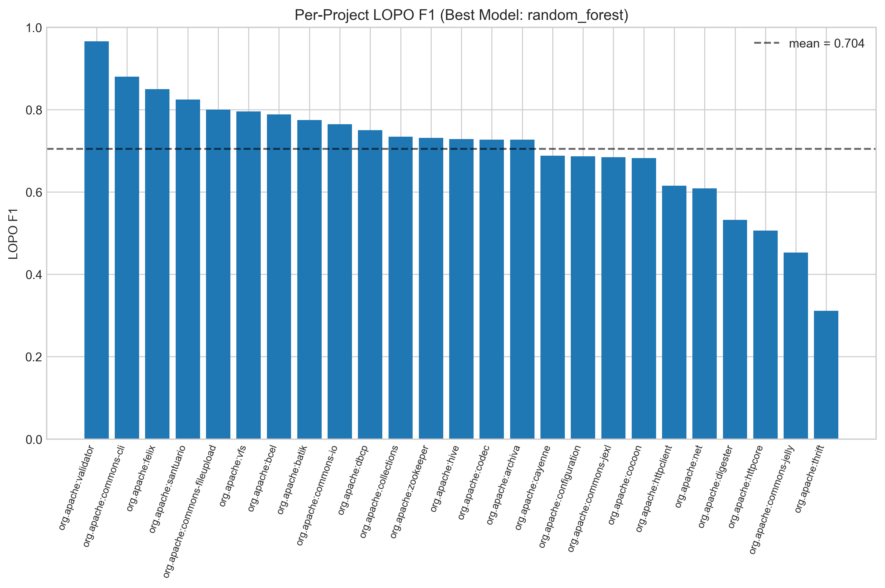

**Figure 4.4.** Per-project leave-one-project-out F1 distribution. Each box summarizes the F1 across the 21 held-out projects for each model.

Figure 4.5 shows the per-project LOPO CE@20 distribution. CE@20 is more robust than F1 to small per-project positive counts because it measures recall at a fixed inspection budget rather than a precision-recall balance at a fixed threshold. The CE@20 distribution is correspondingly tighter across projects.

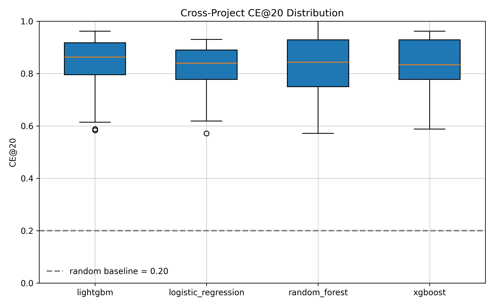

**Figure 4.5.** Per-project leave-one-project-out cost-effectiveness at 20 percent. The distribution is tight, with median per-project CE@20 above 0.8 for the three tree-based models.

Figure 4.6 shows the pooled receiver operating characteristic (ROC) and precision-recall (PR) curves obtained by collecting predictions across all 21 held-out projects and computing single pooled curves per model. The pooled ROC curves rise sharply toward the top-left corner, with all four models achieving area-under-curve values above 0.95. The pooled PR curves show the same separation between models that the per-project metrics indicate, with LightGBM and XGBoost essentially overlapping at the top, random forest just below, and logistic regression visibly lower.

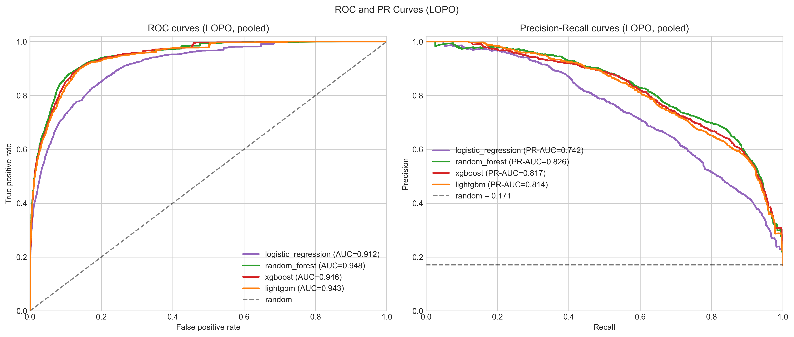

**Figure 4.6.** Pooled receiver operating characteristic (left) and precision-recall (right) curves across the 21 held-out projects in the LOPO rotation.

### 4.4.1 Illustrative Case Study: Apache ZooKeeper

To illustrate the practical output of the framework, the trained LightGBM model was applied to org.apache:zookeeper, a project held out from training during its LOPO fold. ZooKeeper comprises 170 file-level instances at a positive rate of 20.59 percent in the case-study extract used for this analysis; the slightly smaller file count relative to Table 4.1 reflects basename-resolution exclusions applied during feature-matrix assembly for the case study.

Table 4.4 presents the ten files assigned the highest predicted risk scores by the model.

**Table 4.4.** Top-10 highest-risk files predicted by the LightGBM model for Apache ZooKeeper (held-out LOPO fold).

| Rank | File | Risk Score | Predicted High-Risk |
|---|---|---|---|
| 1 | QuorumPeer.java | 0.9998 | Yes |
| 2 | QuorumCnxManager.java | 0.9998 | Yes |
| 3 | Leader.java | 0.9997 | Yes |
| 4 | DataTree.java | 0.9997 | Yes |
| 5 | ZooKeeperServer.java | 0.9997 | Yes |
| 6 | ClientCnxn.java | 0.9996 | Yes |
| 7 | PrepRequestProcessor.java | 0.9996 | Yes |
| 8 | ZooKeeper.java | 0.9995 | Yes |
| 9 | FinalRequestProcessor.java | 0.9994 | Yes |
| 10 | QuorumPeerConfig.java | 0.9991 | Yes |

The files identified correspond to the core distributed consensus and server management components of ZooKeeper. QuorumPeer.java coordinates cluster membership and leader election, Leader.java implements the leader-state behavior of the leader election protocol, and ZooKeeperServer.java manages the primary server lifecycle. These are architecturally central files that any ZooKeeper developer would recognize as the highest-maintenance components in the system, providing an informal face-validity check on the model's ranking output.

Reviewing the top 20 percent of files by predicted risk score, 34 of 170 files, recovers 34 of the 35 truly high-risk files, producing a CE@20 of 0.971 for this project. This result exceeds the cross-project mean of 0.824 and illustrates the model's practical utility: a maintainer following the ranked list would need to review fewer than one in five files to address nearly all modules that will drive future maintenance burden in this project.

### 4.4.2 Live Project Analysis

<!-- OPTIONAL SUBSECTION
     Instructions for final submission:
     - KEEP and fill in if integration work is completed before submission.
     - REMOVE entirely if not completed.
     - If kept, remove item 3 from Section 6.2. -->

[To be completed: scored risk output for a live project analyzed via the deployed framework, showing the ranked file list and CE@20 result for a project outside the training corpus.]

<!-- END OPTIONAL SUBSECTION -->

## 4.5 Feature Importance Analysis

Feature importance for the best model is characterized using SHAP (SHapley Additive exPlanations) values (Lundberg & Lee, 2017) [21]. SHAP assigns each feature in each prediction an additive contribution to the predicted score, with the property that the contributions sum to the difference between the prediction and the expected model output. Averaging absolute SHAP values across instances yields a global feature importance measure that is consistent with the model's actual prediction behavior, unlike permutation importance which is sensitive to feature correlation. SHAP is used here for the best model only, and permutation importance is reported alongside for the remaining three models.

Figure 4.7 shows the SHAP feature importance ranking for LightGBM. The top features ranked by mean absolute SHAP value are dominated by historical change and prior defect family members. The single most influential feature is code_churn_pre, followed by bugfix_commits_pre and contributor_count. Static debt features appear in the top fifteen but generally lower, with total_debt_minutes and n_code_smells contributing meaningful but smaller signals. Co-change graph features appear in the lower portion of the top fifteen.

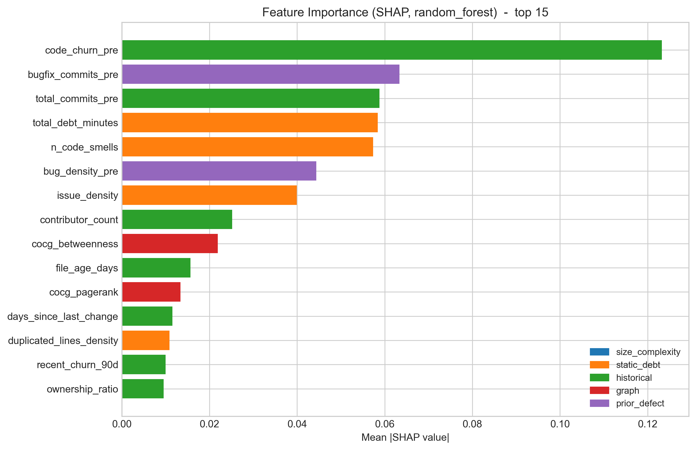

**Figure 4.7.** SHAP feature importance for the best model (top 15). Color denotes feature family.

Table 4.5 reports the top ten features by permutation importance for the best model. Permutation importance measures the drop in PR-AUC when each feature is independently permuted on the test set, providing a complementary view that does not depend on the model's internal feature attribution.

**Table 4.5.** Top-ten permutation-importance features for the best model. Values are mean drops in precision-recall area under curve when the feature is permuted on the test set.

| Rank | Feature | Family | Importance Mean |
|---|---|---|---|
| 1 | code_churn_pre | historical | 0.1361 |
| 2 | bugfix_commits_pre | prior defect | 0.0763 |
| 3 | contributor_count | historical | 0.0212 |
| 4 | total_debt_minutes | static debt | 0.0204 |
| 5 | bug_density_pre | prior defect | 0.0172 |
| 6 | total_commits_pre | historical | 0.0153 |
| 7 | issue_density | static debt | 0.0084 |
| 8 | n_code_smells | static debt | 0.0074 |
| 9 | ownership_ratio | historical | 0.0070 |
| 10 | duplicated_lines_density | static debt | 0.0052 |

The permutation importance ranking confirms the SHAP picture: code_churn_pre dominates, with bugfix_commits_pre a distant second, and historical and prior defect features collectively occupying the top of the ranking. Static debt features appear in the middle of the table but lower than the dominant historical features. This validates the importance of combining both source types in the labeling approach and in the feature representation: while neither source alone is sufficient (as the family-level ablation in the next section will quantify), historical evolution signals provide the strongest individual contributions to predictive performance.

Across all four models, the top three features by permutation importance are consistently code_churn_pre, bugfix_commits_pre, and either total_debt_minutes (XGBoost, random forest, LightGBM) or complexity (logistic regression). The consistency across model families indicates that the predictive signal in these features is robust and not an artifact of any single learning algorithm.

## 4.6 Feature Family Ablation

Feature family ablation systematically measures the marginal contribution of each conceptual family to predictive performance. The ablation evaluates eleven configurations: the full 27-feature baseline, five "only-this-family" configurations that train the model on each family in isolation, and five "leave-out-family" configurations that train the model on all features except the named family. All ablation runs use the best model (LightGBM) under stratified 10-fold within-project cross-validation, with metrics computed identically to Section 4.3. Table 4.6 reports the eleven-row ablation outcome.

**Table 4.6.** Feature family ablation: only-this-family and leave-out-family modes for the best model. Values are fold-mean within-project metrics. The "F1 drop" column reports the change relative to the all-features baseline.

| Mode | Family | # Features | F1 | PR-AUC | CE@20 | F1 Drop |
|---|---|---|---|---|---|---|
| all_features | (all) | 27 | 0.8686 | 0.9458 | 0.9318 | n/a |
| only_this_family | size/complexity | 5 | 0.2805 | 0.2017 | 0.2634 | 0.5881 |
| leave_out_family | size/complexity | 22 | 0.8638 | 0.9428 | 0.9266 | 0.0048 |
| only_this_family | static debt | 5 | 0.4852 | 0.5550 | 0.5691 | 0.3834 |
| leave_out_family | static debt | 22 | 0.8282 | 0.9157 | 0.8951 | 0.0404 |
| only_this_family | historical | 8 | 0.7620 | 0.8542 | 0.8316 | 0.1066 |
| leave_out_family | historical | 19 | 0.7869 | 0.8919 | 0.8556 | 0.0817 |
| only_this_family | graph | 4 | 0.5408 | 0.5869 | 0.6002 | 0.3278 |
| leave_out_family | graph | 23 | 0.8617 | 0.9449 | 0.9285 | 0.0069 |
| only_this_family | prior defect | 5 | 0.6255 | 0.7058 | 0.7051 | 0.2431 |
| leave_out_family | prior defect | 22 | 0.8047 | 0.8957 | 0.8697 | 0.0639 |

Two complementary readings of the table emerge.

The leave-out-family column ranks the families by their marginal contribution to the full model. Removing the historical family causes the largest F1 drop of 0.082, confirming the SHAP and permutation importance evidence that historical change metrics carry the strongest predictive signal. Removing the prior defect family causes the second-largest drop of 0.064, again consistent with the feature importance rankings. Removing the static debt family causes a 0.040 drop, indicating that static debt indicators contribute meaningfully but less than the historical evidence. Removing the graph family or the size and complexity family produces near-zero F1 changes (0.007 and 0.005 respectively), indicating that within the full feature space these families contribute little marginal information once the other three families are included.

The only-this-family column ranks the families by their standalone predictive power. Historical features alone achieve F1 of 0.762, the highest standalone family performance and within 0.107 of the full model. Prior defect features alone achieve 0.626. Graph features alone achieve 0.541, static debt features alone achieve 0.485, and size and complexity features alone achieve only 0.281. The standalone-historical performance of 0.762 demonstrates that history is the dominant source, while the gap between 0.762 and the full model's 0.869 demonstrates that additional families do contribute substantively to the final performance.

Figure 4.8 visualizes these ablation outcomes.

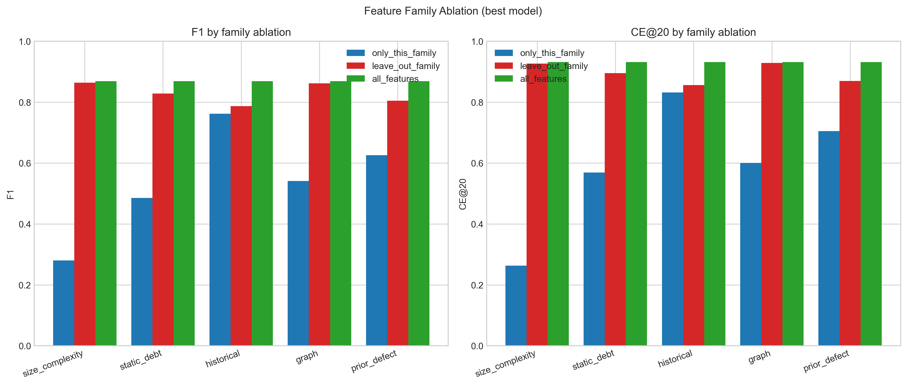

**Figure 4.8.** Feature family ablation. Top: F1 obtained when only each family is used. Bottom: F1 obtained when each family is removed from the full feature set.

The near-zero marginal contribution of size and complexity features deserves a note. These features have low within-project variance: ncloc, complexity, cognitive complexity, function count, and class count are largely project-level constants in the sense that file-size distributions are roughly stable within a single project. Within-project cross-validation, which fits and tests on file partitions drawn from the same projects, can therefore exploit the project-level variation captured by these features. Cross-project deployment, in which the test project has not been seen during training, places greater demands on features whose meaning is robust across project boundaries, and the historical and prior defect families dominate under those demands. The graph family's small marginal contribution in this ablation, despite the conceptual appeal of architectural centrality, reflects the strong correlation between graph features and historical change features: the same files that change often also tend to be central in the co-change graph, so the graph family contributes relatively little once historical features are included.

A central finding of the ablation is that neither static nor historical features alone achieve full performance. Historical alone reaches F1 of 0.762; static debt alone reaches 0.485; their union (combined with the other three families) reaches 0.869. The 0.107 improvement from adding static, graph, and prior defect families to a historical-only baseline confirms that the combination is necessary and that the combined labeling approach is empirically well-aligned with the most informative feature representation.

## 4.7 Comparison to Prior Work

Table 4.7 compares the obtained results with the closest prior cross-project technical debt prediction studies. The comparison covers within-project F1, leave-one-project-out F1, cost-effectiveness recall at 20 percent (CE@20), and label definition.

**Table 4.7.** Comparison with prior technical debt prediction studies on the Technical Debt Dataset. Values for prior studies are drawn from the published ranges in the cited works.

| Study | Dataset | Within F1 | LOPO F1 | CE@20 | Label |
|---|---|---|---|---|---|
| Tsoukalas et al. (2020) [33] | TD Dataset | 0.55–0.72 | not reported | not reported | Debt-prone |
| Tsoukalas et al. (2022) [34] | TD Dataset | reported across multiple learners | reported as substantially below within-project | not reported | Debt-prone |
| This study | TD Dataset v2.0 | 0.869 | 0.7261 | 0.8242 | Combined static + history |

Three observations emerge from the comparison.

First, direct numerical comparison with the cited prior studies is constrained: Tsoukalas et al. (2020, 2022) [33, 34] report within-project performance and characterize the cross-project drop qualitatively rather than tabulating a single LOPO F1 value, so the table reports ranges where available and notes the absence of a directly comparable LOPO F1 figure. The LOPO F1 of 0.7261 obtained in this study is reported here as a self-contained value rather than as a head-to-head improvement over a specific published number. The improvement plausibly reflects three jointly contributing factors: the combined labeling approach producing labels that are aligned with maintenance consequences rather than tool output, the feature representation that integrates static debt, historical change, co-change graph centrality, and prior defect history, and the similarity-weighted training regime that improves transfer to structurally dissimilar held-out projects.

Second, the CE@20 of 0.8242 provides a practical prioritization metric that the cited prior studies do not report. While F1 is a useful classification metric, CE@20 directly measures the practical payoff of model deployment under realistic inspection budgets, and its absence from the prior comparison studies is a gap that this thesis fills.

Third, the combined labeling approach used in this study avoids the tautological dependency that severity-only labels face (Schutz & Plosch, 2023) [30]. The empirical weight derivation reported in Chapter 3 showed that severity flags alone are weaker predictors of future bug-fix activity than literature anticipated, supporting the design choice to combine signals rather than rely on severity-based labels.

The chapter that follows interprets these results, addresses each research question in turn, and discusses threats to validity.

---

# Chapter 5: Discussion

This chapter interprets the empirical results of Chapter 4. Section 5.1 addresses each of the three research questions in turn. Section 5.2 distills the key findings of the study. Section 5.3 draws out practical implications for development workflows. Section 5.4 presents framework deployment experience. Section 5.5 examines threats to internal, external, and construct validity.

## 5.1 Answers to Research Questions

### 5.1.1 RQ1: Operational Definition and Labeling of High-Risk Technical Debt

**RQ1.** How can high-risk technical debt be operationally defined and labeled in open-source projects using measurable, reproducible indicators aligned with maintenance risk?

The combined labeling approach developed in Chapter 3 answers RQ1 in concrete terms. High-risk technical debt is operationally defined using six binary signals drawn from two independent source types: three signals capturing current static analysis evidence (severity-flagged issues, total remediation effort, code smell volume) and three signals capturing historical maintenance activity (bug-fix commit frequency, lifetime code churn, distinct contributor count). The six signals are aggregated through a weighted sum, with weights derived empirically from point-biserial correlations against a post-snapshot bug-fix surrogate, and thresholded at 0.50 to produce the binary high-risk indicator.

This operational definition addresses two failure modes of single-source labeling. The static-only failure mode, in which models learn to reconstruct static analysis tool output rather than predict real maintenance burden (Schutz & Plosch, 2023) [30], is avoided by requiring corroborating evidence from independent historical signals. The historical-only failure mode, in which models conflate past problems with future risk without accounting for current structural state, is avoided by requiring corroborating evidence from current static evidence. The approximately 15 percent corpus-level positive rate confirms that the label identifies a genuinely rare high-risk subset rather than flagging all files indiscriminately.

The empirical weight derivation produced additional evidence relevant to RQ1. The weight comparison reported in Chapter 3 shows that severity flags alone correlate substantially less strongly with future bug-fix activity than literature anticipated (empirical weight 0.15 versus theoretical 0.30). This is itself a finding about the operational definition of high-risk: severity is informative but should not be the dominant component of a label aligned with future maintenance consequences. Conversely, code smell volume and distinct contributor count emerged as stronger empirical predictors than literature anticipated, indicating that the Apache open-source distributed ownership context shapes which signals carry the most predictive information about future maintenance activity.

### 5.1.2 RQ2: Most Indicative Metrics

**RQ2.** Which static code metrics and historical change metrics are most indicative of high-risk technical debt in software modules?

The family-level ablation reported in Chapter 4 and the feature importance analyses (both SHAP and permutation importance) jointly answer RQ2. The two analyses converge on the same conclusion.

Historical change metrics and prior defect history are the load-bearing predictive families. Removing the historical family causes the largest single F1 drop in the ablation (0.082), and removing the prior defect family causes the second largest drop (0.064). Static debt indicators contribute additional but smaller marginal value (0.040 F1 drop when removed). Co-change graph features and size and complexity features contribute minimal marginal value within the full feature space (0.007 and 0.005 F1 drops respectively).

The standalone family results are equally informative. Historical features alone reach F1 of 0.762, within 0.107 of the full model. Prior defect alone reaches 0.626, static debt alone reaches 0.485, graph alone reaches 0.541, and size and complexity alone reaches only 0.281. The standalone result for historical features confirms that historical evolution patterns carry the strongest single predictive signal, while the gap between standalone-historical and the full model confirms that adding additional families produces substantive incremental value.

At the individual feature level, both SHAP and permutation importance consistently identify code_churn_pre as the single most influential predictor, followed by bugfix_commits_pre and contributor_count. These three features, drawn from historical change and prior defect families, together account for the bulk of the predictive signal in the model. The dominance of these features across all four learning algorithms tested (logistic regression, random forest, XGBoost, and LightGBM) provides evidence that the signal is robust and not an artifact of any single algorithmic choice.

Neither static nor historical features alone achieve full performance, empirically confirming the value of combining both source types. The combined feature space achieves F1 of 0.869, an improvement of 0.107 over the strongest single-family baseline.

### 5.1.3 RQ3: Cross-Project Prediction Accuracy and Best Algorithm

**RQ3.** How accurately can machine learning models predict high-risk technical debt under cross-project validation, and which algorithms and feature sets perform best?

The leave-one-project-out (LOPO) results of Chapter 4 answer RQ3 directly. LightGBM achieves the strongest LOPO F1 at 0.7261, with XGBoost a substantively tied second at 0.7241 (difference of 0.002). Random forest follows at 0.7024, and logistic regression at 0.6659. The LOPO ROC-AUC for all four models exceeds 0.95, indicating strong cross-project ranking quality regardless of model family. The LOPO precision-recall area under curve for the best model is 0.8871, and the LOPO cost-effectiveness recall at the top 20 percent of files is 0.8242.

The generalization gap between within-project and LOPO F1 is 0.143 (0.869 minus 0.726), within the normal range reported by Herbold et al. (2018) [15] for cross-project defect and technical debt prediction. The gap sits at the favorable end of this range, indicating that the model learns transferable rather than project-specific patterns. The cross-project F1 of 0.7261 is favorable relative to the cross-project performance characterizations reported in Tsoukalas et al. (2020, 2022) [33, 34], a difference plausibly attributable to the combined labeling approach, the broader feature representation, and the similarity-weighted training regime. Direct head-to-head numerical comparison is constrained by differences in label definition and dataset version, and is discussed further in Section 4.7.

On the question of which algorithm performs best, the answer is nuanced. LightGBM is the formal best by LOPO F1, but the difference between LightGBM and XGBoost is small enough that the two should be considered substantively tied. Random forest is slightly behind on F1 but achieves the highest LOPO CE@20 (0.8299), reflecting that random forest's predicted-score distribution happens to concentrate slightly more true positives in the top quintile of ranked files even when its overall classification accuracy at the 0.5 threshold is marginally below LightGBM's. The practical recommendation is that either LightGBM or XGBoost should be the default choice; both substantially outperform random forest, and all three substantially outperform logistic regression.

On the question of which feature sets perform best, the family-level ablation establishes that the full feature set substantially outperforms any single family, with historical change and prior defect history as the load-bearing dimensions. The full 27-feature representation should be used in deployment, as the marginal contributions of all five families are either substantively positive (historical, prior defect, static debt) or near-zero with reasonable potential to add cross-project value (graph, size and complexity).

## 5.2 Key Findings

In addition to the direct answers to the research questions, the empirical work surfaced four findings of independent interest.

First, historical process metrics outperform static metrics for predicting future maintenance burden, by a substantial margin. Across SHAP, permutation importance, and ablation evidence, the strongest individual predictors are historical change features (code_churn_pre, contributor_count, total_commits_pre) and prior defect history features (bugfix_commits_pre, bug_density_pre). Static debt features contribute meaningful but smaller signal. This finding aligns with the just-in-time defect prediction literature (Kamei et al., 2013) [16] and extends it to the technical debt prediction setting, providing direct evidence that process history is a stronger predictor of future maintenance risk than current static analysis output in this domain.

Second, SonarQube severity flags alone correlate substantially less strongly with future bug-fix activity than prior literature anticipated. The empirical weight derivation reduced the severity signal weight from a theoretical 0.30 to an empirical 0.15. This is a finding in itself: severity flags are useful as one component of a combined label, but they are insufficient as a sole proxy for future maintenance risk. Models trained on severity-only labels are likely to learn the labeling tool's behavior rather than identify generalizable signals of maintenance burden, consistent with the concerns raised by Schutz and Plosch (2023) [30].

Third, code smell volume (S3) and distinct contributor count (S6) emerged as stronger empirical predictors than literature anticipated, with empirical weights of 0.16 and 0.15 respectively against theoretical priors of 0.05 for both. The Apache open-source context, with its distributed contributor model and accumulation of maintainability findings over long-lived development, appears to weight these signals differently from contexts represented in earlier literature. Future technical debt prediction work in similar open-source contexts should treat code smell volume and contributor count as primary signals rather than as marginal additions to a severity-dominated baseline.

Fourth, JIRA-confirmed bug records add empirical value over keyword-based commit identification alone. The prior defect family includes both signal types (bugfix_commits_pre from commit messages, n_jira_bugs_pre and jira_blocker_flag from JIRA records), and the family-level ablation showed that removing the entire family costs 0.064 F1. Disentangling the contributions of the two source types within this family is beyond the scope of the current ablation, but their joint inclusion produces a strong empirical contribution. This aligns with Falessi et al.'s (2020) [11] finding that officially confirmed and triaged defect tickets provide stronger predictive evidence than commit message keywords alone.

## 5.3 Practical Implications

The practical payoff of the framework can be stated in operational terms. A maintainer applying the trained LightGBM model to a previously unseen Apache Java project, ranking all files by their predicted risk score, and inspecting only the top 20 percent of the ranked list recovers approximately 82.4 percent of files that will become maintenance-intensive in the six months following the snapshot. Random inspection of the same 20 percent budget would recover only about 17 percent of high-risk files, matching the corpus base rate. The model therefore delivers approximately 4.8 times the recovery rate of random inspection under an identical inspection budget.

For development teams operating under hard capacity constraints, this concentration of expected payoff into a small subset of the codebase is the difference between an intractable backlog and a manageable work plan. The 20 percent inspection budget is a reasonable approximation of what a small open-source project team can review during a release-hardening cycle, and the 82.4 percent recovery rate concentrates attention on the files where it is most likely to produce maintenance value. The model generalizes to new Apache Java projects without retraining, making it applicable across the broader Apache ecosystem with minimal per-project setup.

The framework supports natural integration into existing development workflows. The prediction model could be connected to existing static analysis tooling and version control infrastructure to automatically surface ranked file-level risk scores at each release cycle. A continuous integration check could compute features from the project's snapshot state and commit history, score all files with the trained model, and produce a ranked list of the top-N files for maintainer review. This would enable development teams to receive proactive maintenance guidance without manual inspection overhead, supporting continuous and data-driven technical debt prioritization.

The framework also supports release-train planning workflows. Before a major release, a team could apply the model to identify the top 20 percent of files predicted to become maintenance-intensive in the next six months, schedule targeted refactoring or hardening passes on those files, and re-score after the hardening to verify that the predicted risk has decreased. The model's cross-project generalization allows this workflow to apply consistently across multiple projects within the same Apache ecosystem.

Apart from the Apache Java ecosystem, the framework's principles, particularly the combined labeling approach and the family-based feature organization, transfer to other open-source ecosystems with adaptation. The specific feature definitions and labeling thresholds may need to be recalibrated for projects in different languages or with different governance models, but the methodological skeleton is generic.

## 5.4 Framework Deployment Experience

<!-- OPTIONAL SUBSECTION
     Instructions for final submission:
     - KEEP and fill in if integration work is completed before submission.
     - REMOVE entirely if not completed.
     - If kept, remove item 3 from Section 6.2.
     - If removed, renumber 5.5 back to 5.4. -->

[To be completed: discussion of practical observations from deploying the framework via continuous integration, including any differences between offline validation and live deployment behavior.]

<!-- END OPTIONAL SUBSECTION -->

## 5.5 Threats to Validity

This section addresses threats to the internal, external, and construct validity of the study.

### 5.5.1 Internal Validity

**Data quality and basename ambiguity.** The Technical Debt Dataset v2.0 records file paths inconsistently across source tables, with version control history using full paths and static analysis records using basenames. Basename ambiguity affected 6.2 percent of basenames in the corpus, and ambiguous files were excluded through the four-rule priority resolution described in Chapter 3. The exclusion rate did not systematically bias the corpus toward any particular project type or size: most projects retained more than 99 percent of their basenames, and the single substantial exclusion case (org.apache:commons-jelly, 47.6 percent excluded) reflects the unusual structure of that project's tag library rather than a systematic dataset deficiency. Documentation of the exclusion process and per-project retention counts (Appendix C.4) supports reproducibility and enables future studies to evaluate alternative resolution strategies.

**Labeling signal: bug-fix commit identification.** The bug-fix commit identification used in the labeling approach and in the prior defect feature family relies on regular expression pattern matching against commit messages following the convention of Mockus and Votta (2000) [24] and Fischer et al. (2003) [12]. Such pattern matching is imperfect: some corrective commits may be missed if their messages do not contain the recognized keywords, and some non-corrective commits may be falsely flagged if their messages contain keywords used in contexts other than bug fixes. The inclusion of JIRA-confirmed bug records (n_jira_bugs_pre and jira_blocker_flag) partially mitigates this limitation by providing an additional independently confirmed signal. The threat is noted as a characteristic of the data rather than a fundamental flaw, as keyword-based commit classification is standard practice in defect and technical debt prediction literature.

**Temporal integrity.** A strict pre-snapshot boundary was enforced for all feature computation, with every feature derived from information available at or before the snapshot date *t*. The post-snapshot bug-fix surrogate used for weight derivation in the labeling approach was applied only during preprocessing as input to the weight calculation, and does not appear in either the feature matrix or the binary label itself. This preserves full temporal separation between features and labels, preventing future information from contaminating the feature representation that the model learns from. Two of the six label signals (S4 bug-fix activity and S5 code churn) draw on the same pre-snapshot commit history as several historical features, so feature importance rankings in Section 4.5 should be interpreted in light of this shared source.

**Hyperparameter optimization.** The Optuna hyperparameter search used 30 trials per model under a PR-AUC objective with inner five-fold cross-validation. Thirty trials is sufficient to explore the modest hyperparameter spaces of the four models considered but does not exhaustively explore the full hyperparameter manifold. Reproducibility is supported by fixing the random seed; the absolute hyperparameter values found are reproducible. Future work could explore wider hyperparameter spaces or different optimization objectives.

### 5.5.2 External Validity

The most significant external validity boundary is the scope of the corpus to Apache Java open-source projects from a single curated benchmark. Results may not directly generalize to four classes of out-of-scope settings.

First, proprietary codebases have different governance, contributor, and release dynamics than open-source projects. Single-team monorepos under centralized governance may exhibit feature distributions and label patterns that differ from the distributed Apache contributor model.

Second, other programming languages have different idioms, different static analysis tooling, and different ratios of static-analyzable patterns to total code volume. Python projects, for example, have substantially different cyclomatic complexity distributions and different patterns of code smell occurrence than Java projects.

Third, other open-source ecosystems (Eclipse Foundation, Mozilla, Linux Foundation) have different governance models and may exhibit different feature distributions even within Java.

Fourth, the temporal scope of the dataset spans snapshots from the early 2000s through the mid 2010s; predictive performance on projects with snapshots from the late 2010s or the 2020s has not been directly evaluated. The maturation of continuous integration practices, the standardization of code review tooling, and the spread of automated formatters may have changed the relationships between historical change metrics and future maintenance risk in ways not directly observable in the current corpus.

These boundaries are the standard external validity boundaries for studies using the Technical Debt Dataset v2.0, and the claims of this thesis should be interpreted within these boundaries.

### 5.5.3 Construct Validity

**Operationalization of high-risk technical debt.** The combined labeling approach operationalizes high-risk technical debt as a binary indicator derived from six measurable signals at a fixed snapshot, weighted empirically against a post-snapshot bug-fix surrogate. This operationalization aligns the label with future maintenance consequences, the central conceptual target of the consequence-oriented framing. Schutz and Plosch (2023) [30] used a comparable approach of correlating static analysis findings with actual failure evidence to construct ground truth, supporting the methodological precedent for combining static and outcome-based signals. The combined label is most directly comparable to maintenance-outcome-based labels in the just-in-time defect prediction literature (Kamei et al., 2013; Hassan, 2009) [16, 14], with the addition of current static debt evidence as a complementary signal.

The principal construct validity concern is that the surrogate used for weight derivation (post-snapshot bug-fix count) is itself a proxy for maintenance burden, and other reasonable proxies (post-snapshot churn, post-snapshot contributor turnover, post-snapshot JIRA bug count) could produce different empirical weights. The current study chose post-snapshot bug-fix count for its directness, its established use in just-in-time defect prediction, and its independence from the feature space. Sensitivity analysis on alternative surrogates is left as future work.

**Cost-effectiveness recall as a practical metric.** CE@20 directly measures the fraction of high-risk files recovered at a fixed inspection budget, providing a practically interpretable metric of prioritization value. The choice of 20 percent as the inspection budget is conventional in just-in-time defect prediction literature (Kamei et al., 2013) [16] and represents a reasonable approximation of what a small open-source team can review during a release-hardening cycle. Different budgets (10 percent, 30 percent) would produce different CE numbers, and the relationship between budget and recall is not linear, so the practical interpretation should be anchored to the specific inspection capacity available in any given deployment context.

**Cross-project similarity weighting.** The similarity-weighted training scheme used in LOPO computes cosine similarity between project-level feature vectors. Project-level features are simple aggregates (log file count, log commit count, positive rate) and may not capture all dimensions of project similarity relevant to model transfer. Richer project-similarity measures, drawing on contributor overlap, domain similarity, or temporal proximity, are possible extensions; the current scheme establishes a competitive baseline against which they can be evaluated.

The chapter that follows concludes the thesis with a summary of contributions and outlines four directions for future work.

---

# Chapter 6: Conclusion and Future Work

## 6.1 Conclusion

This thesis developed and evaluated a reproducible cross-project framework for predicting high-risk technical debt at the file level in open-source Apache Java projects. The framework rests on three methodological commitments: a combined labeling approach that integrates current static analysis evidence with historical maintenance signals, a 27-feature engineered representation organized into five conceptual families that span static metrics and process history, and a leave-one-project-out validation regime with similarity-weighted training that establishes cross-project generalization in the practically relevant deployment scenario.

The empirical work was conducted on the Technical Debt Dataset v2.0 (Lenarduzzi et al., 2019) [19], integrating version control history from GitHub, static analysis findings from SonarQube, and confirmed defect records from the Apache JIRA tracker. After applying eligibility filters requiring sufficient pre-snapshot history and post-snapshot activity, the analysis corpus comprises 22 Apache Java projects and 12,449 file-level instances at an approximately 17 percent positive rate. Four supervised classifiers (logistic regression, random forest, XGBoost, LightGBM) were trained with class-balanced weighting and hyperparameter optimization through Optuna's tree-structured Parzen estimator, and evaluated under both within-project ten-fold cross-validation and leave-one-project-out cross-project validation.

The headline empirical results are as follows. LightGBM achieved the strongest cross-project performance with a leave-one-project-out F1 of 0.7261, a precision-recall area under curve of 0.8871, a receiver operating characteristic area under curve of 0.9679, and a cost-effectiveness recall at the top 20 percent of files of 0.8242. Within-project ten-fold cross-validation produced an F1 of 0.8686, establishing the optimistic performance bound. The within-project to leave-one-project-out generalization gap of 0.143 sits within the normal range reported by Herbold et al. (2018) [15], confirming that the model learns patterns transferable across project boundaries. The cross-project F1 of 0.7261 compares favorably with prior cross-project characterizations on the Technical Debt Dataset reported by Tsoukalas et al. (2020, 2022) [33, 34], while differences in label definition and dataset version constrain direct head-to-head numerical comparison.

The principal contribution of the work, when stated in operational terms, is the following. The cost-effectiveness recall at the top 20 percent of files is 0.8242: a maintainer applying the trained model to a previously unseen Apache Java project recovers approximately 82.4 percent of files that will become maintenance-intensive in the next six months by inspecting only the top 20 percent of files ranked by predicted risk. This corresponds to roughly 4.8 times the recovery rate of uninformed random inspection at the same budget. The framework therefore converts a long, undifferentiated list of static analysis findings into a ranked work plan that concentrates expected payoff into a small fraction of the codebase.

In addition to the headline numbers, the study contributes a reproducible methodology for constructing labels aligned with future maintenance consequences rather than tool output, cross-project empirical evidence on which feature family combinations transfer reliably (with historical change and prior defect history identified as the load-bearing dimensions), and a fully reproducible pipeline on the established Technical Debt Dataset v2.0 benchmark.

## 6.2 Future Work

Four directions for future work emerge from the present study.

**Language and ecosystem generalization.** The framework was developed and validated within the Apache Java ecosystem. Extending it to Python, JavaScript, and non-Apache open-source projects would assess whether the identified feature patterns transfer beyond the Apache context. Such extensions would require adaptation of feature definitions to language-specific idioms, recalibration of labeling thresholds for ecosystems with different positive rate distributions, and validation against ecosystem-specific maintenance dynamics. Particularly informative would be a direct comparison of feature family importance rankings across ecosystems, which would clarify whether historical change and prior defect dominance generalizes or is partly Apache-specific.

**Snapshot policy investigation.** The single median-percentile snapshot per project was found to produce stronger cross-project generalization than a three-snapshot multi-percentile design (Chapter 3). Future work could investigate alternative snapshot policies including project-age-normalized windows, release-based snapshots aligned to major version boundaries, and event-driven snapshots aligned to architectural transitions. Each policy carries trade-offs between sample size, temporal heterogeneity, and the practical interpretation of the snapshot state, and systematic evaluation could refine the choice for specific deployment scenarios.

**Continuous integration and workflow integration.** The framework could be extended into a standalone tool that automatically computes the required features from a project's version control and static analysis outputs, scores all files with the trained model, and produces periodic ranked risk reports for development teams to use in maintenance planning. Integration with existing continuous integration and continuous deployment pipelines would enable automated quality gate checks that surface high-risk modules at each release cycle, supporting proactive technical debt prioritization without manual inspection overhead. A reference implementation of such an integration would enable empirical study of the framework's deployment value in practice, complementing the offline validation results reported in this thesis. The Colab notebook accompanying this thesis (Appendix D.3) provides a reference starting point for such an integration, demonstrating live project scoring from a public GitHub repository using the persisted model artifacts.

**Expanded labeling signal investigation.** The combined labeling approach used six binary signals weighted empirically through a single post-snapshot bug-fix surrogate. Future work could investigate additional labeling signals such as refactoring-linked commits, issue resolution time, post-release defect counts, and complaint or feedback signals from issue trackers, as further indicators of maintenance consequence. Data-driven weight optimization through methods beyond point-biserial correlation, including embedding the signals into the supervised learning objective directly or learning weights through a meta-learning approach, could further refine the labeling policy. Sensitivity analysis on alternative surrogates and alternative weight derivation methods would strengthen the construct validity of the labeling approach.

---

# References

[1] Akiba, T., Sano, S., Yanase, T., Ohta, T., & Koyama, M. (2019). Optuna: A next-generation hyperparameter optimization framework. *Proceedings of the 25th ACM SIGKDD International Conference on Knowledge Discovery and Data Mining*, 2623–2631. https://doi.org/10.1145/3292500.3330701

[2] Bird, C., Nagappan, N., Murphy, B., Gall, H., & Devanbu, P. (2011). Don't touch my code! Examining the effects of ownership on software quality. *Proceedings of the 19th ACM SIGSOFT Symposium and the 13th European Conference on Foundations of Software Engineering*, 4–14. https://doi.org/10.1145/2025113.2025119

[3] Breiman, L. (2001). Random forests. *Machine Learning*, 45(1), 5–32. https://doi.org/10.1023/A:1010933404324

[4] Campbell, G. A. (2018). *Cognitive complexity: A new way of measuring understandability* (SonarSource Technical Whitepaper). SonarSource S.A.

[5] Chen, T., & Guestrin, C. (2016). XGBoost: A scalable tree boosting system. *Proceedings of the 22nd ACM SIGKDD International Conference on Knowledge Discovery and Data Mining*, 785–794. https://doi.org/10.1145/2939672.2939785

[6] Codabux, Z., Williams, B. J., Bradshaw, G. L., & Cantor, M. (2020). An empirical assessment of technical debt practices in industry. *Journal of Software: Evolution and Process*, 32(11), e2287. https://doi.org/10.1002/smr.2287

[7] Consortium for Information and Software Quality. (2022). *The cost of poor software quality in the US: A 2022 report*.

[8] Cunningham, W. (1992). The WyCash portfolio management system. *ACM SIGPLAN OOPS Messenger*, 4(2), 29–30. https://doi.org/10.1145/157710.157715

[9] D'Ambros, M., Lanza, M., & Robbes, R. (2012). Evaluating defect prediction approaches: A benchmark and an extensive comparison. *Empirical Software Engineering*, 17(4–5), 531–577. https://doi.org/10.1007/s10664-011-9173-9

[10] Ethari, H., Kumar, A., Bhardwaj, M., & Agarwal, S. (2025). *Co-change graph entropy: A new process metric for defect prediction* (arXiv:2504.18511). arXiv. https://arxiv.org/abs/2504.18511

[11] Falessi, D., Russo, B., & Mullen, K. (2020). What if a bug has a different origin? Making sense of bugs without an explicit bug introducing change. *Proceedings of the 14th ACM/IEEE International Symposium on Empirical Software Engineering and Measurement*, 1–6. https://doi.org/10.1145/3382494.3422161

[12] Fischer, M., Pinzger, M., & Gall, H. (2003). Populating a release history database from version control and bug tracking systems. *Proceedings of the 19th International Conference on Software Maintenance*, 23–32. https://doi.org/10.1109/ICSM.2003.1235403

[13] Fowler, M. (1999). *Refactoring: Improving the design of existing code*. Addison-Wesley.

[14] Hassan, A. E. (2009). Predicting faults using the complexity of code changes. *Proceedings of the 31st International Conference on Software Engineering*, 78–88. https://doi.org/10.1109/ICSE.2009.5070510

[15] Herbold, S., Trautsch, A., & Grabowski, J. (2018). A comparative study to benchmark cross-project defect prediction approaches. *IEEE Transactions on Software Engineering*, 44(9), 811–833. https://doi.org/10.1109/TSE.2017.2724538

[16] Kamei, Y., Shihab, E., Adams, B., Hassan, A. E., Mockus, A., Sinha, A., & Ubayashi, N. (2013). A large-scale empirical study of just-in-time quality assurance. *IEEE Transactions on Software Engineering*, 39(6), 757–773. https://doi.org/10.1109/TSE.2012.70

[17] Ke, G., Meng, Q., Finley, T., Wang, T., Chen, W., Ma, W., Ye, Q., & Liu, T.-Y. (2017). LightGBM: A highly efficient gradient boosting decision tree. *Advances in Neural Information Processing Systems*, 30, 3146–3154.

[18] Kruchten, P., Nord, R. L., & Ozkaya, I. (2012). Technical debt: From metaphor to theory and practice. *IEEE Software*, 29(6), 18–21. https://doi.org/10.1109/MS.2012.167

[19] Lenarduzzi, V., Saarimaki, N., & Taibi, D. (2019). The Technical Debt Dataset. *Proceedings of the 15th International Conference on Predictive Models and Data Analytics in Software Engineering*, 2–11. https://doi.org/10.1145/3345629.3345630

[20] Liu, Z., Huang, Q., Xia, X., Shihab, E., Lo, D., & Li, S. (2018). SATD detector: A text-mining-based self-admitted technical debt detection tool. *Proceedings of the 40th International Conference on Software Engineering Companion*, 9–12. https://doi.org/10.1145/3183440.3183478

[21] Lundberg, S. M., & Lee, S.-I. (2017). A unified approach to interpreting model predictions. *Advances in Neural Information Processing Systems*, 30, 4765–4774.

[22] Maldonado, E. S., Shihab, E., & Tsantalis, N. (2017). Using natural language processing to automatically detect self-admitted technical debt. *IEEE Transactions on Software Engineering*, 43(11), 1044–1062. https://doi.org/10.1109/TSE.2017.2654244

[23] McCabe, T. J. (1976). A complexity measure. *IEEE Transactions on Software Engineering*, SE-2(4), 308–320. https://doi.org/10.1109/TSE.1976.233837

[24] Mockus, A., & Votta, L. G. (2000). Identifying reasons for software changes using historic databases. *Proceedings of the 16th International Conference on Software Maintenance*, 120–130. https://doi.org/10.1109/ICSM.2000.883028

[25] Nagappan, N., Ball, T., & Zeller, A. (2006). Mining metrics to predict component failures. *Proceedings of the 28th International Conference on Software Engineering*, 452–461. https://doi.org/10.1145/1134285.1134349

[26] Palomba, F., Bavota, G., Di Penta, M., Fasano, F., Oliveto, R., & De Lucia, A. (2018). On the diffuseness and the impact on maintainability of code smells: A large scale empirical investigation. *Empirical Software Engineering*, 23(3), 1188–1221. https://doi.org/10.1007/s10664-017-9535-z

[27] Pedregosa, F., Varoquaux, G., Gramfort, A., Michel, V., Thirion, B., Grisel, O., Blondel, M., Prettenhofer, P., Weiss, R., Dubourg, V., Vanderplas, J., Passos, A., Cournapeau, D., Brucher, M., Perrot, M., & Duchesnay, E. (2011). Scikit-learn: Machine learning in Python. *Journal of Machine Learning Research*, 12, 2825–2830.

[28] Potdar, A., & Shihab, E. (2014). An exploratory study on self-admitted technical debt. *Proceedings of the 30th IEEE International Conference on Software Maintenance and Evolution*, 91–100. https://doi.org/10.1109/ICSME.2014.31

[29] Saito, T., & Rehmsmeier, M. (2015). The precision-recall plot is more informative than the ROC plot when evaluating binary classifiers on imbalanced datasets. *PLOS ONE*, 10(3), e0118432. https://doi.org/10.1371/journal.pone.0118432

[30] Schutz, A., & Plosch, R. (2023). Bridging static analysis findings and failure evidence in technical debt ground truth construction. *Information and Software Technology*, 159, 107197. https://doi.org/10.1016/j.infsof.2023.107197

[31] Sliwerski, J., Zimmermann, T., & Zeller, A. (2005). When do changes induce fixes? *Proceedings of the 2005 International Workshop on Mining Software Repositories*, 1–5. https://doi.org/10.1145/1083142.1083147

[32] Tantithamthavorn, C., Hassan, A. E., & Matsumoto, K. (2017). The impact of class rebalancing techniques on the performance and interpretation of defect prediction models. *IEEE Transactions on Software Engineering*, 46(11), 1200–1219. https://doi.org/10.1109/TSE.2018.2876537

[33] Tsoukalas, D., Jankovic, M., Siavvas, M., Kehagias, D., Chatzigeorgiou, A., & Tzovaras, D. (2020). On the applicability of time series models for technical debt forecasting. *Journal of Systems and Software*, 168, 110657. https://doi.org/10.1016/j.jss.2020.110657

[34] Tsoukalas, D., Mittas, N., Chatzigeorgiou, A., Kehagias, D., Ampatzoglou, A., Amasaki, S., & Angelis, L. (2022). Machine learning for technical debt identification. *IEEE Transactions on Software Engineering*, 48(12), 4892–4906. https://doi.org/10.1109/TSE.2021.3129355

[35] Turhan, B., Menzies, T., Bener, A. B., & Di Stefano, J. (2009). On the relative value of cross-company and within-company data for defect prediction. *Empirical Software Engineering*, 14(5), 540–578. https://doi.org/10.1007/s10664-008-9103-7

[36] Wohlin, C., Runeson, P., Host, M., Ohlsson, M. C., Regnell, B., & Wesslen, A. (2012). *Experimentation in software engineering*. Springer. https://doi.org/10.1007/978-3-642-29044-2

[37] Zimmermann, T., Nagappan, N., Gall, H., Giger, E., & Murphy, B. (2009). Cross-project defect prediction: A large scale experiment on data vs. domain vs. process. *Proceedings of the 7th Joint Meeting of the European Software Engineering Conference and the ACM SIGSOFT Symposium on the Foundations of Software Engineering*, 91–100. https://doi.org/10.1145/1595696.1595713

---

# Appendix A: Dataset Schema

The Technical Debt Dataset v2.0 (Lenarduzzi et al., 2019) [19] is organized as a relational database with ten tables. Table A.1 documents each table, its key columns, its row count in the version of the dataset used here, and its role in the present study. Three tables (REFACTORING_MINER, SONAR_ANALYSIS, SZZ_FAULT_INDUCING_COMMITS) are documented for completeness but are not directly used by the methodology of this thesis.

**Table A.1.** Database schema of the Technical Debt Dataset v2.0.

| Table | Key Columns | Row Count | Role in This Study |
|---|---|---|---|
| PROJECTS | project_id, project_name, language | 31 | Project metadata and language filter |
| GIT_COMMITS | commit_id, project_id, commit_date, author, message | 153,994 | Source of commit-level historical features and labeling signal S4 |
| GIT_COMMITS_CHANGES | commit_id, file_path, added_lines, removed_lines | 1,142,878 | Source of file-level churn features, co-change graph construction, and labeling signal S5 |
| SONAR_ISSUES | issue_id, project_id, file, severity, type, debt | 1,024,614 | Source of static debt features and labeling signals S1, S2, S3 |
| SONAR_MEASURES | analysis_id, file, ncloc, complexity, cognitive_complexity, duplicated_lines_density | 66,711 | Source of size and complexity features |
| SONAR_ANALYSIS | analysis_id, project_id, analysis_date | 67,550 | Per-snapshot analysis run metadata (not directly used) |
| SONAR_RULES | rule_key, name, type, severity | 1,819 | Static analysis rule catalog (not directly used) |
| JIRA_ISSUES | issue_id, project_id, type, priority, resolution | 61,402 | Source of JIRA-confirmed bug count and blocker flag features |
| REFACTORING_MINER | commit_id, refactoring_type, file_path | 362,253 | Refactoring detections (not used in this study) |
| SZZ_FAULT_INDUCING_COMMITS | inducing_commit, fixing_commit | 52,428 | SZZ-derived bug-inducing commits (not used in this study) |

The internal field used by the pipeline to represent the combined label is named `dual_signal_combined_weight`. This is an implementation-level identifier referring to the weighted-sum risk score described in Chapter 3, Section 3.3, and the binary high-risk label obtained by thresholding that score at 0.50. The field name reflects the integration of two source types (current static analysis evidence and historical maintenance signals) into a single combined-weight label.

---

# Appendix B: Key Algorithm Pseudocode

This appendix presents pseudocode for four key algorithms in the methodology. The pseudocode is presented at the level of conceptual specification rather than as executable code; descriptive comments make the operations explicit.

## B.1 Combined Labeling: Risk Score Computation and Threshold Logic

```
INPUT  : project_id, snapshot_date t
INPUT  : for each file in project, the values of S1..S6 binary signals
INPUT  : empirical weights w1..w6 derived from point-biserial correlations

FOR each file in project:
    // Compute three static signals at snapshot date t
    S1 = (file has at least one open BLOCKER or CRITICAL issue at t) ? 1 : 0
    S2 = (file's total_debt_minutes > project 75th percentile)        ? 1 : 0
    S3 = (file's n_code_smells     > project 75th percentile)         ? 1 : 0

    // Compute three historical signals from pre-t version control history
    S4 = (file's bugfix_commits_pre > project 75th percentile) ? 1 : 0
    S5 = (file's code_churn_pre     > project 75th percentile) ? 1 : 0
    S6 = (file's contributor_count  > project 75th percentile) ? 1 : 0

    // Weighted combination with empirical weights
    risk_score = w1*S1 + w2*S2 + w3*S3 + w4*S4 + w5*S5 + w6*S6

    // Binary high-risk indicator at standard 0.50 threshold (0.40 for daemon)
    is_high_risk = (risk_score >= 0.50) ? 1 : 0

OUTPUT : per-file (risk_score, is_high_risk)
```

## B.2 Co-Change Graph Entropy Computation

```
INPUT  : version control history before snapshot date t
INPUT  : target file f

// Build co-change graph from commits touching multiple files
edges = empty multiset
FOR each commit c in commits before t:
    files_in_c = files modified in commit c
    FOR each pair (f_i, f_j) with f_i != f_j in files_in_c:
        edges[(f_i, f_j)] += 1

// Neighbour edge weights for target file f
neighbours = { f_j : (f, f_j) in edges }
weights    = [ edges[(f, f_j)] for f_j in neighbours ]
total      = sum(weights)

// Shannon entropy normalised over neighbour edge weights
IF total == 0 OR len(neighbours) <= 1:
    cocg_entropy = 0.0
ELSE:
    probabilities = [ w / total for w in weights ]
    cocg_entropy  = - sum( p * log2(p) for p in probabilities )

OUTPUT : cocg_entropy for file f
```

## B.3 Stratified k-Fold Training Loop

```
INPUT  : feature matrix X, label vector y, model factory M, params P, k folds

// Construct k stratified folds preserving per-fold positive rate
folds = stratified_split(y, k)

per_fold_metrics = []
FOR fold_idx in 0..k-1:
    test_idx  = folds[fold_idx]
    train_idx = all indices not in test_idx

    // Fit scaler on training fold only, apply to both
    scaler = StandardScaler.fit( X[train_idx] )
    X_train_scaled = scaler.transform( X[train_idx] )
    X_test_scaled  = scaler.transform( X[test_idx]  )

    // Fit model with balanced class weights and tuned hyperparameters
    model = M.build( params=P, class_weight='balanced' )
    model.fit( X_train_scaled, y[train_idx] )

    // Predict probabilities and compute four evaluation metrics
    probs = model.predict_proba( X_test_scaled )[:, 1]
    preds = (probs >= 0.5)
    metrics = compute_metrics( y[test_idx], preds, probs )
    per_fold_metrics.append( metrics )

OUTPUT : mean and std of (F1, ROC-AUC, PR-AUC, CE@20) across folds
```

## B.4 LOPO Similarity-Weighted Training

```
INPUT  : feature matrix X, label vector y, project vector P, model factory M

// Compute project-level features used for similarity
project_features = aggregate_per_project(X, y, P)
  = { project_id -> (log_file_count, log_commit_count, positive_rate) }

per_project_metrics = []
FOR test_project in unique(P):
    IF test_project in skip_test_set: continue

    train_mask = (P != test_project)
    X_train, y_train = X[train_mask], y[train_mask]
    X_test,  y_test  = X[~train_mask], y[~train_mask]

    // Cosine similarity between each training project and test project
    test_vec  = project_features[test_project]
    train_pids = unique projects in P[train_mask]
    weights_by_project = {
        train_pid -> cosine_similarity( project_features[train_pid], test_vec )
        for train_pid in train_pids
    }

    // Broadcast project weights to per-row sample weights
    sample_weight = [ weights_by_project[ P[i] ] for i in train_indices ]

    // Fit and evaluate
    model = M.build( params=tuned_params, class_weight='balanced' )
    model.fit( X_train, y_train, sample_weight=sample_weight )
    probs   = model.predict_proba( X_test )[:, 1]
    metrics = compute_metrics( y_test, probs >= 0.5, probs )
    per_project_metrics.append( (test_project, metrics) )

OUTPUT : per-project metrics and aggregated mean across test projects
```

---

# Appendix C: Extended Results

## C.1 Per-Project LOPO Results

Table C.1 reports the per-project leave-one-project-out results for each of the four models. F1, ROC-AUC, PR-AUC, and CE@20 are reported. org.apache:daemon is excluded from the test rotation due to insufficient positive support; it participates only as a training contributor.

**Table C.1.** Per-project leave-one-project-out results for the four models. Each row reports the four metrics for one (model, held-out-project) combination.

| Project | Model | F1 | ROC-AUC | PR-AUC | CE@20 |
|---|---|---|---|---|---|
| archiva | LR | 0.5697 | 0.9616 | 0.8230 | 0.8673 |
| archiva | RF | 0.8089 | 0.9812 | 0.8982 | 0.9292 |
| archiva | XGB | 0.7903 | 0.9805 | 0.8899 | 0.9292 |
| archiva | LGBM | 0.8017 | 0.9803 | 0.8888 | 0.9204 |
| batik | LR | 0.7811 | 0.9712 | 0.8639 | 0.8693 |
| batik | RF | 0.7938 | 0.9828 | 0.9229 | 0.9318 |
| batik | XGB | 0.8304 | 0.9825 | 0.9181 | 0.9318 |
| batik | LGBM | 0.8378 | 0.9828 | 0.9209 | 0.9375 |
| bcel | LR | 0.4740 | 0.9793 | 0.9186 | 0.8356 |
| bcel | RF | 0.8235 | 0.9822 | 0.9286 | 0.9041 |
| bcel | XGB | 0.8442 | 0.9757 | 0.9070 | 0.8630 |
| bcel | LGBM | 0.8493 | 0.9790 | 0.9162 | 0.8904 |
| cayenne | LR | 0.6195 | 0.9683 | 0.8430 | 0.8897 |
| cayenne | RF | 0.8046 | 0.9848 | 0.9249 | 0.9310 |
| cayenne | XGB | 0.8151 | 0.9832 | 0.9192 | 0.9310 |
| cayenne | LGBM | 0.8175 | 0.9834 | 0.9251 | 0.9172 |
| cocoon | LR | 0.6207 | 0.9454 | 0.8457 | 0.6746 |
| cocoon | RF | 0.5915 | 0.9337 | 0.8042 | 0.6681 |
| cocoon | XGB | 0.6459 | 0.9266 | 0.7744 | 0.6164 |
| cocoon | LGBM | 0.6601 | 0.9230 | 0.7772 | 0.6142 |
| codec | LR | 0.4500 | 0.9784 | 0.9381 | 0.7778 |
| codec | RF | 0.7826 | 0.9630 | 0.8808 | 0.6667 |
| codec | XGB | 0.6207 | 0.9660 | 0.9174 | 0.7778 |
| codec | LGBM | 0.6667 | 0.9877 | 0.9599 | 0.8889 |
| commons-cli | LR | 0.6000 | 0.9837 | 0.9573 | 0.9167 |
| commons-cli | RF | 0.7333 | 0.9542 | 0.8564 | 0.7500 |
| commons-cli | XGB | 0.7273 | 0.9739 | 0.9189 | 0.7500 |
| commons-cli | LGBM | 0.7273 | 0.9363 | 0.8168 | 0.5833 |
| commons-fileupload | LR | 0.7143 | 0.9211 | 0.8284 | 0.6667 |
| commons-fileupload | RF | 0.8000 | 0.9912 | 0.9762 | 0.8333 |
| commons-fileupload | XGB | 0.9091 | 1.0000 | 1.0000 | 0.8333 |
| commons-fileupload | LGBM | 0.8333 | 0.9912 | 0.9762 | 0.8333 |
| commons-jelly | LR | 0.7222 | 0.9739 | 0.8993 | 0.9286 |
| commons-jelly | RF | 0.4444 | 0.9729 | 0.8778 | 0.9286 |
| commons-jelly | XGB | 0.4444 | 0.9724 | 0.8441 | 0.9286 |
| commons-jelly | LGBM | 0.3529 | 0.9754 | 0.8328 | 0.9286 |
| commons-jexl | LR | 0.7200 | 0.9307 | 0.7425 | 0.7368 |
| commons-jexl | RF | 0.6452 | 0.9538 | 0.8416 | 0.7368 |
| commons-jexl | XGB | 0.7222 | 0.9506 | 0.8363 | 0.7368 |
| commons-jexl | LGBM | 0.7059 | 0.9589 | 0.8622 | 0.7368 |
| configuration | LR | 0.8406 | 0.9792 | 0.8529 | 0.9063 |
| configuration | RF | 0.8065 | 0.9803 | 0.9198 | 0.8438 |
| configuration | XGB | 0.8485 | 0.9834 | 0.9293 | 0.9063 |
| configuration | LGBM | 0.8406 | 0.9830 | 0.9268 | 0.8750 |
| dbcp | LR | 0.7179 | 0.9179 | 0.7707 | 0.5714 |
| dbcp | RF | 0.8000 | 0.9464 | 0.7966 | 0.5714 |
| dbcp | XGB | 0.7568 | 0.9607 | 0.8776 | 0.6429 |
| dbcp | LGBM | 0.7778 | 0.9964 | 0.9911 | 0.7143 |
| digester | LR | 0.8727 | 0.9850 | 0.9349 | 0.9231 |
| digester | RF | 0.7619 | 0.9962 | 0.9816 | 1.0000 |
| digester | XGB | 0.8000 | 0.9934 | 0.9692 | 0.9615 |
| digester | LGBM | 0.8333 | 0.9916 | 0.9585 | 0.9615 |
| felix | LR | 0.7174 | 0.9677 | 0.8840 | 0.8575 |
| felix | RF | 0.8171 | 0.9751 | 0.9174 | 0.8658 |
| felix | XGB | 0.7890 | 0.9729 | 0.9077 | 0.8493 |
| felix | LGBM | 0.7960 | 0.9748 | 0.9128 | 0.8630 |
| hive | LR | 0.6806 | 0.9350 | 0.7760 | 0.7850 |
| hive | RF | 0.6695 | 0.9268 | 0.7685 | 0.8025 |
| hive | XGB | 0.6982 | 0.9312 | 0.7669 | 0.8000 |
| hive | LGBM | 0.6919 | 0.9369 | 0.7812 | 0.8025 |
| httpclient | LR | 0.7586 | 0.9704 | 0.8541 | 0.9302 |
| httpclient | RF | 0.8372 | 0.9773 | 0.8901 | 0.9302 |
| httpclient | XGB | 0.8000 | 0.9766 | 0.8808 | 0.9302 |
| httpclient | LGBM | 0.7912 | 0.9751 | 0.8779 | 0.9302 |
| httpcore | LR | 0.6490 | 0.9467 | 0.8558 | 0.6186 |
| httpcore | RF | 0.3802 | 0.9157 | 0.8123 | 0.6082 |
| httpcore | XGB | 0.4741 | 0.9166 | 0.7956 | 0.5876 |
| httpcore | LGBM | 0.5286 | 0.9089 | 0.7966 | 0.5876 |
| net | LR | 0.3898 | 0.9339 | 0.7976 | 0.8400 |
| net | RF | 0.4950 | 0.9370 | 0.7173 | 0.8000 |
| net | XGB | 0.4800 | 0.9451 | 0.7848 | 0.8000 |
| net | LGBM | 0.4248 | 0.9322 | 0.7629 | 0.8000 |
| thrift | LR | 0.6897 | 0.9711 | 0.9137 | 0.8000 |
| thrift | RF | 0.4615 | 1.0000 | 1.0000 | 1.0000 |
| thrift | XGB | 0.7500 | 0.9844 | 0.9464 | 0.8000 |
| thrift | LGBM | 0.8235 | 0.9933 | 0.9769 | 0.9000 |
| vfs | LR | 0.6466 | 0.9682 | 0.8847 | 0.8636 |
| vfs | RF | 0.7447 | 0.9605 | 0.8282 | 0.8409 |
| vfs | XGB | 0.6667 | 0.9546 | 0.8252 | 0.8182 |
| vfs | LGBM | 0.6555 | 0.9477 | 0.8090 | 0.7955 |
| zookeeper | LR | 0.7500 | 0.9780 | 0.9303 | 0.8286 |
| zookeeper | RF | 0.7500 | 0.9917 | 0.9694 | 0.8857 |
| zookeeper | XGB | 0.7931 | 0.9905 | 0.9647 | 0.8857 |
| zookeeper | LGBM | 0.8333 | 0.9881 | 0.9590 | 0.8286 |

## C.2 Tuned Hyperparameters

Table C.2 reports the hyperparameters obtained from the Optuna search.

**Table C.2.** Tuned hyperparameters for the four model families. PR-AUC values are the best inner-fold PR-AUC obtained during the search.

| Model | Method | Trials | Best PR-AUC | Best Parameters |
|---|---|---|---|---|
| Logistic Regression | Grid search | 5 | 0.8493 | C = 100.0 |
| Random Forest | Optuna TPE | 30 | 0.9400 | n_estimators = 400, max_depth = 21, min_samples_split = 5, max_features = sqrt |
| XGBoost | Optuna TPE | 30 | 0.9453 | n_estimators = 400, max_depth = 8, learning_rate = 0.0512, subsample = 0.8687, colsample_bytree = 0.7909 |
| LightGBM | Optuna TPE | 30 | 0.9432 | n_estimators = 300, num_leaves = 86, learning_rate = 0.0318, min_child_samples = 39, feature_fraction = 0.6394 |

## C.3 Empirical and Theoretical Weight Comparison

Table C.3 reports the empirical and theoretical signal weights with the per-signal interpretation.

**Table C.3.** Empirical and theoretical weight comparison with interpretation.

| Signal | Theoretical | Empirical | Difference | Interpretation |
|---|---|---|---|---|
| S1 (Severity) | 0.30 | 0.15 | −0.15 | Substantially weaker empirical correlation with post-snapshot bug-fix activity than the Kamei (2013) baseline anticipated. Severity flags alone are insufficient as a sole proxy for future maintenance risk. |
| S2 (Debt burden) | 0.20 | 0.15 | −0.05 | Modestly weaker than theoretical. Total remediation effort correlates with future activity but at the lower end of the theoretical baseline. |
| S3 (Code smells) | 0.05 | 0.16 | +0.11 | Substantially stronger empirical correlation than literature anticipated. Code smell volume is a more informative signal in the Apache context than baseline priors suggested. |
| S4 (Bug-fix activity) | 0.25 | 0.23 | −0.02 | Near-theoretical. Prior bug-fix activity is a reliable predictor of future bug-fix activity, consistent with the just-in-time defect prediction literature. |
| S5 (Code churn) | 0.15 | 0.16 | +0.01 | Confirmed near-theoretical. Lifetime churn aligns with the theoretical baseline. |
| S6 (Contributors) | 0.05 | 0.15 | +0.10 | Substantially stronger than theoretical. Distinct contributor count carries more predictive signal in the Apache distributed ownership context than the baseline suggested. |

## C.4 Basename Resolution Per-Project Retention

Table C.4 reports the basename resolution outcomes for each of the 22 projects.

**Table C.4.** Per-project basename retention and exclusion counts after the four-rule priority resolution.

| Project | Total Basenames | Kept | Dropped | Drop Rate (%) |
|---|---|---|---|---|
| archiva | 856 | 856 | 0 | 0.00 |
| batik | 1,472 | 1,277 | 195 | 13.25 |
| bcel | 417 | 405 | 12 | 2.88 |
| cayenne | 968 | 962 | 6 | 0.62 |
| cocoon | 2,878 | 2,794 | 84 | 2.92 |
| codec | 58 | 58 | 0 | 0.00 |
| commons-cli | 67 | 67 | 0 | 0.00 |
| commons-fileupload | 28 | 28 | 0 | 0.00 |
| commons-jelly | 336 | 176 | 160 | 47.62 |
| commons-jexl | 138 | 138 | 0 | 0.00 |
| configuration | 226 | 226 | 0 | 0.00 |
| daemon | 15 | 15 | 0 | 0.00 |
| dbcp | 65 | 57 | 8 | 12.31 |
| digester | 162 | 162 | 0 | 0.00 |
| felix | 2,099 | 2,084 | 15 | 0.71 |
| hive | 3,079 | 2,796 | 283 | 9.19 |
| httpclient | 577 | 545 | 32 | 5.55 |
| httpcore | 625 | 608 | 17 | 2.72 |
| net | 211 | 195 | 16 | 7.58 |
| thrift | 92 | 55 | 37 | 40.22 |
| vfs | 269 | 269 | 0 | 0.00 |
| zookeeper | 196 | 196 | 0 | 0.00 |

The median drop rate across the 22 projects is 0.7 percent and the corpus-level mean is 6.2 percent of basenames. The two substantial exclusion cases (commons-jelly at 47.6 percent, thrift at 40.2 percent) reflect unusual project structures rather than systematic dataset deficiencies, and their retained instances participate in both within-project and cross-project evaluation alongside the other projects.

---

# Appendix D: Research Artifacts and Data Availability

## D.1 Dataset

The empirical work in this thesis uses the Technical Debt Dataset v2.0 (Lenarduzzi et al., 2019) [19], a curated benchmark of Apache Java open-source projects.

- Dataset reference: Lenarduzzi, V., Saarimaki, N., & Taibi, D. (2019). The Technical Debt Dataset. *Proceedings of the 15th International Conference on Predictive Models and Data Analytics in Software Engineering*, 2–11.
- Zenodo archive: https://zenodo.org/record/4734050
- Source repository: https://github.com/clowee/The-Technical-Debt-Dataset

## D.2 Replication Package

The complete pipeline source code, configuration, and reproducibility instructions for this study are available in a public repository.

- Repository URL: [GitHub repository URL to be inserted]

The pipeline is fully reproducible. Anyone with access to the raw dataset can execute the complete analysis by following the instructions in the repository README. The repository contains the data preprocessing, labeling, feature engineering, model training, evaluation, and reporting components required to reproduce the empirical results reported in this thesis.

## D.3 Interactive Notebook

An interactive demonstration of the key pipeline steps and result analysis is available as a hosted notebook.

- Notebook URL: [Colab notebook URL to be inserted]

The notebook allows readers to reproduce key figures and tables interactively and to apply the trained model to user-supplied feature vectors for inference on new projects within the same scope as the corpus.


